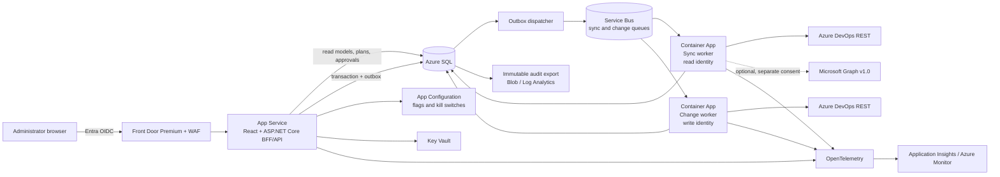
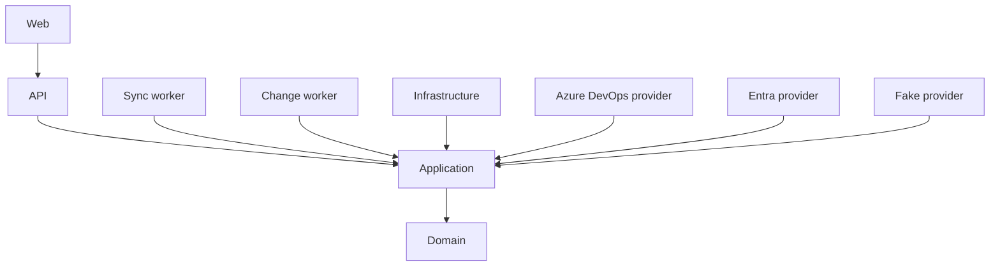

# Architecture

Status: proposed for implementation  
Last reviewed: 2026-08-26

## Executive summary

Azure DevOps Access Manager will be a modular monolith in one repository with
three separately deployed runtimes:

1. **Web/API** — a same-origin React application and ASP.NET Core BFF/API. It
   serves normalized read models, analysis, plans, and approvals. It has no
   Azure DevOps write credential.
2. **Sync worker** — reads explicitly configured Azure DevOps organizations
   using a dedicated read identity and publishes normalized data generations.
3. **Change worker** — has no public ingress, owns the separate write identity,
   reloads approved plans from the database, revalidates live state, executes
   allowlisted operations, and verifies their result.

Azure SQL is the system of record. Azure Service Bus carries job identifiers,
not authoritative operation payloads. A transactional outbox connects database
state changes to queued work. Azure DevOps REST DTOs remain inside provider
projects and never become the domain model.

The first release is read-only. The implemented MVP ends with a deliberately
narrow write slice: add a user to an existing native Azure DevOps group, add
supported Project/Git Allow bits to that group, verify replacement access, and
remove only the exact redundant direct user bits. Every other write remains
disabled until separately proven.

## Repository assessment

At planning time, the repository contains:

- `README.md`
- the authoritative specification, `docs/CURSOR-PLAN.md`
- this planning package

There is no source code, dependency manifest, CI/CD, infrastructure, test
harness, or existing runtime constraint to preserve. The first code-bearing
change must establish project boundaries, architecture tests, formatting,
dependency management, and secure CI.

## Context and runtime diagram



This is not a distributed microservice design. The deployments exist for
credential, scale, and failure isolation; domain and application behavior are
shared modules with one release train.

## Technology decisions

| Area | Choice | Reason |
|---|---|---|
| Backend | .NET 10 LTS, ASP.NET Core 10, EF Core 10 | The project is greenfield in August 2026. .NET 8 support ends in November 2026; .NET 10 is supported through November 2028. |
| HTTP resilience | Typed `HttpClient` plus `Microsoft.Extensions.Http.Resilience` | Current .NET integration, endpoint-specific policies, and safe handling of ambiguous writes |
| Frontend | React 19, TypeScript, Vite | Mature component ecosystem and fast typed development |
| Design system | Fluent UI React v9 | Enterprise controls and an accessibility foundation aligned with Microsoft ecosystems |
| Server state | TanStack Query | Query cancellation, caching, invalidation, and refresh states; never execution authority |
| Large tables | TanStack Table plus TanStack Virtual | Server-side filtering/sorting with bounded browser memory |
| Access graphs | `@xyflow/react` behind an adapter; deterministic layered layout | Good interactive graph fit, with progressive expansion and a mandatory accessible tree/table alternative |
| Production database | Azure SQL | Transactions, relational integrity, row-version concurrency, queryability, backup/restore, and mature Azure operations |
| Development/test database | SQL Server container/Testcontainers | Production-compatible semantics; SQLite is allowed only for a disposable UI demo |
| Messaging | Azure Service Bus | Durable delivery, dead lettering, duplicate detection, managed identity, and worker isolation |
| Hosting | App Service for BFF/API; Container Apps for workers | Stable web hosting and independently secured/scaled background workloads |
| Infrastructure | Bicep | Native Azure coverage and reviewable deployments |
| Observability | OpenTelemetry with Azure Monitor distribution | Vendor-neutral instrumentation with Azure-native export |

Third-party package versions will be selected at implementation time and locked
by the package managers. The choices above are boundaries, not permission to
add every library preemptively.

## Proposed repository structure

```text
/src
  /AccessManager.Web
  /AccessManager.Api
  /AccessManager.Application
  /AccessManager.Domain
  /AccessManager.Infrastructure
  /AccessManager.Providers.AzureDevOps
  /AccessManager.Providers.Entra
  /AccessManager.Providers.Fake
  /AccessManager.Workers.Sync
  /AccessManager.Workers.Change
/tests
  /AccessManager.UnitTests
  /AccessManager.ArchitectureTests
  /AccessManager.ProviderContractTests
  /AccessManager.IntegrationTests
  /AccessManager.Web.Tests
  /AccessManager.E2E
  /AccessManager.PerformanceTests
/infra
  /bicep
/docs
  /decisions
  /runbooks
```

### Dependency direction



Rules enforced by architecture tests:

- Domain references no framework, database, provider, or UI project.
- Application references Domain and provider/repository abstractions only.
- Azure DevOps wire DTOs do not cross the provider boundary.
- API controllers do not call provider clients or EF `DbContext` directly.
- Only the change worker composes `IAccessMutationProvider`.
- The web/API runtime cannot resolve the Azure DevOps write credential.
- Organization scope is explicit on every repository query and command.

## Component responsibilities

### AccessManager.Domain

- Stable entity IDs and external identifier value types
- Permission assignment/evaluation value objects
- Access comparisons and safety classifications
- Immutable migration-plan and operation state invariants
- No networking, persistence, authentication, or serialization concerns

### AccessManager.Application

- Use cases for inventory, search, analysis, recommendations, planning,
  approval, execution requests, and targeted refresh
- Provider and repository interfaces
- Authorization policies independent of HTTP
- Canonical plan hashing and state-machine orchestration
- Transaction boundaries and outbox creation

Core interfaces:

```text
IOrganizationRegistry
IAccessInventoryProvider
IAccessMutationProvider
IProviderCapabilityService
IProjectService
IIdentityService
IMembershipService
IPermissionService
ISecurityNamespaceService
ISecurityNamespaceInterpreter
IAccessAnalysisService
IGroupRecommendationService
IMigrationPlanner
IMigrationExecutor
IMigrationVerifier
IAuditWriter
IClock
```

### AccessManager.Infrastructure

- EF Core mappings and migrations
- Azure SQL repositories, row-version checks, leases, and generation promotion
- Transactional outbox and Service Bus dispatch
- Append-only application audit storage and export
- App Configuration, Key Vault, and OpenTelemetry wiring

### Provider projects

`Providers.AzureDevOps` owns endpoint-specific clients, authentication, API
versions, paging, rate handling, descriptor translation, token interpreters,
and DTO normalization.

`Providers.Entra` is optional and separately consented. It supplies only the
directory details and membership paths that the application explicitly needs.
It is read-only in the planned scope.

`Providers.Fake` implements the same inventory and mutation contracts with
deterministic in-memory/persisted state, fault injection, eventual consistency,
and the Contoso scenarios.

### API/BFF

- Handles Entra sign-in server-side and issues secure same-origin sessions
- Enforces application authorization on every operation
- Serves `/api/v1` JSON and the built SPA
- Returns RFC 9457 problem details, stable error codes, freshness, coverage, and
  correlation IDs
- Writes plan/approval/execution intent to SQL; never executes Azure DevOps
  mutations inline

### Workers

The sync worker can only resolve the read identity. The change worker can only
consume approved plan IDs, has no public ingress, and independently verifies:

- deployment and dynamic write gates
- actor authorization and two-person approval
- immutable plan hash and expiry
- live baseline and provider capability
- operation allowlists and protected principals
- audit persistence before each provider call

Queue messages contain IDs, attempt metadata, and trace context. Workers reload
authoritative state from SQL.

## Domain and persistence design

The normalized model is specified in [DATA-MODEL.md](DATA-MODEL.md). Important
principles:

- Internal IDs are stable and organization-scoped.
- External identifiers have a scheme and validity interval.
- A team links to its generated group principal rather than creating a second
  membership graph.
- Assignment source, resource inheritance, effect, and evaluation authority are
  separate axes.
- Sync generations are staged and promoted atomically per authoritative stage.
- Full effective permissions are computed on demand or captured in plan/audit
  snapshots; the system does not persist the entire user × resource × action
  Cartesian product.
- Every row used for a migration records source generation and provenance.

## Synchronization architecture

Detailed behavior is in [SYNC-ENGINE.md](SYNC-ENGINE.md).

```text
Configured organization
  -> capability check
  -> staged provider pages
  -> validation and normalization
  -> atomic generation promotion
  -> membership closure / findings
  -> query read models
```

Partial failure never converts missing pages into deletions. A failed stage
retains the prior active generation and exposes degraded freshness. Targeted
refresh can update known rows but cannot infer global absence.

Initial tunable scheduling defaults:

- projects, users, groups: every 4 hours
- memberships: every 2 hours
- Project/Git resources and ACLs: every 6 hours
- full reconciliation: daily
- page-triggered user refresh when relevant data is older than 15 minutes
- migration preflight: always live, never satisfied by cache alone

## Permission architecture

Detailed semantics are in [PERMISSIONS-MODEL.md](PERMISSIONS-MODEL.md).

```text
ISecurityNamespaceInterpreter
  NamespaceId
  Capabilities
  TryParseToken(rawToken)
  BuildToken(resource)
  GetAncestors(token)
  DecodeMask(mask)
  ResolveResource(token)
  ClassifyRisk(action)
  ValidateDesiredAce(current, desired)
```

MVP interpreters:

- Project
- Git Repositories at project and repository scope

Branch, Build, Environment, ServiceEndpoint, and Library support is post-MVP.
Unknown namespaces, actions, bits, tokens, membership paths, or provider
behavior are preserved and shown as `Unknown`; they never authorize a removal.

## Migration architecture

The algorithm and state machine are in
[MIGRATION-ENGINE.md](MIGRATION-ENGINE.md).

```text
Draft -> Inventory -> Proposed -> Validated -> Approved
      -> Live preflight -> Add replacement -> Verify replacement
      -> Remove exact direct bits -> Final verification -> Audit
```

Plan creation and execution are separate. Plans are immutable, versioned,
canonically hashed, time-limited, and bound to source generations. Approval
binds the exact plan hash and all acknowledged expansion. Execution uses an
organization lease and operation-level preconditions.

No direct access is removed before replacement access is visible through a live
verification path with sufficient authority. A timed-out mutation enters
`InDoubt` and is reconciled before any retry or subsequent operation.

## API contract

The initial HTTP contract follows these rules:

- `/api/v1` path versioning and generated OpenAPI client
- server-side filtering, sorting, and opaque cursor pagination
- maximum page sizes and export limits
- UTC timestamps in RFC 3339 format
- `asOf`, generation IDs, `Fresh|Stale|Partial|Unknown`, and coverage on
  inventory/analysis responses
- RFC 9457 problem details with stable machine-readable error codes
- optimistic concurrency for app-owned mutable resources using ETag/rowversion
- client-generated idempotency key for app commands, plus server-side command
  reconciliation
- anti-CSRF protection on all cookie-authenticated state-changing requests
- no provider token, raw ACL token, secret-bearing DTO, or internal exception in
  browser-visible errors

Long-running syncs, reports, and executions are jobs. The API returns a job
resource; the client uses bounded status polling initially. Server-sent events
can be evaluated later if polling creates measurable load.

## Frontend information architecture

Primary routes:

```text
/                         actionable access overview
/users                    user search
/users/{id}               user explorer and access graph
/groups/{id}              group explorer and cohort impact
/projects/{id}            project explorer
/permissions              server-paged permission matrix
/findings/direct           direct-permission findings
/plans/{id}               immutable comparison and operation preview
/executions/{id}          execution, verification, and audit timeline
/admin/organizations      organization registry and capabilities
/admin/sync               freshness, issues, and targeted refresh
```

The UI does not hide uncertainty. Every result can expose:

- evaluation authority and completeness
- last successful source generation
- stale/partial stages
- unsupported resource types
- unresolved identities/tokens/actions
- whether a result is provider-computed or locally derived

Graphs are progressively expanded and bounded (initial design ceiling: 500
visible nodes and 1,000 edges). Every graph has an equivalent keyboard-operable
tree or table. Tables use server paging and virtualization; the browser never
loads an entire enterprise organization.

## Security boundaries

The full model is in [SECURITY.md](SECURITY.md).

Key boundaries:

- Browser tokens target only the application backend.
- The SPA never receives Azure DevOps or Microsoft Graph access tokens.
- The web identity has no Azure DevOps rights.
- Read and write Azure DevOps identities are separate.
- The sync runtime cannot obtain the write identity.
- The change worker trusts only SQL state it reloads and revalidates.
- `READ_ONLY_MODE=true` is the default and is backend enforced.
- Static deployment, global dynamic, organization, and operation flags must all
  allow a write; configuration failure denies it.
- Application Administrator does not implicitly receive migration authority.
- Protected app identities, system groups, administrators, break-glass users,
  organizations, and projects cannot be migration targets.

## Data classification and privacy

Inventory data is confidential security metadata. Names, email addresses,
descriptors, group membership, and access paths can expose organization
structure and privileged users.

Planning defaults, subject to organizational/legal approval:

| Data | Default retention |
|---|---|
| Raw Azure DevOps/Graph response bodies | Never persist |
| Operational telemetry | 30 days |
| Security telemetry | 90 days |
| Historical inventory generations | 90 days |
| Expired/abandoned plans | 1 year |
| Completed execution and audit records | 7 years |
| Deleted-principal display PII | Pseudonymize after 90 days unless audit/legal policy requires it |

Backups and immutable exports must have explicit expiry compatible with the
approved policy. Exported CSV neutralizes formula prefixes and enforces row/size
limits.

## Observability and operations

Instrument HTTP, SQL, Service Bus, sync stages, provider calls, plan state
transitions, mutation attempts, verification, and audit export using
OpenTelemetry.

Required measures:

- source freshness and stage completeness by organization
- provider latency/error and rate-limit delay/cost
- queue age, retries, and dead-letter count
- plan states, expiry, stale-baseline blocks, and approval latency
- execution `InDoubt`, verification failure, compensation, and rollback failure
- audit-export lag and worker readiness

Do not use email, display name, descriptors, ACL tokens, resource names, or
other high-cardinality sensitive values as metric dimensions. HTTP
authorization, cookies, query strings containing descriptors, request bodies,
service endpoint authorization fields, and variable values are always
redacted.

Runbooks are required for throttling, expired credentials/permissions, partial
sync, descriptor remapping, dead-letter jobs, audit failure, `InDoubt`
operations, failed verification, and write kill-switch use.

## Availability, recovery, and scale

Initial production topology:

- App Service Premium with at least two instances and deployment slots
- Container Apps workers without public ingress
- Azure SQL General Purpose with zone redundancy where available
- Service Bus Premium where private endpoints/isolation are required
- private endpoints for SQL, Service Bus, Key Vault, App Configuration, and
  audit storage
- Front Door Premium/WAF and restricted outbound Azure DevOps/Entra hosts

Before production, stakeholders must ratify:

- service-level objectives
- recovery point and recovery time objectives
- region and data-residency requirements
- capacity/cost budgets
- audit retention and legal hold

Backup restore and regional recovery are tested, not assumed. A recovered or
failover deployment starts read-only; writes stay disabled until SQL, queue,
audit, configuration, and live provider capability are reconciled.

## Deferred choices

The following are intentionally not selected until measurements or a validated
need exist:

- Azure Managed Redis
- Azure AI Search
- a graph database
- event-driven Azure DevOps change feeds (none are assumed complete)
- Microsoft Graph directory enrichment
- real-time UI transport beyond bounded polling
- generic support for every Azure DevOps security namespace

## Architecture acceptance gates

- [ ] Phase 0 capability probes pass in a disposable Azure DevOps organization.
- [ ] All accepted ADRs are reflected in code/project boundaries.
- [ ] Architecture tests enforce dependency and credential composition rules.
- [ ] Read-only mode is proven fail-closed.
- [ ] Data classification, retention, accessibility, RPO/RTO, and SLOs are
      ratified before production.
- [ ] Live sandbox tests prove exact Project/Git token and bit behavior before
      the first mutation feature flag can be enabled.
