# Normalized Data Model

Status: proposed  
Database target: Azure SQL via EF Core

The model separates Azure DevOps wire contracts from durable application data.
It must preserve provider facts without pretending incomplete data is
authoritative.

## Modeling principles

1. Every provider-owned object receives an internal stable ID.
2. Every external identifier is typed and validity dated. Azure DevOps
   identifiers are organization-scoped; Entra identifiers are tenant-scoped.
3. Email, UPN, display name, and resource name are never primary keys.
4. A team is both a Core team and a group principal; memberships are stored once.
5. Direct assignment, group source, resource inheritance, allow/deny effect, and
   effective outcome are independent properties.
6. Provider action bits and raw tokens are preserved even when unknown.
7. Authoritative list stages use generations. Partial stages never tombstone
   previously active rows.
8. Effective permissions are calculated on demand and captured for plans/audit;
   the full enterprise Cartesian product is not materialized.
9. Every plan references immutable evidence, evaluator/interpreter versions, and
   data completeness.
10. Organization scope is present in provider keys and foreign-key paths to
    prevent accidental cross-organization joins. Deliberate cross-organization
    person views go through a tenant-scoped directory-subject link and reapply
    authorization per organization.

## Relationship overview

```mermaid
erDiagram
    DIRECTORY_SUBJECT ||--o{ PRINCIPAL_DIRECTORY_LINK : materializes_as
    PRINCIPAL ||--o{ PRINCIPAL_DIRECTORY_LINK : correlates
    APPLICATION_ACTOR ||--o{ APPLICATION_ROLE_GRANT : receives
    APPLICATION_ACTOR ||--o{ AUTHORIZATION_EVIDENCE : authenticates
    APPLICATION_ACTOR ||--o{ MIGRATION_PLAN_VERSION : creates
    APPLICATION_ACTOR ||--o{ PLAN_APPROVAL : approves
    APPLICATION_ACTOR ||--o{ MIGRATION_EXECUTION : requests
    APPLICATION_ACTOR ||--o{ CONFIGURATION_CHANGE_REQUEST : initiates
    APPLICATION_ACTOR ||--o{ PROTECTED_TARGET_CHANGE : approves
    ORGANIZATION ||--o{ PROJECT : contains
    ORGANIZATION ||--o{ PRINCIPAL : contains
    PRINCIPAL ||--o{ PRINCIPAL_IDENTIFIER : identified_by
    PRINCIPAL ||--o| USER_ENTITLEMENT : licensed_as
    PRINCIPAL ||--o| GROUP : specializes
    GROUP ||--o| TEAM : may_back
    PROJECT ||--o{ TEAM : owns
    PRINCIPAL ||--o{ MEMBERSHIP : member
    PRINCIPAL ||--o{ MEMBERSHIP : container
    PROJECT ||--o{ RESOURCE : contains
    RESOURCE ||--o{ RESOURCE : parent_of
    SECURITY_NAMESPACE ||--o{ PERMISSION_ACTION : defines
    SECURITY_NAMESPACE ||--o{ ACL : secures
    RESOURCE ||--o{ ACL : represented_by
    ACL ||--o{ ACE : contains
    PRINCIPAL ||--o{ ACE : assigned_to
    SYNC_RUN ||--o{ SYNC_STAGE_RUN : contains
    MIGRATION_PLAN ||--o{ MIGRATION_PLAN_VERSION : versions
    MIGRATION_PLAN_VERSION ||--o{ MIGRATION_OPERATION : contains
    MIGRATION_PLAN_VERSION ||--o{ PLAN_APPROVAL : approved_by
    MIGRATION_PLAN_VERSION ||--o{ MIGRATION_EXECUTION : executes
    MIGRATION_EXECUTION ||--o{ OPERATION_ATTEMPT : attempts
    MIGRATION_EXECUTION ||--o{ VERIFICATION_RESULT : verifies
    MIGRATION_EXECUTION ||--o{ AUDIT_EVENT : audits
```



## Shared columns

Provider fact tables carry:

```text
Id                    internal ULID/GUID
OrganizationId
FirstSeenAtUtc
LastSeenAtUtc
ObservedGenerationId
ValidFromUtc
ValidToUtc             null while active
ProviderETag/Revision  nullable; never assume all APIs provide one
Provenance             endpoint/version/stage
RowVersion             app database optimistic concurrency
```

Timestamps are UTC. Raw provider response bodies are not retained.

## Application identity and cross-organization entities

Application actors are not Azure DevOps principals. A person can sign in to the
application without being materialized in every configured Azure DevOps
organization, and the app must not use an organization-scoped principal as an
authorization identity.

### DirectorySubject

A tenant-scoped identity used to correlate materializations across
organizations:

| Field | Notes |
|---|---|
| `Id` | Internal stable ID |
| `TenantId`, `EntraObjectId`, `Kind` | Unique current Entra user, service principal, or group coordinate |
| `DisplayNameSnapshot` | Mutable display data only |
| `State` | Active, Deleted, Relinked, Ambiguous |

For an Entra user, this is the cross-organization “person” aggregate. MSA,
unresolved, tenant-mismatched, or relinked subjects are not automatically
merged.

### PrincipalDirectoryLink

| Field | Notes |
|---|---|
| `PrincipalId`, `DirectorySubjectId` | Organization materialization to tenant subject |
| `Status` | Confirmed, Ambiguous, Historical, Rejected |
| `Evidence` | `origin=aad`, origin ID, tenant, storage key, observed generation |
| `ValidFromUtc`, `ValidToUtc` | Correlation history |

Automatic linking requires matching tenant, subject kind, `origin=aad`, and
current `originId`; email/display name never links records. Ambiguity produces
separate candidates and `Unknown`, not an automatic merge. A cross-org API loads
the directory subject, then independently authorizes and filters every linked
organization/project before returning results.

### ApplicationActor

| Field | Notes |
|---|---|
| `Id` | Stable application actor ID |
| `TenantId`, `EntraObjectId` | Unique signed-in Entra subject |
| `SubjectType` | HumanUser for approval/execution; service identities are non-approvers |
| `DirectorySubjectId` | Optional correlation to inventory, not authorization authority |
| `Status`, `LastSeenAtUtc` | Active/disabled and session attribution context |

### ApplicationRoleGrant

| Field | Notes |
|---|---|
| `ActorId`, `Role` | Viewer, AccessAnalyst, MigrationApprover, AccessAdministrator, ApplicationAdministrator |
| `OrganizationId`, `ProjectId` | Nullable scope; project requires organization |
| `Source` | AppManagedScope in MVP; external policy import is future work |
| `ValidFromUtc`, `ValidToUtc` | Revalidated authorization interval |
| `GrantedByActorId` | Required for app-managed scope; distinct authorization/audit |

Token app-role/group claims establish candidate role membership. Persisted
scope grants constrain it; they never expand beyond current Entra authorization.
Application Administrator changes to app-managed scope are audited. Execution
revalidates the actor and approver's current effective grants.

### AuthorizationEvidence

Bounded proof captured from a freshly validated interactive Entra session:

| Field | Notes |
|---|---|
| `ActorId` | ApplicationActor |
| `Source` | ValidatedEntraAppRoleToken |
| `TenantId`, `EntraObjectId` | Must match actor |
| `AppRoleSetHash` | Canonical `roles` claims; no raw token persisted |
| `ScopedGrantHash`, `PolicyVersion` | Current active SQL constraints |
| `AuthenticatedAtUtc`, `TokenIssuedAtUtc`, `TokenExpiresAtUtc` | Middleware evidence |
| `EvidenceExpiresAtUtc` | Short application policy window |
| `SessionIdHash`, `AuthenticationContext` | Safe replay/reauth context where available |

The BFF relies on Entra app-role assignments emitted in the validated `roles`
claim; it does not require Microsoft Graph to evaluate group membership. Role
changes are not instantaneously introspectable from a worker. Approval and
execution request therefore require recent reauthentication, and evidence has a
short bounded lifetime (initial proposal: 15 minutes, ratified in Phase 0).
Execution rechecks the local scoped grant/policy hash and stops if either actor's
evidence expired or local grants changed. Entra revocation within that bounded
token window is a documented residual risk unless a separately consented live
authorization provider is adopted.

### ConfigurationChangeRequest

Azure App Configuration is the runtime source for app-owned nonsecret dynamic
flags and policy values. SQL is the durable change-workflow/audit source:

| Field | Notes |
|---|---|
| `Key`, `DesiredValue` | Allowlisted nonsecret app-owned setting |
| `ExpectedAppConfigETag` | Required compare-and-set precondition |
| `InitiatedByActorId`, `AuthorizationEvidenceId` | Fresh Application Administrator evidence |
| `State` | Pending, Applying, Applied, Conflict, Failed |
| `ObservedAppConfigETag`, `AppliedAtUtc` | Read-back proof |
| `RowVersion` | SQL workflow concurrency |

The Operations worker applies a request through the Azure App Configuration
adapter with `If-Match`, reads it back, and appends audit. The API never writes
App Configuration directly. Static deployment capability, secrets, and absolute
`READ_ONLY_MODE` are not app-owned keys.

### ProtectedTarget and ProtectedTargetChange

Protected targets are authoritative SQL rows typed as organization, project,
principal, group, or resource. A change records action, target, reason,
initiator/evidence, rowversion, and audit. Addition requires one Application
Administrator; removal requires approval/evidence from a second distinct
Application Administrator before the row is closed. The Change worker reads the
active SQL set during every preflight and operation.

### MappingOverride

Explicit identity/resource correlation overrides are authoritative, validity-
dated SQL records with source/target typed IDs, reason, initiator/evidence,
rowversion, and audit. They cannot merge tenant/object/kind mismatches or change
provider descriptors. `MappingOverrideApproval` stores a distinct second
Application Administrator/evidence when policy classifies an override as
high-impact. Applying/expiring an override writes an outbox invalidation for
affected person/resource read models and migration plans.

## Inventory entities

### Organization

| Field | Notes |
|---|---|
| `Id` | Internal ID |
| `ProviderAccountId` | Azure DevOps account GUID when discoverable; nullable |
| `Slug` | URL organization segment |
| `CanonicalUrl` | Unique normalized `https://dev.azure.com/{slug}` |
| `TenantId` | Expected Entra tenant |
| `DisplayName` | Mutable |
| `Status` | Configured, Validating, Active, Degraded, Disabled |
| `ReadEnabled` / `WriteEnabled` | Write defaults false |
| `CapabilitySnapshotId` | Most recent validated provider capabilities |

No free-form provider base URL is called. Registration normalizes to an
allowlisted Azure DevOps host and stores the canonical organization slug.

### Project

| Field | Notes |
|---|---|
| `OrganizationId`, `ProviderId` | Unique Azure DevOps project GUID |
| `Name` | Mutable display value |
| `State`, `Visibility`, `Revision` | Provider facts |
| `ObservationState` | Visible, VisibilityLost, ProviderDeleted, Unknown |
| `Description` | Optional, length bounded |

### Principal

One row for a user, service principal, native group, Entra-backed group, team
group, or unresolved identity.

| Field | Notes |
|---|---|
| `Kind` | User, ServicePrincipal, Group, Unresolved |
| `Origin` | AAD, VSTS, MSA, unknown/provider value |
| `DisplayName`, `PrincipalName`, `MailAddress` | Mutable, encrypted/masked according to policy |
| `IdentityState` | Active, Pending, Disabled, Deleted, Unresolved |
| `ObservationState` | Visible, VisibilityLost, ProviderDeleted, Unknown |
| `IsProtected` | App/system/break-glass target protection |

### PrincipalIdentifier

| Field | Notes |
|---|---|
| `PrincipalId` | Parent |
| `Scheme` | GraphDescriptor, LegacyDescriptor, StorageKey, OriginId, EntraObjectId |
| `Value` | Exact opaque value |
| `TenantId` | Required where scheme is directory-scoped |
| `ValidFromUtc`, `ValidToUtc` | Identifier history |
| `IsCurrent` | Unique current value per principal/scheme |

Uniqueness is scoped by organization, scheme, tenant where applicable, and
validity. Descriptor strings are never parsed to infer identity.

### UserEntitlement

| Field | Notes |
|---|---|
| `PrincipalId` | Human user identity |
| `AccessLevel` | Stakeholder, Basic, Basic+Test, VS subscriber, unknown |
| `LicenseStatus` | Provider value |
| `AssignmentSource` | Direct, group rule, unknown |
| `DateCreatedUtc`, `LastAccessedUtc` | Context only; not automatic stale-removal proof |

### ServicePrincipalEntitlement

The API has no documented list/search equivalent to User Entitlements. Store a
separate per-ID observation:

| Field | Notes |
|---|---|
| `PrincipalId` | Graph service principal |
| `AccessLevel`, `LicenseStatus` | Preview per-ID entitlement response |
| `Coverage` | Fetched, Forbidden, Unsupported, Unknown |
| `ObservedAtUtc` | Evidence timestamp |

### Group

| Field | Notes |
|---|---|
| `PrincipalId` | Group principal |
| `ScopeDescriptor` | Opaque Graph scope |
| `GroupKind` | NativeAdo, EntraBacked, Team, System, Unknown |
| `SpecialType` | Provider value |
| `Description` | Mutable |
| `CanManageMembership` | Derived capability, not merely origin |
| `PermissionManagementPolicy` | None or PolicyManaged with owner/project/future-member semantics; not causal ownership proof |

### Team

| Field | Notes |
|---|---|
| `ProviderTeamId` | Core team GUID |
| `ProjectId` | Owning project |
| `GroupPrincipalId` | Generated group principal; unique |
| `IsDefaultTeam` | Provider fact |

There is no separate `TeamMembership`. Team membership uses `Membership` with
the team's group principal as container.

### Membership

Stores only direct edges:

| Field | Notes |
|---|---|
| `MemberPrincipalId` | User or group |
| `ContainerPrincipalId` | Group |
| `Source` | AzureDevOpsGraph, EntraGraph, provider/fake |
| `Completeness` | Complete, Partial, Unknown for this observation |
| `ObservedGenerationId` | Source generation |

Unique active edge: `(OrganizationId, MemberPrincipalId,
ContainerPrincipalId, Source)`.

### MembershipClosure

A generation-specific derived index:

| Field | Notes |
|---|---|
| `AncestorPrincipalId` | Container reachable from descendant |
| `DescendantPrincipalId` | Starting principal |
| `MinimumDepth` | Shortest path |
| `PathCountCapped` | Number of known paths up to configured cap |
| `HasCycle` | Fault/corrupt data marker |
| `IsComplete` | False when traversal limits/provider errors apply |

Direct `Membership` edges remain the explanation source. Closure rows accelerate
queries but are never used without their generation/completeness.

### Resource and ResourceIdentifier

`Resource` represents Organization, Project, GitProject, Repository, Branch,
BuildDefinition, Pipeline, Environment, ServiceEndpoint, VariableGroup, or an
unknown securable resource.

| Field | Notes |
|---|---|
| `ProjectId` | Nullable for organization-scoped resources |
| `Type` | Stable application enum plus Unknown |
| `ParentResourceId` | Hierarchy |
| `ProviderKey` | Bounded canonical key where one exists |
| `Name`, `Path` | Mutable display/search values |
| `LifecycleState` | Active, Disabled, Deleted, Unknown |
| `ObservationState` | Visible, VisibilityLost, ProviderDeleted, Unknown |

`ResourceIdentifier` stores GUID, integer, provider path, and other typed
identifiers. Secret service-endpoint authorization parameters and variable
values are not resources or identifiers and are never persisted.

## Security entities

### SecurityNamespace

| Field | Notes |
|---|---|
| `ProviderNamespaceId` | Namespace GUID |
| `Name`, `DisplayName` | Discovered |
| `IsHierarchical` | Discovered |
| `SeparatorValue`, `ElementLength` | Token metadata |
| `WritePermissionBit`, `SystemBitMask` | Discovered masks |
| `DataVersion` | Provider value |
| `SchemaHash` | Canonical action/metadata hash used for drift detection |
| `InterpreterKey` | Registered interpreter or null |

### PermissionAction

| Field | Notes |
|---|---|
| `SecurityNamespaceId`, `Bit` | Unique |
| `ProviderName`, `DisplayName` | Discovered at runtime |
| `Risk` | Low, Medium, High, Administrative, Unknown |
| `IsSystem`, `IsDeprecated`, `IsWriteSupported` | Application policy |

Masks are stored in a numeric representation that safely supports all provider
bits. Browser code receives normalized action rows rather than using JavaScript
signed bitwise operations.

### Acl

| Field | Notes |
|---|---|
| `SecurityNamespaceId` | Parent |
| `RawToken` | Exact provider token |
| `TokenHash` | Indexed hash for lookup; collisions checked with raw token |
| `ResourceId` | Nullable when unresolved |
| `InheritPermissions` | Provider value |
| `TokenParseStatus` | Supported, Unsupported, Malformed, Unknown |

Unknown raw tokens are retained, redacted from ordinary telemetry, and exposed
to authorized diagnostics.

### Ace

| Field | Notes |
|---|---|
| `AclId`, `PrincipalId` | Assignment target |
| `DescriptorUsed` | Legacy descriptor from the provider response |
| `ExplicitAllowMask`, `ExplicitDenyMask` | Stored direct masks |
| `ProviderEffectiveAllowMask`, `ProviderEffectiveDenyMask` | Nullable extended info |
| `ProviderInheritedAllowMask`, `ProviderInheritedDenyMask` | Nullable extended info |
| `UnknownAllowMask`, `UnknownDenyMask` | Bits absent from discovered action schema |
| `IsSynthetic` | True only when returned from a filtered query; synthetic rows cannot prove directness |

### AceAction

Derived index for reporting:

```text
AceId
PermissionActionId
Effect = Allow | Deny
IsExplicit = true
```

An all-zero ACE may be retained for fidelity but does not produce a direct grant
or deny finding.

### RoleDefinition and RoleAssignment

Post-MVP entities for role-based resources:

```text
RoleDefinition(scopeId, name, allowMask, denyMask, schemaHash)
RoleAssignment(resource, principal, roleName, access=Assigned|Inherited)
```

They are not forced into ordinary ACL/ACE semantics. Provider capability records
the supported role scope/resource grammar.

## Evaluation entities

### EvaluationSnapshot

| Field | Notes |
|---|---|
| `Purpose` | Interactive, PlanBaseline, PlanProposed, Verification, Audit |
| `EvaluatorVersion` | Algorithm build/version |
| `InterpreterVersions` | Per-namespace map/hash |
| `GenerationSetHash` | Exact source generations |
| `Mode` | Cached or Live |
| `Completeness` | Complete, Partial, Unknown |
| `CreatedAtUtc` | UTC |

Interactive snapshots may be ephemeral. Plan, verification, and audit snapshots
are durable and immutable.

### EffectivePermission

Coordinate:

```text
PrincipalId + ResourceId + PermissionActionId
```

Value:

| Field | Notes |
|---|---|
| `Outcome` | Allow, Deny, NotSet, Unknown |
| `Authority` | ProviderComputed, DerivedSupported, DerivedPartial, Unknown |
| `AssignmentEffect` | Allow/Deny facts remain separate |
| `Constraints` | License, disabled identity, incomplete Entra path, system override, etc. |
| `ReasonCode` | Stable machine-readable explanation |

`NotSet` means no applicable grant/deny was established in the modeled
permission system. `Unknown` is not converted to NotSet.

### AccessPath and AccessPathEdge

An explanation contains ordered typed edges:

```text
principal -> membership -> group/team/Entra group
          -> ACE/role assignment -> resource scope
          -> resource inheritance -> evaluated action
```

Path counts and lengths are bounded. When more paths exist, return a truncation
marker without changing the effective result.

### DirectPermissionFinding

| Field | Notes |
|---|---|
| `AceActionId` / `RoleAssignmentId` | Exact direct fact |
| `PrincipalId`, `ResourceId`, `ActionId` | Search coordinate |
| `Risk` | Includes action, scope, deny, unknown, and blast radius |
| `Status` | Open, Planned, Remediated, Suppressed |
| `RedundancyAuthority` | Unproven, ProvenBySupportedEvaluation |

The system never labels a direct permission redundant from name similarity or
mask subtraction.

## Synchronization entities

### DataGeneration

Identifies a promoted snapshot for one organization and stage, such as
`Principals`, `Memberships`, `Repositories`, or `GitAcls`.

```text
Id, OrganizationId, Stage, StartedAtUtc, CompletedAtUtc
Coverage, Completeness, SourceVersion, SchemaHash
CallerScopeFingerprint, VisibilityBaselineHash, DeletionConfirmationPolicy
SupersedesGenerationId
```

### SyncRun and SyncStageRun

`SyncRun` tracks the requested full/targeted job. `SyncStageRun` tracks each
stage, attempt, page count, throttle delay, result, issue count, and published
generation.

### SyncCheckpoint

Stores an opaque continuation token, fixed query parameters, and last complete
page boundary. Tokens are encrypted when operational policy treats them as
sensitive and are never logged.

### SyncIssue

Structured issue codes include:

```text
Forbidden
PartialPageSet
ContinuationLoop
DescriptorUnresolved
TokenUnresolved
NamespaceDrift
MembershipLimitExceeded
RateLimited
MalformedProviderResponse
CapabilityUnavailable
```

## Migration and audit entities

### MigrationPlan and MigrationPlanVersion

`MigrationPlan` is a user-visible container. Every edit creates an immutable
`MigrationPlanVersion`.

Version fields include:

- `CreatedByActorId` and creation `AuthorizationEvidenceId`
- target organization/user/group
- selected direct findings
- baseline and proposed evaluation snapshot IDs
- baseline canonical hash and source generation set
- comparisons, unknowns, cohort blast radius, and warnings
- transitive cohort hash and any approved all-current/future-member group policy
- ordered operations and dependencies
- plan schema/algorithm versions
- expiration
- canonical plan hash

### MigrationOperation

```text
Id
Type
Target identifiers
Desired exact state
Dependencies
Precondition hash
Captured pre-state
Inverse/compensation metadata
Risk and support classification
```

Operation types are explicit:

```text
AddGroupMembership
RemoveGroupMembership        ManualOnly in MVP
AddPermissionBits
RemovePermissionBits         automatic for direct removal; group cleanup ManualOnly
CreateGroup               post-MVP
AddTeamMember             represented through membership
RemoveTeamMember          represented through membership
VerificationBarrier
```

### PlanApproval

| Field | Notes |
|---|---|
| `PlanVersionId`, `PlanHash` | Exact approved content |
| `ApproverActorId` | Human `ApplicationActor`, never an Azure DevOps principal |
| `AuthorizationEvidenceId`, `ScopedGrantHash` | Fresh Entra app-role evidence and local scope used to approve |
| `ApprovedAtUtc`, `ExpiresAtUtc` | Time bound |
| `AcknowledgedExpansionHash` | Exact gains/cohort impact |
| `Decision`, `Comment` | Decision record |

Database constraints/application policy prevent a requester from approving
their own plan. The approver must differ from both the plan-version creator and
the execution requester. The plan creator and execution requester may be the
same human only when that actor independently holds both required roles.

### MigrationExecution and OperationAttempt

Execution stores state-machine status, lease, actor, live preflight hash,
verification/compensation outcomes, and timestamps.
`RequestedByActorId`, requester/approver references point to `ApplicationActor`
and capture
the `AuthorizationEvidenceId` and effective scoped role-grant hash used at that
decision.

An attempt is append-only:

```text
AttemptId, OperationId, Number, IdempotencyKey
StartedAtUtc, CompletedAtUtc
ProviderCorrelationId
Outcome = NoChange|Succeeded|Failed|InDoubt
OwnershipEvidence = NotApplicable|ProviderResultOnlyNotCausal|Ambiguous
ErrorCode / redacted error
Observed pre/post-state hashes
```

### VerificationResult and RollbackPlan

Verification records each affected coordinate, expected/actual outcome,
authority, convergence attempts, whether selected direct bits were suppressed,
surviving replacement path, and final `Verified|Failed|Inconclusive`.

Rollback/restoration is a new immutable plan generated from actual operation
attempts. Exact captured direct access can be restored automatically. Additive
group bits/membership are ManualOnly cleanup candidates because Azure DevOps
cannot prove causal ownership of an identical fact; their current cohort/target
impact, preview, external observation, verification, and audit remain durable.

### AuditEvent

Append-only event:

```text
Sequence
TimestampUtc
ApplicationActorId and effective scoped role-grant hash
Organization/project/resource/target IDs
Plan/version/execution/operation IDs
Event type and outcome
Previous/requested/observed state hashes and approved safe projections
Provider operation, correlation ID, status, redacted error
PreviousEventHash + EventHash
```

Audit projections omit credentials, authorization headers, PATs, secrets,
service endpoint authorization data, variable values, and unbounded raw
provider bodies. Events are exported to a separately protected immutable store.

### OutboxMessage and ProviderCapability

`OutboxMessage` is created in the same transaction as application state and
dispatched idempotently to Service Bus.

`ProviderCapability` records:

```text
organization + identity kind + feature + endpoint/version
ReadSupported / WriteSupported
Evidence timestamp and sandbox/live environment
Failure/limitation reason
```

Feature gates consume capability records; they do not assume every organization
supports the same behavior.

## Index and constraint plan

At minimum:

- unique organization canonical URL
- unique application actor by tenant/object ID
- indexes for unexpired authorization evidence by actor and expiry
- unique pending configuration change per key plus expected App Configuration
  ETag/SQL rowversion
- unique active protected target and distinct initiator/approver constraint on
  removal
- unique current mapping override per typed source/scope with validity history
- unique current directory subject by tenant/object ID/kind
- unique current confirmed principal-directory link
- indexes for active application role grants by actor/organization/project
- unique active external identifier by organization/scheme/value
- unique provider project/resource key within organization
- unique active direct membership edge
- unique namespace GUID and action bit per organization/schema generation
- unique ACL by namespace/raw-token hash with raw-token collision check
- unique ACE by ACL/principal/active generation
- indexes for user/group/project/resource search using normalized bounded fields
- indexes for direct user ACE actions and risk/status
- composite foreign keys that include `OrganizationId` on cross-aggregate
  provider data
- filtered unique indexes for one active generation per organization/stage
- rowversion on app-owned mutable records
- append-only permissions/trigger or separate database role for audit tables

The exact physical indexes are validated with representative enterprise data
and query plans, not guessed from the conceptual model.

## Deletion, visibility loss, and retention

- Absence from a completed page set is only a deletion candidate. Tombstone
  requires a stage whose authority/coverage is unchanged plus an authoritative
  direct confirmation such as provider `404` under sufficient visibility or an
  explicit provider deleted state.
- `403`, reduced project/repository visibility, count anomalies, or an
  unconfirmable missing object sets `ObservationState=VisibilityLost` (or
  `Unknown`) and retains the last known fact. It never becomes
  `ProviderDeleted`.
- A large/unexpected disappearance quarantines the candidate generation and
  requires confirmation probes/operator visibility before promotion.
- Targeted refresh never infers global deletion.
- Historical identifiers and plan/audit facts remain immutable under the
  approved retention policy.
- PII can be pseudonymized after principal deletion while preserving stable
  audit references.
- Raw secret-bearing fields are never ingested, so deletion does not depend on
  locating them later.

## Model acceptance criteria

- [ ] EF migrations enforce organization isolation and key uniqueness.
- [ ] Descriptor remapping preserves identifier history.
- [ ] Cross-organization person links require tenant/object/kind evidence and
      filter each organization through current app authorization.
- [ ] App actors, scoped grants, approvals, and audit attribution remain separate
      from Azure DevOps principals.
- [ ] Team and group membership produce one canonical graph.
- [ ] Partial, forbidden, visibility-reduced, and anomalous complete generations
      cannot create false deletions.
- [ ] Unknown bits/tokens/actions survive read-normalize-write simulations.
- [ ] Plan/audit snapshots reproduce the evaluation using recorded versions.
- [ ] Audit database role cannot update or delete events.
- [ ] Representative enterprise queries remain server-paged and indexed.
