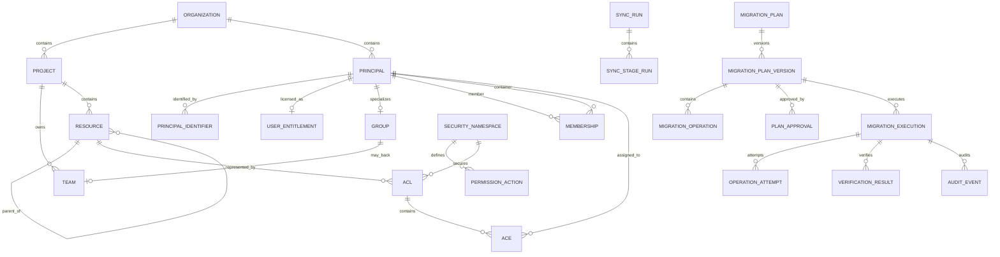

# Normalized Data Model

Status: proposed  
Database target: Azure SQL via EF Core

The model separates Azure DevOps wire contracts from durable application data.
It must preserve provider facts without pretending incomplete data is
authoritative.

## Modeling principles

1. Every provider-owned object receives an internal stable ID.
2. Every external identifier is typed, organization-scoped, and validity dated.
3. Email, UPN, display name, and resource name are never primary keys.
4. A team is both a Core team and a group principal; memberships are stored once.
5. Direct assignment, group source, resource inheritance, allow/deny effect, and
   effective outcome are independent properties.
6. Provider action bits and raw tokens are preserved even when unknown.
7. Authoritative list stages use generations. Partial stages never tombstone
   previously active rows.
8. Effective permissions are calculated on demand and captured for plans/audit;
   the full enterprise Cartesian product is not materialized.
9. Every plan references immutable evidence, evaluator/interpreter versions, and
   data completeness.
10. Organization scope is present in keys and foreign-key paths to prevent
    cross-organization joins.

## Relationship overview



## Shared columns

Provider fact tables carry:

```text
Id                    internal ULID/GUID
OrganizationId
FirstSeenAtUtc
LastSeenAtUtc
ObservedGenerationId
ValidFromUtc
ValidToUtc             null while active
ProviderETag/Revision  nullable; never assume all APIs provide one
Provenance             endpoint/version/stage
RowVersion             app database optimistic concurrency
```

Timestamps are UTC. Raw provider response bodies are not retained.

## Inventory entities

### Organization

| Field | Notes |
|---|---|
| `Id` | Internal ID |
| `ProviderAccountId` | Azure DevOps account GUID when discoverable; nullable |
| `Slug` | URL organization segment |
| `CanonicalUrl` | Unique normalized `https://dev.azure.com/{slug}` |
| `TenantId` | Expected Entra tenant |
| `DisplayName` | Mutable |
| `Status` | Configured, Validating, Active, Degraded, Disabled |
| `ReadEnabled` / `WriteEnabled` | Write defaults false |
| `CapabilitySnapshotId` | Most recent validated provider capabilities |

No free-form provider base URL is called. Registration normalizes to an
allowlisted Azure DevOps host and stores the canonical organization slug.

### Project

| Field | Notes |
|---|---|
| `OrganizationId`, `ProviderId` | Unique Azure DevOps project GUID |
| `Name` | Mutable display value |
| `State`, `Visibility`, `Revision` | Provider facts |
| `Description` | Optional, length bounded |

### Principal

One row for a user, service principal, native group, Entra-backed group, team
group, or unresolved identity.

| Field | Notes |
|---|---|
| `Kind` | User, ServicePrincipal, Group, Unresolved |
| `Origin` | AAD, VSTS, MSA, unknown/provider value |
| `DisplayName`, `PrincipalName`, `MailAddress` | Mutable, encrypted/masked according to policy |
| `IdentityState` | Active, Pending, Disabled, Deleted, Unresolved |
| `IsProtected` | App/system/break-glass target protection |

### PrincipalIdentifier

| Field | Notes |
|---|---|
| `PrincipalId` | Parent |
| `Scheme` | GraphDescriptor, LegacyDescriptor, StorageKey, OriginId, EntraObjectId |
| `Value` | Exact opaque value |
| `TenantId` | Required where scheme is directory-scoped |
| `ValidFromUtc`, `ValidToUtc` | Identifier history |
| `IsCurrent` | Unique current value per principal/scheme |

Uniqueness is scoped by organization, scheme, tenant where applicable, and
validity. Descriptor strings are never parsed to infer identity.

### UserEntitlement

| Field | Notes |
|---|---|
| `PrincipalId` | User/service identity |
| `AccessLevel` | Stakeholder, Basic, Basic+Test, VS subscriber, unknown |
| `LicenseStatus` | Provider value |
| `AssignmentSource` | Direct, group rule, unknown |
| `DateCreatedUtc`, `LastAccessedUtc` | Context only; not automatic stale-removal proof |

### Group

| Field | Notes |
|---|---|
| `PrincipalId` | Group principal |
| `ScopeDescriptor` | Opaque Graph scope |
| `GroupKind` | NativeAdo, EntraBacked, Team, System, Unknown |
| `SpecialType` | Provider value |
| `Description` | Mutable |
| `CanManageMembership` | Derived capability, not merely origin |

### Team

| Field | Notes |
|---|---|
| `ProviderTeamId` | Core team GUID |
| `ProjectId` | Owning project |
| `GroupPrincipalId` | Generated group principal; unique |
| `IsDefaultTeam` | Provider fact |

There is no separate `TeamMembership`. Team membership uses `Membership` with
the team's group principal as container.

### Membership

Stores only direct edges:

| Field | Notes |
|---|---|
| `MemberPrincipalId` | User or group |
| `ContainerPrincipalId` | Group |
| `Source` | AzureDevOpsGraph, EntraGraph, provider/fake |
| `Completeness` | Complete, Partial, Unknown for this observation |
| `ObservedGenerationId` | Source generation |

Unique active edge: `(OrganizationId, MemberPrincipalId,
ContainerPrincipalId, Source)`.

### MembershipClosure

A generation-specific derived index:

| Field | Notes |
|---|---|
| `AncestorPrincipalId` | Container reachable from descendant |
| `DescendantPrincipalId` | Starting principal |
| `MinimumDepth` | Shortest path |
| `PathCountCapped` | Number of known paths up to configured cap |
| `HasCycle` | Fault/corrupt data marker |
| `IsComplete` | False when traversal limits/provider errors apply |

Direct `Membership` edges remain the explanation source. Closure rows accelerate
queries but are never used without their generation/completeness.

### Resource and ResourceIdentifier

`Resource` represents Organization, Project, GitProject, Repository, Branch,
BuildDefinition, Pipeline, Environment, ServiceEndpoint, VariableGroup, or an
unknown securable resource.

| Field | Notes |
|---|---|
| `ProjectId` | Nullable for organization-scoped resources |
| `Type` | Stable application enum plus Unknown |
| `ParentResourceId` | Hierarchy |
| `ProviderKey` | Bounded canonical key where one exists |
| `Name`, `Path` | Mutable display/search values |
| `LifecycleState` | Active, Disabled, Deleted, Unknown |

`ResourceIdentifier` stores GUID, integer, provider path, and other typed
identifiers. Secret service-endpoint authorization parameters and variable
values are not resources or identifiers and are never persisted.

## Security entities

### SecurityNamespace

| Field | Notes |
|---|---|
| `ProviderNamespaceId` | Namespace GUID |
| `Name`, `DisplayName` | Discovered |
| `IsHierarchical` | Discovered |
| `SeparatorValue`, `ElementLength` | Token metadata |
| `WritePermissionBit`, `SystemBitMask` | Discovered masks |
| `DataVersion` | Provider value |
| `SchemaHash` | Canonical action/metadata hash used for drift detection |
| `InterpreterKey` | Registered interpreter or null |

### PermissionAction

| Field | Notes |
|---|---|
| `SecurityNamespaceId`, `Bit` | Unique |
| `ProviderName`, `DisplayName` | Discovered at runtime |
| `Risk` | Low, Medium, High, Administrative, Unknown |
| `IsSystem`, `IsDeprecated`, `IsWriteSupported` | Application policy |

Masks are stored in a numeric representation that safely supports all provider
bits. Browser code receives normalized action rows rather than using JavaScript
signed bitwise operations.

### Acl

| Field | Notes |
|---|---|
| `SecurityNamespaceId` | Parent |
| `RawToken` | Exact provider token |
| `TokenHash` | Indexed hash for lookup; collisions checked with raw token |
| `ResourceId` | Nullable when unresolved |
| `InheritPermissions` | Provider value |
| `TokenParseStatus` | Supported, Unsupported, Malformed, Unknown |

Unknown raw tokens are retained, redacted from ordinary telemetry, and exposed
to authorized diagnostics.

### Ace

| Field | Notes |
|---|---|
| `AclId`, `PrincipalId` | Assignment target |
| `DescriptorUsed` | Legacy descriptor from the provider response |
| `ExplicitAllowMask`, `ExplicitDenyMask` | Stored direct masks |
| `ProviderEffectiveAllowMask`, `ProviderEffectiveDenyMask` | Nullable extended info |
| `ProviderInheritedAllowMask`, `ProviderInheritedDenyMask` | Nullable extended info |
| `UnknownAllowMask`, `UnknownDenyMask` | Bits absent from discovered action schema |
| `IsSynthetic` | True only when returned from a filtered query; synthetic rows cannot prove directness |

### AceAction

Derived index for reporting:

```text
AceId
PermissionActionId
Effect = Allow | Deny
IsExplicit = true
```

An all-zero ACE may be retained for fidelity but does not produce a direct grant
or deny finding.

### RoleDefinition and RoleAssignment

Post-MVP entities for role-based resources:

```text
RoleDefinition(scopeId, name, allowMask, denyMask, schemaHash)
RoleAssignment(resource, principal, roleName, access=Assigned|Inherited)
```

They are not forced into ordinary ACL/ACE semantics. Provider capability records
the supported role scope/resource grammar.

## Evaluation entities

### EvaluationSnapshot

| Field | Notes |
|---|---|
| `Purpose` | Interactive, PlanBaseline, PlanProposed, Verification, Audit |
| `EvaluatorVersion` | Algorithm build/version |
| `InterpreterVersions` | Per-namespace map/hash |
| `GenerationSetHash` | Exact source generations |
| `Mode` | Cached or Live |
| `Completeness` | Complete, Partial, Unknown |
| `CreatedAtUtc` | UTC |

Interactive snapshots may be ephemeral. Plan, verification, and audit snapshots
are durable and immutable.

### EffectivePermission

Coordinate:

```text
PrincipalId + ResourceId + PermissionActionId
```

Value:

| Field | Notes |
|---|---|
| `Outcome` | Allow, Deny, NotSet, Unknown |
| `Authority` | ProviderComputed, DerivedSupported, DerivedPartial, Unknown |
| `AssignmentEffect` | Allow/Deny facts remain separate |
| `Constraints` | License, disabled identity, incomplete Entra path, system override, etc. |
| `ReasonCode` | Stable machine-readable explanation |

`NotSet` means no applicable grant/deny was established in the modeled
permission system. `Unknown` is not converted to NotSet.

### AccessPath and AccessPathEdge

An explanation contains ordered typed edges:

```text
principal -> membership -> group/team/Entra group
          -> ACE/role assignment -> resource scope
          -> resource inheritance -> evaluated action
```

Path counts and lengths are bounded. When more paths exist, return a truncation
marker without changing the effective result.

### DirectPermissionFinding

| Field | Notes |
|---|---|
| `AceActionId` / `RoleAssignmentId` | Exact direct fact |
| `PrincipalId`, `ResourceId`, `ActionId` | Search coordinate |
| `Risk` | Includes action, scope, deny, unknown, and blast radius |
| `Status` | Open, Planned, Remediated, Suppressed |
| `RedundancyAuthority` | Unproven, ProvenBySupportedEvaluation |

The system never labels a direct permission redundant from name similarity or
mask subtraction.

## Synchronization entities

### DataGeneration

Identifies a promoted snapshot for one organization and stage, such as
`Principals`, `Memberships`, `Repositories`, or `GitAcls`.

```text
Id, OrganizationId, Stage, StartedAtUtc, CompletedAtUtc
Coverage, Completeness, SourceVersion, SchemaHash
SupersedesGenerationId
```

### SyncRun and SyncStageRun

`SyncRun` tracks the requested full/targeted job. `SyncStageRun` tracks each
stage, attempt, page count, throttle delay, result, issue count, and published
generation.

### SyncCheckpoint

Stores an opaque continuation token, fixed query parameters, and last complete
page boundary. Tokens are encrypted when operational policy treats them as
sensitive and are never logged.

### SyncIssue

Structured issue codes include:

```text
Forbidden
PartialPageSet
ContinuationLoop
DescriptorUnresolved
TokenUnresolved
NamespaceDrift
MembershipLimitExceeded
RateLimited
MalformedProviderResponse
CapabilityUnavailable
```

## Migration and audit entities

### MigrationPlan and MigrationPlanVersion

`MigrationPlan` is a user-visible container. Every edit creates an immutable
`MigrationPlanVersion`.

Version fields include:

- target organization/user/group
- selected direct findings
- baseline and proposed evaluation snapshot IDs
- baseline canonical hash and source generation set
- comparisons, unknowns, cohort blast radius, and warnings
- ordered operations and dependencies
- plan schema/algorithm versions
- expiration
- canonical plan hash

### MigrationOperation

```text
Id
Type
Target identifiers
Desired exact state
Dependencies
Precondition hash
Captured pre-state
Inverse/compensation metadata
Risk and support classification
```

Operation types are explicit:

```text
AddGroupMembership
RemoveGroupMembership
AddPermissionBits
RemovePermissionBits
CreateGroup               post-MVP
AddTeamMember             represented through membership
RemoveTeamMember          represented through membership
VerificationBarrier
```

### PlanApproval

| Field | Notes |
|---|---|
| `PlanVersionId`, `PlanHash` | Exact approved content |
| `ApproverPrincipalId` | Human app user |
| `ApprovedAtUtc`, `ExpiresAtUtc` | Time bound |
| `AcknowledgedExpansionHash` | Exact gains/cohort impact |
| `Decision`, `Comment` | Decision record |

Database constraints/application policy prevent a requester from approving
their own plan.

### MigrationExecution and OperationAttempt

Execution stores state-machine status, lease, actor, live preflight hash,
verification/compensation outcomes, and timestamps.

An attempt is append-only:

```text
AttemptId, OperationId, Number, IdempotencyKey
StartedAtUtc, CompletedAtUtc
ProviderCorrelationId
Outcome = NoChange|Succeeded|Failed|InDoubt
ErrorCode / redacted error
Observed pre/post-state hashes
```

### VerificationResult and RollbackPlan

Verification records each affected coordinate, expected/actual outcome,
authority, convergence attempts, and final `Verified|Failed|Inconclusive`.

Rollback is a new immutable plan generated from operations this execution
actually owns. It has its own live baseline, preview, approval, and audit. It
cannot remove pre-existing replacement membership/permissions.

### AuditEvent

Append-only event:

```text
Sequence
TimestampUtc
Actor and effective application role
Organization/project/resource/target IDs
Plan/version/execution/operation IDs
Event type and outcome
Previous/requested/observed state hashes and approved safe projections
Provider operation, correlation ID, status, redacted error
PreviousEventHash + EventHash
```

Audit projections omit credentials, authorization headers, PATs, secrets,
service endpoint authorization data, variable values, and unbounded raw
provider bodies. Events are exported to a separately protected immutable store.

### OutboxMessage and ProviderCapability

`OutboxMessage` is created in the same transaction as application state and
dispatched idempotently to Service Bus.

`ProviderCapability` records:

```text
organization + identity kind + feature + endpoint/version
ReadSupported / WriteSupported
Evidence timestamp and sandbox/live environment
Failure/limitation reason
```

Feature gates consume capability records; they do not assume every organization
supports the same behavior.

## Index and constraint plan

At minimum:

- unique organization canonical URL
- unique active external identifier by organization/scheme/value
- unique provider project/resource key within organization
- unique active direct membership edge
- unique namespace GUID and action bit per organization/schema generation
- unique ACL by namespace/raw-token hash with raw-token collision check
- unique ACE by ACL/principal/active generation
- indexes for user/group/project/resource search using normalized bounded fields
- indexes for direct user ACE actions and risk/status
- composite foreign keys that include `OrganizationId` on cross-aggregate
  provider data
- filtered unique indexes for one active generation per organization/stage
- rowversion on app-owned mutable records
- append-only permissions/trigger or separate database role for audit tables

The exact physical indexes are validated with representative enterprise data
and query plans, not guessed from the conceptual model.

## Deletion and retention

- Provider disappearance creates a tombstone only after a complete successful
  authoritative generation.
- Targeted refresh never infers global deletion.
- Historical identifiers and plan/audit facts remain immutable under the
  approved retention policy.
- PII can be pseudonymized after principal deletion while preserving stable
  audit references.
- Raw secret-bearing fields are never ingested, so deletion does not depend on
  locating them later.

## Model acceptance criteria

- [ ] EF migrations enforce organization isolation and key uniqueness.
- [ ] Descriptor remapping preserves identifier history.
- [ ] Team and group membership produce one canonical graph.
- [ ] Partial generation tests cannot create false deletions.
- [ ] Unknown bits/tokens/actions survive read-normalize-write simulations.
- [ ] Plan/audit snapshots reproduce the evaluation using recorded versions.
- [ ] Audit database role cannot update or delete events.
- [ ] Representative enterprise queries remain server-paged and indexed.
