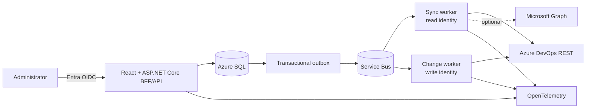

# Azure DevOps Access Manager — Implementation Plan

Status: planning gate complete; application implementation not started  
Plan date: 2026-08-26  
Authoritative product specification: [CURSOR-PLAN.md](CURSOR-PLAN.md)

## Executive summary

Build a read-first internal access-control application around a normalized,
generation-based Azure DevOps inventory. The product must answer what a person
can access, why, whether assignments are direct or group-derived, and whether a
proposed group migration preserves access.

Use a .NET 10 modular monolith with React and three separately deployed
composition roots:

- same-origin web/BFF/API with no Azure DevOps write credential
- background sync worker using a dedicated read identity
- non-public change worker using a separate narrowly privileged write identity

Azure SQL is authoritative; Service Bus carries job IDs through a transactional
outbox. Azure DevOps provider DTOs and token parsing stay behind adapters.

The first production release is read-only. The final MVP write slice is narrow:
join an existing native Azure DevOps group, add supported Project/Git Allow
bits, verify effective replacement, remove exact redundant direct user bits,
and verify again. Unknown, stale, lost, or unacknowledged expanded access stops
automation.

## Planning deliverables

- [x] Repository assessment
- [x] Current Azure DevOps API and authentication research
- [x] Endpoint/version/scope/paging/limitation mapping
- [x] Architecture and technology evaluation
- [x] Normalized data model
- [x] Synchronization design
- [x] Security namespace and effective-permission strategy
- [x] Direct-permission and recommendation algorithms
- [x] Migration, verification, and rollback pseudocode
- [x] Threat model and authorization design
- [x] Testing, local development, deployment, and operations plans
- [x] Phased agent-sized implementation checklist
- [ ] Phase 0 live capability evidence in a disposable Azure DevOps organization
- [ ] Stakeholder ratification of retention, SLO, RPO/RTO, residency, browser,
      and write-approval policy

Application code must not begin by guessing the two unchecked decisions. The
solution scaffold can begin while a sandbox is provisioned, but no real provider
write implementation can be enabled until its live evidence exists.

## Planning document map

| Required output | Location |
|---|---|
| Executive architecture, diagram, repository assessment | [ARCHITECTURE.md](ARCHITECTURE.md) |
| Azure DevOps API mapping and limitations | [AZURE-DEVOPS-API.md](AZURE-DEVOPS-API.md) |
| Authentication, authorization, threat model | [SECURITY.md](SECURITY.md) |
| Domain/data model | [DATA-MODEL.md](DATA-MODEL.md) |
| Sync and freshness | [SYNC-ENGINE.md](SYNC-ENGINE.md) |
| Namespace, effective permission, direct findings, recommendations | [PERMISSIONS-MODEL.md](PERMISSIONS-MODEL.md) |
| Migration, verification, concurrency, rollback | [MIGRATION-ENGINE.md](MIGRATION-ENGINE.md) |
| Testing strategy | [TESTING.md](TESTING.md) |
| Local fake-first workflow | [LOCAL-DEVELOPMENT.md](LOCAL-DEVELOPMENT.md) |
| Azure/Entra/Azure DevOps configuration and operations | [DEPLOYMENT.md](DEPLOYMENT.md) |
| Architecture decisions | [decisions/README.md](decisions/README.md) |

## Architecture at a glance

See [ARCHITECTURE.md](ARCHITECTURE.md) for runtime and dependency boundaries.

## Repository assessment

The repository began with only `README.md` and `docs/CURSOR-PLAN.md`. There is
no code, dependency graph, test harness, CI/CD, or infrastructure to preserve.
Planning can therefore select the current supported LTS rather than inherit the
specification's illustrative .NET 8 choice.

Use .NET 10 LTS: as of this plan date, .NET 8 support ends in November 2026 while
.NET 10 is supported through November 2028. Pin the SDK and servicing policy.

## API conclusions that shape the design

1. User Entitlements `7.1` is the stable primary entitled-user roster; Graph
   users/service principals supplement descriptors and authorization subjects.
2. A service principal cannot discover every accessible organization through a
   supported app-only API. Production organizations are explicitly registered.
3. Graph users/groups/memberships remain `7.1-preview.1`.
4. Projects, project teams, descriptor translation, security namespaces, ACLs,
   ACEs, Git repositories, Build, Environments, Service Endpoints, and Variable
   Groups have stable `7.1` APIs, but capability and permission visibility are
   caller-dependent.
5. Project and Git repository ACLs are the MVP permission namespaces.
6. Has Permissions evaluates the caller. Permissions Report is useful for
   supported Git cases, not every resource. There is no universal arbitrary-user
   effective-permission API.
7. Environment/ServiceEndpoint/Library use preview role APIs whose resource-key
   grammar is incompletely documented; defer their writes.
8. Azure DevOps Graph depth is one. Traverse direct edges with cycle/budget
   protection.
9. ACL list calls have no reliable paging. Query deterministic known Project and
   repository tokens instead of dumping entire namespaces.
10. Azure DevOps can return HTTP 200 with `Retry-After`; delay subsequent calls
    without repeating the successful request.

## Resolved specification questions

| # | Resolution |
|---:|---|
| 1 | Use User Entitlements `7.1` for the stable entitled-user roster, joined to Graph users/service principals for descriptors and all materialized authorization subjects. |
| 2 | Persist Graph descriptor, legacy IMS descriptor, storage-key GUID, origin, origin ID, tenant, and validity separately. Resolve through Graph Descriptor/Storage Key and IMS Read Identities APIs. |
| 3 | Entra-backed groups have `origin=aad`; `originId` normally correlates to the tenant-scoped Entra object ID. Azure DevOps only exposes materialized groups and cannot change directory membership. |
| 4 | A Core team is linked to its generated group/identity. Use one principal and membership graph. |
| 5 | MVP interpreters support Project and Git project/repository tokens. Build and role resources are post-MVP. |
| 6 | Each namespace has a tested token interpreter. Query namespace actions at runtime, preserve raw/unknown values, and never parse in UI/controllers. |
| 7 | Provider-computed evidence is partial. Use ACL extended info and Git Permissions Report where exact contracts apply; otherwise use tested local interpretation with authority/completeness, or Unknown. |
| 8 | At the same applicable resource level, group Deny generally overrides Allow; explicit child scope can override inherited parent scope. Delegate exact precedence to a namespace interpreter and block unsupported admin/system cases. |
| 9 | Traverse direct Graph membership edges iteratively with visited set and depth/node/edge/query limits. Optional Entra graph has separate provenance. |
| 10 | Direct means a stored, nonzero ACE bit on the selected user's exact legacy descriptor at an exact token. Resource inheritance and group derivation are separate axes. |
| 11 | After sandbox proof, automate native ADO membership and exact supported Project/Git ACE-bit operations only. Do not automate Entra membership, Deny migration, system bits, or underdocumented roles. |
| 12 | Verify stored membership/ACE state, unrelated-bit preservation, recomputed target-user access, approved gains, and existing-group cohort impact using live reads; use Git Permissions Report where supported. |
| 13 | Exact least privilege is a Phase 0 empirical result. Separate scopes, organization membership/license, groups, and resource ACLs all apply. Never use broad `user_impersonation` or PCA by default. |
| 14 | Yes. Web, sync/read, and change/write identities are separate; the web/sync runtimes cannot obtain the write identity. |
| 15 | Correlate using organization + storage key and tenant + origin/originId with identifier history; never email. |
| 16 | Plans bind generation/evaluator hashes and expire. Execution performs a live full affected-state preflight and exact per-operation precondition reads. |
| 17 | Adapt to TSTU limits, delayed HTTP 200, HTTP 429, all documented rate headers, bounded concurrency, jitter, and stage checkpoints. |
| 18 | Graph users/groups/memberships/service principals, security roles, pipeline permissions, and organization-wide team list are preview dependencies. Avoid the team preview by enumerating projects. |
| 19 | Do not automate ambiguous Deny/admin/system behavior, unsupported resource roles, Entra changes, cross-tenant setup, secret-bearing resource restoration, or guaranteed rollback. |
| 20 | Stop on disabled gates, invalid approval, protected target, stale/partial/changed state, unresolved/unknown input, any loss, unacknowledged expansion/cohort impact, failed audit, ambiguous response, or failed/inconclusive verification. |

## MVP boundary

### Included

- explicitly configured Azure DevOps organizations
- entitled users, service principals, groups, teams, direct memberships
- projects and repositories
- Project and repository-level Git permissions
- user/group/project explorer, search, matrix, and access paths
- direct user permission findings and risk
- nested native-group traversal and visible Entra coverage limitations
- existing-group recommendations based on permission simulation
- target-user before/after and existing-group cohort impact
- immutable dry-run plans, expiry, two-person approval, audit, freshness
- narrow flagged membership/Project/Git Allow and direct-bit operations
- fake provider and Contoso E2E experience

### Explicitly excluded

- automatic app-identity organization discovery
- Entra membership writes or broad Microsoft Graph requirement
- new group creation
- automatic direct Deny migration/removal
- protected/system/admin targets
- branch permissions
- Build, Pipeline, Environment, ServiceEndpoint, Variable Group, Library writes
- bulk execution
- stale-access removal based only on last-access timestamp
- universal/guaranteed effective access or rollback

Read-only inventory and analysis ship before the narrow write slice.

## Cross-cutting definition of done

Every implementation task is done only when:

- code follows documented module/credential boundaries
- behavior, errors, freshness, and limitations are exposed through stable APIs
- organization-scoped authorization and negative tests pass
- no raw provider DTO or secret-bearing field crosses its adapter
- tests include success, partial/forbidden, throttled, and unknown cases as
  applicable
- telemetry is present, bounded, and redaction-tested
- docs/OpenAPI/runbook are updated
- dependencies are locked/scanned and no critical vulnerability is introduced
- implementation is verified with fake provider; live proof is additionally
  required before a real provider mutation can be enabled

## Phase 0 — Decisions and live API proof

Goal: remove unsupported assumptions before provider code and ratify operational
requirements.

Dependencies: disposable Azure DevOps organization/project/repository and Entra
tenant administration.

### [x] P0.1 Complete API capability map

- **Files:** `docs/AZURE-DEVOPS-API.md`
- **Interfaces:** planned `IProviderCapabilityService`
- **Behavior:** identifies endpoint, host, version, auth scope, paging, read/write,
  and limitation for every MVP fact/operation.
- **Tests:** documentation link/version review.
- **Done:** every MVP data source is mapped and unsupported behavior is explicit.

### [x] P0.2 Ratify architecture and safety model

- **Files:** all planning docs and `docs/decisions/*`
- **Interfaces:** planned runtime/provider boundaries.
- **Behavior:** selects .NET 10, modular monolith, Azure SQL, separate workers/
  identities, generation sync, permission authority, and narrow writes.
- **Tests:** cross-document requirements review.
- **Done:** no contradictory architecture or missing original-plan output.

### [ ] P0.3 Provision and record sandbox capabilities

- **Files:** `tools/capability-probe/*`, sanitized evidence schema, runbook;
  never commit credentials/raw tenant data.
- **Interfaces:** `IProviderCapabilityProbe`, `ProviderCapability`.
- **Behavior:** validates managed-identity/service-principal auth, read coverage,
  versions, descriptor translation, namespace/actions, exact tokens, and
  permission-trimmed behavior.
- **Tests:** live read probe plus negative least-privilege cases.
- **Done:** signed/reviewed evidence exists for read identity and every MVP read
  endpoint.

### [ ] P0.4 Prove exact sandbox write primitives

- **Files:** capability probe and `docs/runbooks/provider-capability.md`.
- **Interfaces:** proof implementation only; no production executor yet.
- **Behavior:** on disposable targets, add/read/remove membership and harmless
  Project/Git bit while preserving unrelated/unknown bits.
- **Tests:** idempotent repeat, timeout/reconcile, outside-scope denial.
- **Done:** exact identity rights, request/response behavior, propagation, and
  cleanup are recorded; otherwise the write is removed from MVP.

### [ ] P0.5 Ratify nonfunctional policy

- **Files:** architecture/deployment/security decisions.
- **Interfaces:** configuration policy records.
- **Behavior:** records SLO, RPO/RTO, region/residency, retention/legal hold,
  browser support, accessibility, plan expiry, operation limits, and approval
  ownership.
- **Tests:** review checklist and restore/accessibility test plans.
- **Done:** named owners approve values; placeholders are not shipped.

Acceptance: implementation has no unresolved MVP endpoint, token, identity, or
policy assumption. Phase 1 can begin before P0.3/P0.4 completes, but phases 3/8
respect those gates.

## Phase 1 — Engineering foundation

Goal: deployable authenticated shell with enforced project boundaries and no
Azure DevOps integration.

Dependencies: P0.2; P0.5 values may initially be configuration placeholders.

### [ ] P1.1 Create solution and dependency boundaries

- **Files:** `AccessManager.slnx`, `global.json`, `Directory.*.props`,
  `src/AccessManager.{Domain,Application,Infrastructure,Api}`,
  `src/AccessManager.Workers.{Sync,Change}`, provider projects, architecture tests.
- **Interfaces:** composition roots only.
- **Behavior:** pins .NET 10 and permits only documented project references.
- **Tests:** architecture tests reject Domain framework/provider references,
  provider DTO leakage, and mutation provider composition in API/sync.
- **Done:** restore/build/test succeeds and forbidden-reference tests fail when
  intentionally violated.

### [ ] P1.2 Create React application and shared UI foundation

- **Files:** `src/AccessManager.Web/*`, package/TypeScript/Vite/ESLint configs.
- **Interfaces:** generated API-client seam, design tokens, route shell.
- **Behavior:** React/Fluent UI shell with error boundary, routing, responsive
  layout, and accessibility baseline.
- **Tests:** build, lint, component smoke, axe, keyboard navigation.
- **Done:** shell is served same-origin and contains no provider token logic.

### [ ] P1.3 Define HTTP contract foundation

- **Files:** API middleware/options/OpenAPI, generated client tooling.
- **Interfaces:** `/api/v1`, `ProblemDetails`, cursor page, freshness/coverage,
  command/idempotency contracts.
- **Behavior:** RFC 9457 errors, correlation IDs, bounded opaque paging, UTC,
  versioning, ETag for app-owned mutable resources.
- **Tests:** contract snapshots, invalid cursor/filter, safe errors, generated
  client compilation.
- **Done:** web consumes only generated/typed API contracts.

### [ ] P1.4 Implement app authentication and authorization shell

- **Files:** API/BFF auth, policies, app role/scope model, Web session/CSRF.
- **Interfaces:** `ICurrentActor`, `IAuthorizationScopeService`.
- **Behavior:** Entra OIDC BFF session, assignment required, independent scoped
  roles, anti-CSRF; fake auth only in Development/Test.
- **Tests:** full role/scope matrix, IDOR, CSRF, session/cookie, production fake
  auth rejection.
- **Done:** every route is deny-by-default and cross-org negative tests pass.

### [ ] P1.5 Add observability and health

- **Files:** OpenTelemetry, redaction, health/readiness, safe logging conventions.
- **Interfaces:** activity/metric names and `IClock`.
- **Behavior:** traces API/worker/SQL/outbox; health omits sensitive details.
- **Tests:** telemetry snapshot contains no token/email/descriptor/raw body.
- **Done:** local trace correlation works and redaction tests pass.

### [ ] P1.6 Add CI, dependency, and supply-chain controls

- **Files:** `.github/workflows/*`, lockfiles, scan configs, `eng/*`.
- **Interfaces:** root format/lint/test/build commands.
- **Behavior:** reproducible restore, tests, SAST/SCA/secret/IaC scans, SBOM,
  signed artifact path, GitHub OIDC deployment.
- **Tests:** clean clone pipeline and intentional policy-failure fixtures.
- **Done:** green required CI with no long-lived deployment secret.

Acceptance: authenticated same-origin shell builds and deploys; API has no Azure
DevOps credential or implementation.

## Phase 2 — Domain, SQL, and fake provider

Goal: production-shaped normalized model and a complete offline Contoso
experience.

Dependencies: Phase 1.

### [ ] P2.1 Implement identities, groups, teams, and memberships

- **Files:** Domain entities/value types, EF mappings/migrations/repositories.
- **Interfaces:** `IPrincipalRepository`, `IMembershipRepository`.
- **Behavior:** typed external identifiers/history, team-to-group link, direct
  edges, organization-scoped constraints.
- **Tests:** remap history, unique edges, team graph, cross-org FK/query denial.
- **Done:** model matches `DATA-MODEL.md` and SQL Server integration tests pass.

### [ ] P2.2 Implement resources and security facts

- **Files:** Resource, Namespace, Action, ACL, ACE, role model and EF mappings.
- **Interfaces:** `IResourceRepository`, `IPermissionFactRepository`.
- **Behavior:** preserves raw tokens, masks, unknown bits, generations, and
  provenance without provider DTOs.
- **Tests:** maximum masks, unknown token/action, synthetic/all-zero ACE,
  generation uniqueness.
- **Done:** round-trip persistence is lossless for known/unknown facts.

### [ ] P2.3 Implement sync operational model and outbox

- **Files:** generation/run/stage/checkpoint/issue/outbox entities, SQL dispatcher.
- **Interfaces:** `ISyncRunRepository`, `IGenerationPublisher`,
  `IOutboxWriter/Dispatcher`.
- **Behavior:** page-boundary checkpoints and atomic stage publication; partial
  run retains prior active generation.
- **Tests:** crash/transaction/duplicate/partial-stage/tombstone cases.
- **Done:** no failure path publishes false empty authority.

### [ ] P2.4 Implement plan, execution, approval, and audit schema

- **Files:** migration/audit entities, mappings, database roles/constraints.
- **Interfaces:** plan/execution/audit repositories.
- **Behavior:** immutable versions/hashes, rowversion, distinct approval,
  append-only audit/hash chain.
- **Tests:** mutation denial on audit rows, approval uniqueness, plan edit/hash,
  optimistic concurrency.
- **Done:** SQL enforces core invariants in addition to application code.

### [ ] P2.5 Define provider abstractions and capability model

- **Files:** Application provider contracts and normalized DTOs.
- **Interfaces:** `IAccessInventoryProvider`, `IAccessMutationProvider`,
  `IProviderCapabilityService`.
- **Behavior:** typed pages/errors/rate observations, explicit read/write support,
  no raw URLs or generic “execute request”.
- **Tests:** provider contract kit and mutation composition architecture tests.
- **Done:** fake/live providers can share contracts without leaky abstractions.

### [ ] P2.6 Build deterministic fake provider and Contoso seed

- **Files:** `Providers.Fake`, seed/scenario/fault definitions.
- **Interfaces:** both provider interfaces and controllable fake clock/faults.
- **Behavior:** required users/projects/groups/teams/nesting/ACLs/denies/unknowns,
  mutable state, paging, throttling, eventual consistency, concurrent changes.
- **Tests:** provider contract suite and deterministic reset.
- **Done:** all planned read/write safety scenarios run without network access.

### [ ] P2.7 Add production startup guards

- **Files:** composition/config validation in API and workers.
- **Interfaces:** environment/provider options validators.
- **Behavior:** rejects fake/PAT/SQLite/unsafe write config in production.
- **Tests:** matrix of environment/provider/gates.
- **Done:** no mislabeled production process starts with unsafe mode.

Acceptance: fake provider syncs normalized Contoso data through SQL; no live
Azure DevOps dependency.

## Phase 3 — Read-only Azure DevOps sync

Goal: repeatable, transparent inventory with no false deletions.

Dependencies: Phase 2 and P0.3 read capability evidence.

### [ ] P3.1 Implement endpoint-specific auth and clients

- **Files:** `Providers.AzureDevOps/Auth`, typed clients for Entitlements, Core,
  Graph, IMS, Git, Security.
- **Interfaces:** internal typed clients behind `IAccessInventoryProvider`.
- **Behavior:** managed identity production, pinned versions/hosts, opaque tokens,
  no body logging.
- **Tests:** host/version/auth/header/redaction fixtures; production PAT rejection.
- **Done:** every client is capability-mapped and DTOs stay internal.

### [ ] P3.2 Implement paging, throttling, and error policy

- **Files:** provider paging/resilience/rate limiter.
- **Interfaces:** `IContinuationStrategy`, `IRateLimitCoordinator`.
- **Behavior:** endpoint-specific continuation, delayed 200, 429, bounded safe
  read retry, no generic mutation retry.
- **Tests:** all continuation/error cases in `TESTING.md`.
- **Done:** no duplicate/skipped page under fixed fixture scenarios.

### [ ] P3.3 Sync projects and entitlement/principal identities

- **Files:** sync stage handlers and normalizers.
- **Interfaces:** stage runner, identifier resolver.
- **Behavior:** projects, entitlements, users, service principals, groups,
  descriptor translation/history.
- **Tests:** permission-trimmed/forbidden/partial, relink/unresolved.
- **Done:** roster coverage and limitations are explicit.

### [ ] P3.4 Sync memberships and teams

- **Files:** membership/team stages and closure builder.
- **Interfaces:** `IMembershipGraphService`.
- **Behavior:** direct depth-one edges, project team/group correlation,
  cycles/budgets/completeness.
- **Tests:** random graphs, partial Entra, cycles/limits, team mapping.
- **Done:** every path has provenance and partial traversal cannot appear complete.

### [ ] P3.5 Sync repositories, namespace schema, and exact ACL tokens

- **Files:** repository/namespace/Project ACL/Git ACL stages.
- **Interfaces:** namespace registry and token builders.
- **Behavior:** inventories repos, discovers action schema, queries known tokens,
  retains unknown bits and drift.
- **Tests:** exact tokens, no unbounded namespace dump, schema drift.
- **Done:** complete active Project/Git fact generations publish atomically.

### [ ] P3.6 Add scheduler, targeted refresh, and operational UI/API

- **Files:** sync worker scheduling/queues, admin API/UI, runbook.
- **Interfaces:** `ISyncScheduler`, `ITargetedRefreshService`.
- **Behavior:** jitter, coalescing, leases, checkpoints, DLQ, organization/
  project/user/resource refresh, freshness/coverage/issues.
- **Tests:** duplicate jobs, worker crash, stale token restart, targeted no-global
  deletion.
- **Done:** operators can diagnose/recover every partial stage safely.

Acceptance: repeated sandbox syncs are idempotent, show freshness, and never turn
403/partial data into an empty inventory.

## Phase 4 — Project/Git permission engine

Goal: explain supported access and direct assignments with explicit authority.

Dependencies: Phase 3.

### [ ] P4.1 Implement namespace registry and schema drift gates

- **Files:** Domain/Application namespace contracts and provider interpreters.
- **Interfaces:** `ISecurityNamespaceInterpreter/Registry`.
- **Behavior:** selects only tested namespace/schema/token/action capabilities.
- **Tests:** unknown namespace/action/system bits and drift invalidation.
- **Done:** generic discovery never silently enables interpretation/write.

### [ ] P4.2 Implement Project token interpreter

- **Files:** Azure DevOps Project interpreter.
- **Interfaces:** interpreter methods in `PERMISSIONS-MODEL.md`.
- **Behavior:** root/project tokens, action decode, ancestors, risk, unsupported
  internal actions.
- **Tests:** token round trip, exact/inherited Allow/Deny, malformed/reserved.
- **Done:** representative sandbox result matches provider/UI evidence.

### [ ] P4.3 Implement Git project/repository interpreter

- **Files:** Git interpreter.
- **Interfaces:** same namespace contract.
- **Behavior:** project/repository tokens; branch tokens preserved as unsupported.
- **Tests:** token/mask/property tests, obsolete Administer, inheritance.
- **Done:** representative sandbox and Permissions Report cases agree or surface
  explicit Unknown/drift.

### [ ] P4.4 Implement effective evaluation and access paths

- **Files:** Application access evaluator/path builder.
- **Interfaces:** `IAccessAnalysisService`.
- **Behavior:** combines complete memberships, token hierarchy, provider evidence,
  constraints, authority, bounded explanations.
- **Tests:** precedence matrix, nested paths, partial/unknown, provider
  disagreement.
- **Done:** Unknown is never coerced and all outputs include authority/coverage.

### [ ] P4.5 Implement direct findings and risk

- **Files:** finding detector/classifier/read models.
- **Interfaces:** `IDirectPermissionFindingService`.
- **Behavior:** stored user ACE bits only; direct Deny/admin/unknown/broad risk.
- **Tests:** synthetic/all-zero/group ACE exclusion, unresolved/high-risk.
- **Done:** every finding links to exact evidence and no false redundancy claim.

Acceptance: a selected user's supported Project/Git access and source are
explainable; uncertain cases are visibly Unknown.

## Phase 5 — Read-only product experience

Goal: answer the core inventory questions without loading enterprise data into
browser memory.

Dependencies: Phase 4.

### [ ] P5.1 Build global search

- **Files:** indexed query service, `/api/v1/search`, React search.
- **Interfaces:** search result/cursor contracts.
- **Behavior:** user/email/group/team/project/repository search with scoped
  server paging; email opens user graph quickly.
- **Tests:** auth scope, paging, special chars, large data, accessibility.
- **Done:** bounded low-latency representative queries and no cross-org leakage.

### [ ] P5.2 Build User Explorer

- **Files:** user query/API/routes/components.
- **Interfaces:** user access summary/tree/evidence contracts.
- **Behavior:** projects/groups/teams/resources/actions, source, paths, outcome,
  authority, freshness, constraints.
- **Tests:** all outcome/coverage states, Playwright Evan flow, a11y.
- **Done:** primary “what/why/direct/group” questions are answerable.

### [ ] P5.3 Build Group and Project Explorers

- **Files:** group/project query/API/routes/components.
- **Interfaces:** group/project detail and reverse lookup contracts.
- **Behavior:** members/nesting/teams/projects/resources/permissions and reverse
  paths with server paging.
- **Tests:** empty/nested/Entra/system groups, large projects, scope auth.
- **Done:** user/group/project perspectives link consistently.

### [ ] P5.4 Build permission matrix and direct report

- **Files:** query/read models, API, TanStack table/filter UI.
- **Interfaces:** server sort/filter/cursor/export contracts.
- **Behavior:** direct/inherited/deny/admin filters, risk/status, bounded CSV.
- **Tests:** query plans, filters, CSV injection/limits, virtualization.
- **Done:** no organization-wide client load and exact findings are inspectable.

### [ ] P5.5 Build access graph and accessible equivalent

- **Files:** graph adapter/layout, semantic tree/table.
- **Interfaces:** bounded graph page/expansion contract.
- **Behavior:** progressive nodes/edges, path highlighting, 500/1,000 initial
  ceiling, keyboard/screen-reader equivalent.
- **Tests:** cycles/truncation, reduced motion, keyboard/axe, browser memory.
- **Done:** graph never becomes the only way to consume access information.

### [ ] P5.6 Build actionable overview and freshness UX

- **Files:** dashboard/read models, refresh/status components.
- **Interfaces:** issue counts/trends and refresh job contracts.
- **Behavior:** direct/admin/deny/orphan/empty/nested/cross-project problems, not
  generic BI; visible stale/partial/unsupported states.
- **Tests:** no-data/degraded/forbidden, targeted refresh job.
- **Done:** dashboard entries lead to actionable filtered evidence.

Acceptance: the complete read-only MVP works with fake data and validated
sandbox data, with WCAG 2.2 AA baseline.

## Phase 6 — Recommendations and dry-run planning

Goal: simulate migrations without any provider write capability.

Dependencies: Phase 5.

### [ ] P6.1 Implement immutable access snapshots/comparison

- **Files:** Domain comparison/value objects and persistence.
- **Interfaces:** `IAccessComparisonService`.
- **Behavior:** captures generation/evaluator versions and classifies SAME,
  GAINED, LOST, CHANGED, CHANGED_SOURCE, UNKNOWN.
- **Tests:** all transitions/materiality, deterministic serialization.
- **Done:** snapshots are reproducible and Unknown/loss is blocking.

### [ ] P6.2 Implement recommendation engine

- **Files:** candidate/simulation/ranking services.
- **Interfaces:** `IGroupRecommendationService`.
- **Behavior:** permission-based coverage, missing/gained access, support,
  operations, group cohort blast radius; no name scoring.
- **Tests:** ranking, protected/system exclusion, incomplete/cohort cases.
- **Done:** recommendations explain score and rejection reasons.

### [ ] P6.3 Implement migration planner and validation

- **Files:** plan builder/validator/canonicalizer/hash persistence.
- **Interfaces:** `IMigrationPlanner`, `IMigrationValidator`.
- **Behavior:** exact typed operations, dependencies, preconditions, captured
  state, inverse/manual reason, expiry/hash.
- **Tests:** all safety matrix cases and deterministic hash.
- **Done:** no provider mutation dependency is composed into planning.

### [ ] P6.4 Build plan preview

- **Files:** plan API/routes/components.
- **Interfaces:** comparison/operation/warning/acknowledgement contracts.
- **Behavior:** gains/losses/unknowns/source changes/cohort impact, adds/removals,
  estimated API calls, limitations, plan expiry.
- **Tests:** acknowledgement and inaccessible/stale/expired states, a11y.
- **Done:** an administrator can see exactly what would change before approval.

Acceptance: complete dry-run value exists while all real mutation calls are
architecturally unavailable.

## Phase 7 — Audit, approval, and write safety gates

Goal: make disabled writes provably safe before implementing provider mutation.

Dependencies: Phase 6.

### [ ] P7.1 Implement append-only audit and immutable export

- **Files:** audit writer/store/export worker/monitoring.
- **Interfaces:** `IAuditWriter`, `IAuditExporter`.
- **Behavior:** pre-call attempt event, hash chain, separately protected export,
  redacted safe state.
- **Tests:** update/delete denied, export lag/failure, crash gap recovery.
- **Done:** audit failure prevents provider mutation.

### [ ] P7.2 Implement plan approval and separation of duties

- **Files:** approval commands/API/UI/policies.
- **Interfaces:** `IPlanApprovalService`.
- **Behavior:** different human, scoped role, exact hash/expansion/expiry, edit
  invalidation.
- **Tests:** requester self-approval, stale role/scope, hash replay, CSRF.
- **Done:** only one exact current plan is approved.

### [ ] P7.3 Implement multilayer write gates and protected targets

- **Files:** config validators, API/Application/worker/provider policies.
- **Interfaces:** `IWriteGate`, `IProtectedTargetPolicy`.
- **Behavior:** static/global/org/operation/capability allow; failure closed.
- **Tests:** full gate matrix and mid-execution disable.
- **Done:** deliberately disabled deployment cannot invoke a provider mutation.

### [ ] P7.4 Implement leases, execution skeleton, and InDoubt reconciliation

- **Files:** change worker state machine/leases/attempt orchestration.
- **Interfaces:** `IMigrationExecutor`, `IOperationReconciler`.
- **Behavior:** reloads SQL intent, checks approval/live preflight, serializes org,
  audits transitions; mutation provider remains test/fake only.
- **Tests:** duplicate delivery, crash at every state, stale baseline, timeout.
- **Done:** deterministic fake execution/recovery follows documented states.

Acceptance: security can prove no real mutation occurs without all gates, audit,
approval, and live preflight.

## Phase 8 — Narrow controlled writes

Goal: add the smallest safe provider mutation path.

Dependencies: Phase 7, P0.4, sandbox sign-off.

### [ ] P8.1 Implement native Azure DevOps membership add

- **Files:** Azure DevOps mutation client/provider and exact-edge verifier.
- **Interfaces:** `IAccessMutationProvider.AddMembership`.
- **Behavior:** native group only, precheck, NO_CHANGE, single call, reconcile
  ambiguous result, read-back.
- **Tests:** idempotency, outside-scope/protected/Entra denial, timeout.
- **Done:** sandbox add/read/remove cleanup and least privilege pass.

### [ ] P8.2 Implement additive supported group Allow bits

- **Files:** Project/Git mutation adapters.
- **Interfaces:** `AddPermissionBits`.
- **Behavior:** exact allowlisted bits, preserves current/unknown/unrelated masks,
  second precondition read, no generic retry.
- **Tests:** concurrent change, merge/replace semantics, unknown-bit preservation.
- **Done:** sandbox exact bit is added and verified without collateral change.

### [ ] P8.3 Implement replacement verification barrier

- **Files:** live verifier/scheduled convergence.
- **Interfaces:** `IMigrationVerifier.VerifyReplacement`.
- **Behavior:** membership/ACE/read-back, target-user access, approved gains,
  cohort comparison, optional Git report.
- **Tests:** delayed visibility, mismatch, Unknown, timeout.
- **Done:** no direct-removal state is reachable on failed/inconclusive proof.

### [ ] P8.4 Implement exact redundant direct-bit removal

- **Files:** Remove Permission adapter and operation policy.
- **Interfaces:** `RemovePermissionBits`.
- **Behavior:** selected user Allow bits only, live precondition, unrelated-bit
  preservation, direct Deny excluded.
- **Tests:** selected/unselected masks, race, already removed, timeout.
- **Done:** sandbox operation changes only the approved exact bit.

### [ ] P8.5 Implement final verification and compensation

- **Files:** final verifier, immediate restoration, rollback planner/UI.
- **Interfaces:** `VerifyFinal`, `GenerateRollback`.
- **Behavior:** verifies no loss/unapproved gain and direct removal; restores
  captured access on failure; rollback is newly previewed/approved.
- **Tests:** partial removal, compensation success/failure/change, ownership.
- **Done:** all safety matrix/crash points pass fake and sandbox.

### [ ] P8.6 Conduct limited pilot

- **Files:** deployment flags, runbooks, capability/audit evidence (no sensitive
  tenant data in repo).
- **Interfaces:** operational process.
- **Behavior:** one org/project, low operation cap, two-person approval,
  monitored post-change review.
- **Tests:** kill switch, identity disablement, `InDoubt`, partial application.
- **Done:** formal review authorizes or rejects broader rollout.

Acceptance: no direct user bit can be removed until live replacement is verified;
all provider attempts are audited and recoverable to a safe/manual state.

## Phase 9 — Production hardening

Goal: operate read-only and later narrow writes with recoverability and support.

Dependencies: phases required for selected release boundary.

### [ ] P9.1 Complete production IaC and network isolation

- **Files:** `infra/bicep/*`, policy/what-if workflows.
- **Interfaces:** environment outputs only.
- **Behavior:** private dependencies, WAF, no worker ingress, separate identities,
  diagnostics/budgets.
- **Tests:** IaC lint/policy, network/RBAC negative probes.
- **Done:** repeatable staging/production deployment with no secrets.

### [ ] P9.2 Implement safe database delivery

- **Files:** migration job and expand/migrate/contract runbook.
- **Interfaces:** schema version/readiness.
- **Behavior:** backward-compatible rolling changes and resumable backfills.
- **Tests:** representative migration duration/locks, restore/forward-fix.
- **Done:** API startup never auto-mutates production schema.

### [ ] P9.3 Define and validate SLO/capacity/cost

- **Files:** dashboards/alerts/performance baselines.
- **Interfaces:** health/readiness/metrics.
- **Behavior:** measured freshness, API, queue, SQL, graph/table, and provider
  budgets.
- **Tests:** load/soak/chaos against representative scale.
- **Done:** approved numeric targets pass and costs have alerts.

### [ ] P9.4 Complete privacy, audit, accessibility, and security review

- **Files:** policy/config/runbooks/evidence.
- **Interfaces:** retention/export/pseudonymization jobs.
- **Behavior:** approved retention/residency, WCAG 2.2 AA, penetration test,
  audit ownership, incident response.
- **Tests:** deletion/retention, telemetry leak, a11y/manual, pen test.
- **Done:** owners sign off all security/privacy/accessibility findings.

### [ ] P9.5 Prove backup and regional recovery

- **Files:** DR runbook and automation.
- **Interfaces:** recovery status/gates.
- **Behavior:** restore SQL/audit/config/artifacts, reconcile outbox/queues, start
  read-only, expire stale plans.
- **Tests:** isolated restore and approved regional exercise.
- **Done:** approved RPO/RTO is demonstrated, not assumed.

Acceptance: production read-only release is supportable; write pilot additionally
requires Phase 8 and all mutation runbooks/alerts.

## Phase 10 — Post-MVP capabilities

Each item is a separate capability proof, interpreter, tests, and feature gate:

- [ ] Build/pipeline namespace read/analysis, then separately evaluated writes
- [ ] Environment role inventory and effective-access limitations
- [ ] ServiceEndpoint role inventory without authorization secret ingestion
- [ ] Variable Group/Library role inventory without variable values
- [ ] Pipeline-to-resource authorization as a distinct model
- [ ] optional read-only Microsoft Graph Entra membership enrichment
- [ ] branch-level Git token interpreter
- [ ] native group creation with ownership/naming/lifecycle policy
- [ ] bulk planning, followed by separately designed bulk execution
- [ ] governance trends/anomalies and stale-access context with authoritative
      activity evidence
- [ ] Azure AI Search/distributed cache only after measured need

No generic “enable all namespaces” milestone exists.

## Key risks and mitigations

| Risk | Plan treatment |
|---|---|
| App identity cannot discover organizations | Explicit registry and validation |
| Preview Graph APIs | Isolated versioned adapters, contract tests, capability degradation |
| No universal effective API | Authority/completeness labels, namespace interpreters, Unknown stops |
| Membership/Entra incompleteness | Direct traversal, optional provider, visible coverage |
| ACL volume/no paging | Deterministic known-token queries |
| No universal conditional writes | Live baseline/preconditions/read-back and one org execution |
| Rate/throttling | TSTU-aware adaptive concurrency and checkpoints |
| Eventual consistency | Bounded scheduled verification; keep original access |
| Descriptor remap | Typed identifier history, never email key |
| Group permission blast radius | Existing-member cohort simulation/approval |
| Secret-bearing resources | Metadata allowlists; no raw DTO/body persistence |
| Incomplete role API contracts | Post-MVP read-only/proof before writes |
| Rollback conflict | New preview/preconditions; manual-only is explicit |
| Compromised web tier | No Azure DevOps write credential; worker revalidation |
| Audit tampering | Append-only store/hash chain and separate immutable export |

## Required configuration before production

### Entra

- assigned single-tenant app, redirect URIs, app roles
- CA/MFA and PIM for privileged groups
- distinct web/read/write identities
- optional Graph consent disabled for MVP

### Azure DevOps per organization

- explicit organization registration
- read/write identities added/licensed directly
- custom least-privilege groups and resource permissions
- protected targets
- sandbox resources and capability evidence

### Azure

- Front Door/WAF, App Service, Container Apps
- Azure SQL, Service Bus, Key Vault, App Configuration
- immutable audit storage, Application Insights/Log Analytics
- private endpoints/DNS, ACR
- environment separation and GitHub OIDC deployment

See [DEPLOYMENT.md](DEPLOYMENT.md) for the complete checklist.

## Recommended first implementation slice

Start with P1.1–P1.6 and P2.1–P2.7. This creates enforceable architecture,
production-shaped SQL, and the fake Contoso provider before external API access.
In parallel, complete P0.3 read capability evidence. Then implement Phase 3
endpoint by endpoint with contract fixtures rather than beginning with UI or
mutations.

The first user-visible milestone is Phase 5 read-only. The write identity,
change provider, and production write flags remain absent/disabled until Phases
6–8 and their sandbox evidence are complete.
