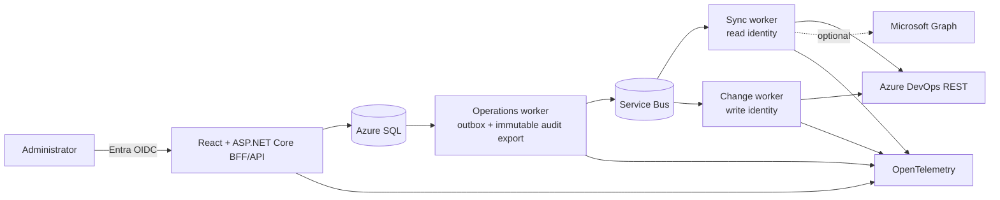

# Azure DevOps Access Manager — Implementation Plan

Status: design package complete; Phase 0 live capability and policy gates open
Plan date: 2026-08-26  
Authoritative product specification: [CURSOR-PLAN.md](CURSOR-PLAN.md)

## Executive summary

Build a read-first internal access-control application around a normalized,
generation-based Azure DevOps inventory. The product must answer what a person
can access, why, whether assignments are direct or group-derived, and whether a
proposed group migration preserves access.

Use a .NET 10 modular monolith with the frontend stack finalized by the P0.6
spike (React is the current candidate) and four separately deployed
composition roots:

- same-origin web/BFF/API with no Azure DevOps write credential
- operations worker for outbox dispatch and immutable audit export, with no
  Azure DevOps identity
- background sync worker using a dedicated read identity
- non-public change worker using a separate narrowly privileged write identity

Azure SQL is authoritative; Service Bus carries job IDs through a transactional
outbox. Azure DevOps provider DTOs and token parsing stay behind adapters.

The first production release is read-only. The final MVP write slice is narrow:
join an existing native Azure DevOps group, add explicitly allowlisted
Project/Git Allow bits when group-governance rules permit, verify a
direct-bit-suppressed counterfactual, remove exact redundant direct user bits,
and verify again. Exact inverse primitives restore those bits; additive cleanup
is always a ManualOnly preview/external action in MVP because causal ownership
cannot be proven. Unknown, stale, lost, or unacknowledged expanded access stops
automation.

## Planning deliverables

- [x] Repository assessment
- [x] Current Azure DevOps API and authentication research
- [x] Endpoint/version/scope/paging/limitation mapping
- [x] Architecture and technology evaluation
- [x] Normalized data model
- [x] Synchronization design
- [x] Security namespace and effective-permission strategy
- [x] Direct-permission and recommendation algorithms
- [x] Migration, verification, and rollback pseudocode
- [x] Threat model and authorization design
- [x] Testing, local development, deployment, and operations plans
- [x] Phased agent-sized implementation checklist
- [ ] Phase 0 live capability evidence in a disposable Azure DevOps organization
- [ ] Stakeholder ratification of retention, SLO, RPO/RTO, residency, browser,
      and write-approval policy

Phase 0 is implementation work, not a claim that the two unchecked decisions
are already resolved. The solution scaffold can begin while a sandbox is
provisioned, but real Azure DevOps provider work must follow the recorded
capability evidence and no production release can use unratified policy values.

## Planning document map

| Required output | Location |
|---|---|
| Executive architecture, diagram, repository assessment | [ARCHITECTURE.md](ARCHITECTURE.md) |
| Azure DevOps API mapping and limitations | [AZURE-DEVOPS-API.md](AZURE-DEVOPS-API.md) |
| Authentication, authorization, threat model | [SECURITY.md](SECURITY.md) |
| Domain/data model | [DATA-MODEL.md](DATA-MODEL.md) |
| Sync and freshness | [SYNC-ENGINE.md](SYNC-ENGINE.md) |
| Namespace, effective permission, direct findings, recommendations | [PERMISSIONS-MODEL.md](PERMISSIONS-MODEL.md) |
| Migration, verification, concurrency, rollback | [MIGRATION-ENGINE.md](MIGRATION-ENGINE.md) |
| Testing strategy | [TESTING.md](TESTING.md) |
| Local fake-first workflow | [LOCAL-DEVELOPMENT.md](LOCAL-DEVELOPMENT.md) |
| Azure/Entra/Azure DevOps configuration and operations | [DEPLOYMENT.md](DEPLOYMENT.md) |
| Architecture decisions | [decisions/README.md](decisions/README.md) |

## Architecture at a glance

See [ARCHITECTURE.md](ARCHITECTURE.md) for runtime and dependency boundaries.

## Repository assessment

The repository began with only `README.md` and `docs/CURSOR-PLAN.md`. There is
no code, dependency graph, test harness, CI/CD, or infrastructure to preserve.
Planning can therefore select the current supported LTS rather than inherit the
specification's illustrative .NET 8 choice.

Use .NET 10 LTS: as of this plan date, .NET 8 support ends in November 2026 while
.NET 10 is supported through November 2028. Pin the SDK and servicing policy.

## API conclusions that shape the design

1. User Entitlements `7.1` is the stable primary human-user roster; Graph
   users/service principals supplement authorization subjects. Service-principal
   entitlement is a separate preview per-ID lookup with no documented list API.
2. A service principal cannot discover every accessible organization through a
   supported app-only API. Production organizations are explicitly registered.
3. Graph users/groups/service principals/memberships and Subject Lookup remain
   `7.1-preview.1`; descriptor/storage-key translation and IMS identities are
   stable `7.1`.
4. Projects, project teams, descriptor translation, security namespaces, ACLs,
   ACEs, Git repositories, Build, Environments, Service Endpoints, and Variable
   Groups have stable `7.1` APIs, but capability and permission visibility are
   caller-dependent.
5. Project and Git repository ACLs are the MVP permission namespaces.
6. Has Permissions evaluates the caller. Permissions Report is useful for
   supported Git cases, not every resource. There is no universal arbitrary-user
   effective-permission API.
7. Environment/ServiceEndpoint/Library use preview role APIs whose resource-key
   grammar is incompletely documented; defer their writes.
8. Azure DevOps Graph depth is one. Traverse direct edges with cycle/budget
   protection.
9. ACL list calls have no reliable paging. Query deterministic known Project and
   repository tokens instead of dumping entire namespaces.
10. Azure DevOps can return HTTP 200 with `Retry-After`; delay subsequent calls
    without repeating the successful request.

## Resolved specification questions

| # | Resolution |
|---:|---|
| 1 | Use User Entitlements `7.1` for the stable human-user roster, joined to Graph users for descriptors. Inventory materialized service principals through Graph and retrieve entitlement per storage-key ID where needed; report that separate preview coverage. |
| 2 | Persist Graph descriptor, legacy IMS descriptor, storage-key GUID, origin, origin ID, tenant, and validity separately. Resolve through Graph Descriptor/Storage Key and IMS Read Identities APIs. |
| 3 | Entra-backed groups have `origin=aad`; `originId` normally correlates to the tenant-scoped Entra object ID. Azure DevOps only exposes materialized groups and cannot change directory membership. |
| 4 | A Core team is linked to its generated group/identity. Use one principal and membership graph. |
| 5 | MVP interpreters support Project and Git project/repository tokens. Build and role resources are post-MVP. |
| 6 | Each namespace has a tested token interpreter. Query namespace actions at runtime, preserve raw/unknown values, and never parse in UI/controllers. |
| 7 | Provider-computed evidence is partial. Use ACL extended info and Git Permissions Report where exact contracts apply; otherwise use tested local interpretation with authority/completeness, or Unknown. |
| 8 | At the same applicable resource level, group Deny generally overrides Allow; explicit child scope can override inherited parent scope. Delegate exact precedence to a namespace interpreter and block unsupported admin/system cases. |
| 9 | Traverse direct Graph membership edges iteratively with visited set and depth/node/edge/query limits. Optional Entra graph has separate provenance. |
| 10 | Direct means a stored, nonzero ACE bit on the selected user's exact legacy descriptor at an exact token. Resource inheritance and group derivation are separate axes. |
| 11 | After sandbox proof, automate native ADO membership, Project `GENERIC_READ`, and Git `GenericRead`, `GenericContribute`, `CreateBranch`, and `CreateTag` at project/repository scope. Rollback automatically restores exact direct bits; additive cleanup is ManualOnly. Exclude Entra membership, Deny, admin/system/unknown actions, branch tokens, and underdocumented roles. |
| 12 | Before removal, live-read membership/ACEs/cohort and derive a supported counterfactual with exactly the selected direct user bits suppressed; require a surviving replacement-group path. After removal, verify fresh provider state, unrelated-bit preservation, approved gains, and cohort impact; use Git Permissions Report where supported. |
| 13 | The identities require explicit organization membership/license, instance/project visibility, repository Read for inventory, and tested ACL visibility. Security APIs document broad `vso.security_manage` and no read-only scope; Phase 0 must record whether the sync identity retains unavoidable provider mutation capability. Never use `user_impersonation` or PCA by default. |
| 14 | Runtime/credential separation is definite: web and operations have no Azure DevOps identity, sync cannot obtain the change identity, and change is separate. Pure provider-level read-only ACL permission may not be expressible; Phase 0 must prove or explicitly accept that residual risk before ACL inventory. |
| 15 | Link organization principals to a tenant-scoped DirectorySubject only when tenant + `origin=aad` + current origin/object ID + subject kind match. Keep identifier/link history and ambiguity; never correlate by email. |
| 16 | Plans bind generation/evaluator/capability hashes and expire. Sync distinguishes deletion from visibility loss; execution performs a live full affected-state preflight, cohort hash, and exact per-operation reads. |
| 17 | Adapt to TSTU limits, delayed HTTP 200, HTTP 429, all documented rate headers, bounded concurrency, jitter, and stage checkpoints. |
| 18 | Graph users/groups/memberships/service principals, Subject Lookup, service-principal entitlement, security roles, pipeline permissions, and organization-wide team list are preview dependencies. Avoid the team preview by enumerating projects. |
| 19 | Do not automate ambiguous Deny/admin/system behavior, unsupported resource roles, Entra changes, cross-tenant setup, secret-bearing resource restoration, or guaranteed rollback. |
| 20 | Stop on disabled gates, invalid approval, protected target, stale/partial/changed state, unresolved/unknown input, any loss, unacknowledged expansion/cohort impact, failed audit, ambiguous response, or failed/inconclusive verification. |

## MVP boundary

### Included

- explicitly configured Azure DevOps organizations
- human entitlements, service-principal identity/separate entitlement coverage,
  groups, teams, direct memberships
- tenant-scoped person correlation across authorized organizations, with
  ambiguity/coverage shown
- projects and repositories
- Project and repository-level Git permissions
- user/group/project explorer, search, matrix, and access paths
- direct user permission findings and risk
- nested native-group traversal and visible Entra coverage limitations
- existing-group recommendations based on permission simulation
- target-user before/after and existing-group cohort impact
- immutable dry-run plans, expiry, two-person approval, audit, freshness
- separate application actors and organization/project-scoped role grants
- narrow flagged membership, explicit Project/Git Allow, exact direct-bit
  removal/restoration, plus ManualOnly additive-cleanup previews
- fake provider and Contoso E2E experience

### Explicitly excluded

- automatic app-identity organization discovery
- Entra membership writes or broad Microsoft Graph requirement
- new group creation
- automatic direct Deny migration/removal
- protected/system/admin targets
- branch permissions
- Build, Pipeline, Environment, ServiceEndpoint, Variable Group, Library writes
- bulk execution
- stale-access removal based only on last-access timestamp
- universal/guaranteed effective access or rollback

Read-only inventory and analysis ship before the narrow write slice.

## Cross-cutting definition of done

Every implementation task is done only when:

- code follows documented module/credential boundaries
- behavior, errors, freshness, and limitations are exposed through stable APIs
- organization-scoped authorization and negative tests pass
- no raw provider DTO or secret-bearing field crosses its adapter
- tests include success, partial/forbidden, throttled, and unknown cases as
  applicable
- telemetry is present, bounded, and redaction-tested
- docs/OpenAPI/runbook are updated
- dependencies are locked/scanned and no critical vulnerability is introduced
- implementation is verified with fake provider; live proof is additionally
  required before a real provider mutation can be enabled

`Files` entries below are target repository paths/globs, even when the files do
not exist yet. An agent that needs to cross a listed module boundary must update
the plan in the same change rather than silently broadening scope.

## Phase 0 — Decisions and live API proof

Goal: remove unsupported assumptions before provider code and ratify operational
requirements.

Dependencies: disposable Azure DevOps organization/project/repository and Entra
tenant administration.

### [x] P0.1 Complete API capability map

- **Files:** `docs/AZURE-DEVOPS-API.md`
- **Interfaces:** planned `IProviderCapabilityService`
- **Behavior:** identifies endpoint, host, version, auth scope, paging, read/write,
  and limitation for every MVP fact/operation.
- **Tests:** documentation link/version review.
- **Done:** every MVP data source is mapped and unsupported behavior is explicit.

### [x] P0.2 Document architecture and safety model

- **Files:** `docs/*.md`, `docs/decisions/*`
- **Interfaces:** planned runtime/provider boundaries.
- **Behavior:** selects .NET 10, modular monolith, Azure SQL, separate workers/
  identities, generation sync, permission authority, and narrow writes.
- **Tests:** cross-document requirements review.
- **Done:** no contradictory architecture or missing original-plan output.

### [ ] P0.3 Provision and record sandbox capabilities

- **Files:** `tools/capability-probe/*`,
  `docs/runbooks/provider-capability.md`;
  never commit credentials/raw tenant data.
- **Interfaces:** `IProviderCapabilityProbe`, `ProviderCapability`.
- **Behavior:** validates managed-identity/service-principal auth, read coverage,
  versions, descriptor translation, namespace/actions, exact tokens, and
  completeness/visibility-loss behavior, including whether ACL reads leave the
  sync identity with residual mutation capability.
- **Tests:** live read probe plus negative least-privilege cases.
- **Done:** signed/reviewed evidence exists for read identity and every MVP read
  endpoint.

### [ ] P0.4 Prove exact sandbox write primitives

- **Files:** `tools/capability-probe/*`,
  `docs/runbooks/provider-capability.md`.
- **Interfaces:** proof implementation only; no production executor yet.
- **Behavior:** on disposable targets, add/read/remove membership; add/remove/
  restore Project `GENERIC_READ` and the four allowlisted Git actions while
  preserving unrelated/unknown bits.
- **Tests:** idempotent repeat, timeout/reconcile, outside-scope denial.
- **Done:** exact identity rights, request/response behavior, propagation,
  forward/restoration primitives, and raw operator cleanup behavior are
  recorded; otherwise the write is removed from MVP.

### [ ] P0.5 Ratify nonfunctional policy

- **Files:** `docs/{ARCHITECTURE,DEPLOYMENT,SECURITY,TESTING}.md`,
  `docs/decisions/*`.
- **Interfaces:** configuration policy records.
- **Behavior:** records SLO, RPO/RTO, region/residency, retention/legal hold,
  browser support, accessibility, plan expiry, operation limits, and approval
  ownership/authorization-evidence lifetime.
- **Tests:** review checklist and restore/accessibility test plans.
- **Done:** named owners approve values; placeholders are not shipped.

### [ ] P0.6 Evaluate and select graph/table UI libraries

- **Files:** `spikes/access-visualization/*`,
  `docs/decisions/0008-react-enterprise-ui-and-accessibility.md`.
- **Interfaces:** bounded graph page/expansion prototype and semantic tree/table
  contract.
- **Behavior:** compares the candidate React Flow/TanStack/Fluent stack with a
  realistic 500-node/1,000-edge graph, server paging, and accessible equivalent.
- **Tests:** package license/health review; approved-browser memory/interaction;
  keyboard, screen reader, high contrast, reduced motion, and 200% zoom.
- **Done:** ADR 0008 is Accepted with evidence or superseded before P1.2/P5 UI
  packages are selected.

Acceptance: no provider/UI capability is implemented from an unresolved
assumption. Backend foundation can begin while P0.3–P0.6 run, but provider,
production, and relevant UI phases respect those gates.

## Phase 1 — Engineering foundation

Goal: deployable authenticated shell with enforced project boundaries and no
Azure DevOps integration.

Dependencies: P0.2; P0.5 values may initially be configuration placeholders.

### [ ] P1.1 Create backend solution and composition-root scaffolds

- **Files:** `AccessManager.slnx`, `global.json`, `Directory.*.props`,
  each `src/AccessManager.*/*.csproj`, and empty startup projects for API,
  Operations, Sync, and Change.
- **Interfaces:** composition roots only.
- **Behavior:** pins .NET 10, creates the documented projects, and gives every
  runtime a health-only startup without provider credentials.
- **Tests:** restore/build and one startup smoke test per composition root.
- **Done:** all four runtimes build/start independently and dependency references
  match the architecture diagram.

### [ ] P1.1b Enforce module and credential composition boundaries

- **Files:** `tests/AccessManager.ArchitectureTests/*`,
  `src/*/Composition/*`, solution reference policy.
- **Interfaces:** marker types and composition registration tests.
- **Behavior:** Domain is framework-free; provider DTOs stay internal; API/sync/
  operations cannot compose mutation; only Operations composes outbox/audit
  export; only Change composes the write identity.
- **Tests:** one intentionally forbidden fixture per boundary.
- **Done:** each forbidden dependency/composition fails for the expected reason.

### [ ] P1.2 Create React application and shared UI foundation

- **Files:** `src/AccessManager.Web/*`, `package.json`, lockfile,
  `tsconfig*.json`, `vite.config.*`, `eslint.config.*`.
- **Interfaces:** generated API-client seam, design tokens, route shell.
- **Behavior:** React/Fluent UI shell with error boundary, routing, responsive
  layout, and accessibility baseline.
- **Tests:** build, lint, component smoke, axe, keyboard navigation.
- **Done:** P0.6/ADR 0008 is decided, the shell is served same-origin, and it
  contains no provider token logic.

### [ ] P1.3 Define HTTP contract foundation

- **Files:** `src/AccessManager.Api/Http/*`,
  `src/AccessManager.Api/OpenApi/*`, `src/AccessManager.Web/src/api/*`,
  `eng/generate-client.*`.
- **Interfaces:** `/api/v1`, `ProblemDetails`, cursor page, freshness/coverage,
  command/idempotency contracts.
- **Behavior:** RFC 9457 errors, correlation IDs, bounded opaque paging, UTC,
  versioning, ETag for app-owned mutable resources.
- **Tests:** contract snapshots, invalid cursor/filter, safe errors, generated
  client compilation.
- **Done:** web consumes only generated/typed API contracts.

### [ ] P1.4 Implement app authentication and authorization shell

- **Files:** `src/AccessManager.Api/Auth/*`,
  `src/AccessManager.Application/Authorization/*`,
  `src/AccessManager.Web/src/auth/*`.
- **Interfaces:** `ICurrentActor`, `IAuthorizationScopeService`.
- **Behavior:** Entra OIDC BFF session keyed to ApplicationActor tenant/object
  ID, assignment required, validated app-role claims, bounded
  AuthorizationEvidence, independent scoped roles, anti-CSRF; fake auth only in
  Development/Test.
- **Tests:** full role/scope matrix, IDOR, CSRF, session/cookie, production fake
  auth rejection.
- **Done:** every route is deny-by-default and cross-org negative tests pass.

### [ ] P1.5 Add observability and health

- **Files:** `src/AccessManager.Infrastructure/Telemetry/*`,
  each runtime's `Health/*`, logging/redaction options.
- **Interfaces:** activity/metric names and `IClock`.
- **Behavior:** traces API/worker/SQL/outbox; health omits sensitive details.
- **Tests:** telemetry snapshot contains no token/email/descriptor/raw body.
- **Done:** local trace correlation works and redaction tests pass.

### [ ] P1.6 Add deterministic engineering CI

- **Files:** `.github/workflows/ci.yml`, `Directory.Packages.props`, frontend
  lockfile, `eng/{format,lint,test,build}.*`.
- **Interfaces:** root format/lint/test/build commands.
- **Behavior:** reproducible locked restore, format/lint/build, unit/architecture/
  contract tests, and artifact handoff.
- **Tests:** clean clone pipeline and intentional format/test failure.
- **Done:** one required CI workflow produces repeatable tested artifacts.

### [ ] P1.6b Add supply-chain and deployment identity controls

- **Files:** `.github/workflows/{security,artifact,deploy}.yml`, `.config/*`,
  artifact-signing/SBOM configuration.
- **Interfaces:** signed artifact/provenance and GitHub OIDC deployment contract.
- **Behavior:** SAST/SCA/secret/IaC/container scans, license policy, SBOM,
  signed/provenanced artifacts, no long-lived deployment secret.
- **Tests:** intentional secret/vulnerability/policy failure and OIDC
  environment-scope negative test.
- **Done:** security workflow blocks policy violations and deployment accepts
  only the promoted artifact identity/digest.

Acceptance: authenticated same-origin shell builds and deploys; API has no Azure
DevOps credential or implementation.

## Phase 2 — Domain, SQL, and fake provider

Goal: production-shaped normalized model and a complete offline Contoso
experience.

Dependencies: Phase 1.

### [ ] P2.1 Implement application actors and scoped role grants

- **Files:** `src/AccessManager.Domain/Authorization/ApplicationActor*.cs`,
  `src/AccessManager.Infrastructure/Persistence/Configurations/Application*.cs`,
  `src/AccessManager.Infrastructure/Persistence/Migrations/*`.
- **Interfaces:** `IApplicationActorRepository`, `IRoleGrantRepository`.
- **Behavior:** tenant/object-keyed actors, independent scoped role grants,
  bounded token/session-derived AuthorizationEvidence, validity/source/audit
  attribution.
- **Tests:** role scope intersection, evidence expiry/hash/policy change,
  revocation, duplicate actor, app actor not interchangeable with Azure DevOps
  principal.
- **Done:** approval/execution can reference a stable human actor and current
  scoped grant hash.

### [ ] P2.1a Implement application role-scope administration

- **Files:** `src/AccessManager.Application/Authorization/RoleGrantAdmin/*`,
  `src/AccessManager.Api/Admin/Roles/*`,
  `src/AccessManager.Web/src/admin/roles/*`.
- **Interfaces:** `IApplicationRoleGrantService`.
- **Behavior:** Application Administrator can list/create/revoke app-managed
  organization/project scope constraints; Entra app roles remain the outer
  authority; initial admin is deployment-bootstrapped and every change audited.
- **Tests:** no unscoped bootstrap/self-grant, cannot expand beyond Entra role,
  cross-org IDOR, revoke during active session, optimistic concurrency,
  CSRF/a11y.
- **Done:** app role-scope management exists on the persisted P2.1 model without
  granting migration authority to Application Administrator.

### [ ] P2.1b Implement cross-organization subjects and provider principals

- **Files:** `src/AccessManager.Domain/Inventory/*`,
  `src/AccessManager.Infrastructure/Persistence/Configurations/*`,
  `src/AccessManager.Infrastructure/Persistence/Repositories/*`,
  `src/AccessManager.Infrastructure/Persistence/Migrations/*`.
- **Interfaces:** `IDirectorySubjectRepository`, `IPrincipalRepository`,
  `IMembershipRepository`.
- **Behavior:** typed identifier history, evidence-only person links,
  team-to-group link, direct edges, organization constraints.
- **Tests:** confirmed/ambiguous/relinked correlation, no email merge, unique
  edges, team graph, per-org authorization filtering.
- **Done:** one person can link safely across organizations without weakening
  organization isolation.

### [ ] P2.2 Implement resources and security facts

- **Files:** `src/AccessManager.Domain/Permissions/*`,
  `src/AccessManager.Infrastructure/Persistence/{Configurations,Migrations}/*`.
- **Interfaces:** `IResourceRepository`, `IPermissionFactRepository`.
- **Behavior:** preserves raw tokens, masks, unknown bits, generations, and
  provenance without provider DTOs.
- **Tests:** maximum masks, unknown token/action, synthetic/all-zero ACE,
  generation uniqueness.
- **Done:** round-trip persistence is lossless for known/unknown facts.

### [ ] P2.3 Implement sync generation operational model

- **Files:** `src/AccessManager.Domain/Sync/*`,
  `src/AccessManager.Infrastructure/{Persistence,Sync}/*`.
- **Interfaces:** `ISyncRunRepository`, `IGenerationPublisher`.
- **Behavior:** page-boundary checkpoints, atomic promotion, visibility-loss/
  deletion confirmation, partial run retains prior generation.
- **Tests:** crash/partial/403/visibility-drop/404-confirmed deletion cases.
- **Done:** neither incomplete nor complete-but-visibility-reduced stages create
  false deletions.

### [ ] P2.3b Implement transactional outbox and Operations worker

- **Files:** `src/AccessManager.Domain/Operations/OutboxMessage.cs`,
  `src/AccessManager.Infrastructure/Outbox/*`,
  `src/AccessManager.Workers.Operations/*`.
- **Interfaces:** `IOutboxWriter`, `IOutboxDispatcher`.
- **Behavior:** transactionally stores intent, dispatches ID-only messages,
  deduplicates, and recovers leases.
- **Tests:** commit/rollback, duplicate dispatch, crash before/after send.
- **Done:** API has no Service Bus send right and every queued job originates
  from durable SQL state.

### [ ] P2.4 Implement plan, execution, approval, and audit schema

- **Files:** `src/AccessManager.Domain/{Migrations,Audit}/*`,
  `src/AccessManager.Infrastructure/Persistence/{Configurations,Migrations}/*`,
  `infra/sql/roles/*`.
- **Interfaces:** plan/execution/audit repositories.
- **Behavior:** immutable versions/hashes, rowversion, ApplicationActor-based
  plan creator, approver, execution requester/evidence, pairwise separation,
  append-only audit/hash chain.
- **Tests:** approver equals creator/requester constraints, creator=requester
  allowed only with both roles, mutation denial on audit, plan edit/hash,
  optimistic concurrency.
- **Done:** SQL enforces core invariants in addition to application code.

### [ ] P2.5 Define provider abstractions and capability model

- **Files:** `src/AccessManager.Application/Providers/*`.
- **Interfaces:** `IAccessInventoryProvider`, `IAccessMutationProvider`,
  separate `IEntraDirectoryProvider`, `IProviderCapabilityService`.
- **Behavior:** typed pages/errors/rate observations, explicit read/write support,
  no raw URLs or generic “execute request”.
- **Tests:** provider contract kit and mutation composition architecture tests.
- **Done:** fake/live providers can share contracts without leaky abstractions.

### [ ] P2.6 Build deterministic fake inventory and Contoso seed

- **Files:** `src/AccessManager.Providers.Fake/*`,
  `tests/AccessManager.ProviderContractTests/Fake/*`.
- **Interfaces:** `IAccessInventoryProvider` and controllable fake clock.
- **Behavior:** required users/projects/groups/teams/nesting/ACLs/denies/unknowns,
  deterministic paging and reset.
- **Tests:** read provider contract suite, seed scenario assertions, repeat reset.
- **Done:** every read-only UI scenario can be sourced without network access.

### [ ] P2.6b Add fake mutation and fault controls

- **Files:** `src/AccessManager.Providers.Fake/{Mutations,Faults}/*`,
  `tests/AccessManager.ProviderContractTests/Fake/Faults/*`.
- **Interfaces:** `IAccessMutationProvider`, `IFakeFaultController`.
- **Behavior:** mutable exact state, throttling, eventual consistency,
  caller-visibility loss, concurrent changes, worker crash hooks, and both
  phase-specific ambiguous writes.
- **Tests:** mutation provider contract plus one deterministic test per fault.
- **Done:** the migration/sync safety matrix can inject each failure without
  timing-dependent test flakiness.

### [ ] P2.7 Add production startup guards

- **Files:** `src/AccessManager.Api/Configuration/*`,
  `src/AccessManager.Workers.Operations/Configuration/*`,
  `src/AccessManager.Workers.Sync/Configuration/*`,
  `src/AccessManager.Workers.Change/Configuration/*`.
- **Interfaces:** environment/provider options validators.
- **Behavior:** rejects fake/PAT/SQLite/unsafe write config in production.
- **Tests:** matrix of environment/provider/gates.
- **Done:** no mislabeled production process starts with unsafe mode.

Acceptance: fake provider syncs normalized Contoso data through SQL; no live
Azure DevOps dependency.

## Phase 3 — Read-only Azure DevOps sync

Goal: repeatable, transparent inventory with no false deletions.

Dependencies: Phase 2 and P0.3 read capability evidence.

### [ ] P3.0 Implement explicit organization registration

- **Files:** `src/AccessManager.Application/Organizations/*`,
  `src/AccessManager.Api/Admin/Organizations/*`,
  `src/AccessManager.Web/src/admin/organizations/*`.
- **Interfaces:** `IOrganizationRegistry`, `IProviderCapabilityProbe`.
- **Behavior:** Application Administrator registers/normalizes an Azure DevOps
  slug, rejects arbitrary hosts, probes tenant/identity/read capability, and
  enables/disables sync without implying write enablement.
- **Tests:** SSRF/path/port/userinfo inputs, duplicate slug, wrong tenant,
  forbidden/partial probe, role/CSRF/a11y.
- **Done:** production never depends on service-principal organization discovery
  and every active organization has reviewed capability evidence.

### [ ] P3.1 Implement Azure DevOps auth and safe HTTP transport

- **Files:** `src/AccessManager.Providers.AzureDevOps/Auth/*`,
  `src/AccessManager.Providers.AzureDevOps/Http/*`,
  `src/AccessManager.Providers.AzureDevOps/Configuration/*`.
- **Interfaces:** internal `IAzureDevOpsTokenProvider`, safe typed-client factory.
- **Behavior:** managed identity production, fixed allowlisted hosts, access-token
  opacity, no body/query credential logging, PAT Development-only.
- **Tests:** host/version/auth/header/redaction fixtures; production PAT rejection.
- **Done:** transport cannot call a resource-supplied URL or log credentials.

### [ ] P3.1b Implement entitlement clients

- **Files:** `src/AccessManager.Providers.AzureDevOps/Entitlements/*`.
- **Interfaces:** internal human-list and service-principal-per-ID entitlement
  contracts.
- **Behavior:** User Entitlements `7.1` body continuation and preview per-ID
  service-principal entitlement normalization.
- **Tests:** paging, license/status variants, forbidden/unknown fields, preview
  capability failure.
- **Done:** human and service entitlement coverage remain distinct.

### [ ] P3.1c Implement Graph principal and membership clients

- **Files:** `src/AccessManager.Providers.AzureDevOps/Graph/*`.
- **Interfaces:** internal users/groups/service-principals/membership contracts.
- **Behavior:** preview header continuation, direct depth-one edges, membership
  `HEAD`, no transitive completeness claim.
- **Tests:** all subject kinds, continuation encoding, 200/404 `HEAD`, Entra
  service-principal listing gap, unknown fields.
- **Done:** Graph wire DTOs stay internal and preview failure is capability state.

### [ ] P3.1d Implement descriptor and IMS identity clients

- **Files:** `src/AccessManager.Providers.AzureDevOps/Identity/*`.
- **Interfaces:** descriptor/storage-key/legacy identity resolver contracts.
- **Behavior:** stable descriptor/storage-key and IMS resolution, preview batch
  Subject Lookup optional optimization.
- **Tests:** all conversion directions, relink/unresolved/mismatched kind,
  preview fallback.
- **Done:** Graph and legacy descriptors are never treated as interchangeable.

### [ ] P3.1e Implement Core project/team read clients

- **Files:** `src/AccessManager.Providers.AzureDevOps/Core/*`.
- **Interfaces:** internal project/team/team-member contracts.
- **Behavior:** stable project-scoped team APIs and caller-visibility metadata;
  avoids organization-wide team preview.
- **Tests:** project/team paging, `$expandIdentity`, forbidden/visibility loss.
- **Done:** Core DTOs normalize with exact host/version and no mutation methods.

### [ ] P3.1f Implement Git repository read client

- **Files:** `src/AccessManager.Providers.AzureDevOps/Git/*`.
- **Interfaces:** internal repository inventory contract.
- **Behavior:** project-scoped repository metadata only, exact stable version,
  no permission inference.
- **Tests:** hidden repository option, empty/forbidden/visibility-loss fixtures.
- **Done:** repository inventory is capability/coverage-aware and DTOs stay
  internal.

### [ ] P3.1g Implement Security read clients

- **Files:** `src/AccessManager.Providers.AzureDevOps/Security/Clients/*`.
- **Interfaces:** namespace, ACL/extended info, caller-evaluation, and Permissions
  Report contracts.
- **Behavior:** deterministic token-scoped reads, exact methods/parameters and
  report lifecycle; no mutation methods.
- **Tests:** namespace/ACL/synthetic ACE, report create/poll/download, caller-only
  evaluation and PAT/Entra capability behavior.
- **Done:** every security read is pinned/mapped and exposes authority limits.

### [ ] P3.2 Implement paging, throttling, and error policy

- **Files:** `src/AccessManager.Providers.AzureDevOps/Paging/*`,
  `src/AccessManager.Providers.AzureDevOps/Resilience/*`,
  `src/AccessManager.Providers.AzureDevOps/RateLimiting/*`.
- **Interfaces:** `IContinuationStrategy`, `IRateLimitCoordinator`.
- **Behavior:** endpoint-specific continuation, delayed 200, 429, bounded safe
  read retry, no generic mutation retry.
- **Tests:** all continuation/error cases in `TESTING.md`.
- **Done:** no duplicate/skipped page under fixed fixture scenarios.

### [ ] P3.3 Sync projects

- **Files:** `src/AccessManager.Workers.Sync/Stages/Projects/*`.
- **Interfaces:** project stage runner.
- **Behavior:** staged project pages, scope fingerprint, visibility/deletion
  confirmation and atomic generation.
- **Tests:** partial page, count drop, 403 versus confirmed 404, rename/revision.
- **Done:** project visibility loss cannot become false deletion.

### [ ] P3.3b Sync entitlements and Graph principals

- **Files:** `src/AccessManager.Workers.Sync/Stages/{Entitlements,Principals}/*`.
- **Interfaces:** entitlement/principal stage runners.
- **Behavior:** human entitlements, Graph users/groups/service principals and
  separate per-ID service entitlement coverage.
- **Tests:** partial/forbidden, disabled/deleted, service entitlement unavailable.
- **Done:** human and service-principal roster/license coverage is explicit.

### [ ] P3.3c Sync identifiers and person correlation

- **Files:** `src/AccessManager.Workers.Sync/Stages/Identifiers/*`,
  `src/AccessManager.Application/People/Correlation/*`.
- **Interfaces:** identifier resolver and person linker.
- **Behavior:** descriptor history and tenant/object/kind-only DirectorySubject
  links; ambiguity/relink invalidates affected read models/plans.
- **Tests:** confirmed/ambiguous/relinked/unresolved and no-email-merge cases.
- **Done:** cross-org person links are evidence-based and history-preserving.

### [ ] P3.4 Sync memberships and build closure

- **Files:** `src/AccessManager.Workers.Sync/Stages/Memberships/*`,
  `src/AccessManager.Application/Memberships/*`.
- **Interfaces:** `IMembershipGraphService`.
- **Behavior:** direct depth-one edges and generation closure with cycles/budgets/
  completeness and Entra/service-principal caveats.
- **Tests:** random graphs, partial Entra, service principal gap, cycles/limits.
- **Done:** every path has provenance and partial traversal cannot appear complete.

### [ ] P3.4b Sync teams and correlate group principals

- **Files:** `src/AccessManager.Workers.Sync/Stages/Teams/*`.
- **Interfaces:** team stage/group-correlation contract.
- **Behavior:** project teams and members link to one generated group principal.
- **Tests:** default/renamed/deleted team, unresolved identity, member paging.
- **Done:** no duplicate team membership graph exists.

### [ ] P3.5 Sync repositories

- **Files:** `src/AccessManager.Workers.Sync/Stages/Repositories/*`.
- **Interfaces:** repository stage runner.
- **Behavior:** project repository generations with visibility/deletion
  confirmation.
- **Tests:** partial/hidden/renamed, 403 versus authoritative 404.
- **Done:** repository visibility loss cannot become false deletion.

### [ ] P3.5b Sync namespace/action schemas

- **Files:** `src/AccessManager.Workers.Sync/Stages/Namespaces/*`.
- **Interfaces:** namespace-schema registry.
- **Behavior:** discovers/canonicalizes actions/system masks and blocks on drift.
- **Tests:** added/removed/renamed action, unknown/system bit, schema hash.
- **Done:** interpreter capability is invalidated on unaccepted drift.

### [ ] P3.5c Sync exact Project ACL tokens

- **Files:** `src/AccessManager.Workers.Sync/Stages/ProjectAcls/*`.
- **Interfaces:** Project token builder and ACL stage runner.
- **Behavior:** queries only known Project tokens, extended ACEs and generation
  coverage; never dumps an unbounded namespace.
- **Tests:** exact root/project tokens, synthetic/unknown ACE, partial/403.
- **Done:** Project ACL generation is complete or explicitly degraded.

### [ ] P3.5d Sync exact Git project/repository ACL tokens

- **Files:** `src/AccessManager.Workers.Sync/Stages/GitAcls/*`.
- **Interfaces:** Git token builder and ACL stage runner.
- **Behavior:** queries known project/repository tokens; branch/raw unsupported
  facts stay preserved; no unbounded namespace dump.
- **Tests:** exact tokens, unknown/branch raw token, partial/403/schema drift.
- **Done:** Git ACL generation is complete or explicitly degraded.

### [ ] P3.6 Add sync scheduler and queue recovery

- **Files:** `src/AccessManager.Workers.Sync/Scheduling/*`,
  `src/AccessManager.Infrastructure/Messaging/Sync/*`.
- **Interfaces:** `ISyncScheduler`.
- **Behavior:** schedule jitter, duplicate coalescing, leases, checkpoint resume/
  restart, bounded retries and dead-letter state.
- **Tests:** duplicate jobs, worker crash, expired token restart, DLQ recovery.
- **Done:** scheduled full stages recover without overlapping authority.

### [ ] P3.6b Add targeted refresh commands

- **Files:** `src/AccessManager.Application/Sync/TargetedRefresh/*`,
  `src/AccessManager.Api/Admin/Sync/Refresh*`.
- **Interfaces:** `ITargetedRefreshService`.
- **Behavior:** authorized organization/project/person/principal/resource refresh,
  coalescing, exact deletion boundary, and job status.
- **Tests:** role/IDOR, duplicate target, no-global deletion, stale dependency.
- **Done:** each supported target refreshes only its authoritative affected set.

### [ ] P3.6c Build sync operations view and runbook

- **Files:** `src/AccessManager.Api/Admin/Sync/Queries/*`,
  `src/AccessManager.Web/src/admin/sync/*`,
  `docs/runbooks/sync-failures.md`.
- **Interfaces:** freshness/capability/stage/issue/DLQ query contracts.
- **Behavior:** authorized operators inspect degraded stages, VisibilityLost,
  capability drift, checkpoints and retry/dead-letter actions.
- **Tests:** every partial/forbidden/quarantined state, redaction, role/IDOR,
  paging and a11y.
- **Done:** operators can diagnose/recover every modeled sync failure safely.

Acceptance: repeated sandbox syncs are idempotent, show freshness, and never turn
403, partial data, or a complete page set after visibility loss into a deleted/
empty inventory.

## Phase 4 — Project/Git permission engine

Goal: explain supported access and direct assignments with explicit authority.

Dependencies: Phase 3.

### [ ] P4.1 Implement namespace registry and schema drift gates

- **Files:** `src/AccessManager.Domain/Permissions/Namespaces/*`,
  `src/AccessManager.Application/Permissions/NamespaceRegistry.cs`,
  `src/AccessManager.Providers.AzureDevOps/Security/Interpreters/*`.
- **Interfaces:** `ISecurityNamespaceInterpreter/Registry`.
- **Behavior:** selects only tested namespace/schema/token/action capabilities.
- **Tests:** unknown namespace/action/system bits and drift invalidation.
- **Done:** generic discovery never silently enables interpretation/write.

### [ ] P4.2 Implement Project token interpreter

- **Files:** `src/AccessManager.Providers.AzureDevOps/Security/Interpreters/
  ProjectNamespaceInterpreter.cs`.
- **Interfaces:** interpreter methods in `PERMISSIONS-MODEL.md`.
- **Behavior:** root/project tokens, explicit per-subject specificity/combination,
  action decode/risk; only `GENERIC_READ` is write-allowlisted after proof.
- **Tests:** token round trip, exact/inherited Allow/Deny, malformed/reserved.
- **Done:** representative sandbox result matches provider/UI evidence.

### [ ] P4.3 Implement Git project/repository interpreter

- **Files:** `src/AccessManager.Providers.AzureDevOps/Security/Interpreters/
  GitRepositoryNamespaceInterpreter.cs`.
- **Interfaces:** same namespace contract.
- **Behavior:** project/repository tokens and explicit precedence; only
  GenericRead/GenericContribute/CreateBranch/CreateTag are write-allowlisted;
  branch tokens are preserved as unsupported.
- **Tests:** token/mask/property tests, obsolete Administer, inheritance.
- **Done:** representative sandbox and Permissions Report cases agree or surface
  explicit Unknown/drift.

### [ ] P4.4 Implement effective evaluation and access paths

- **Files:** `src/AccessManager.Application/Analysis/{AccessEvaluator,
  AccessPathBuilder}.cs`.
- **Interfaces:** `IAccessAnalysisService`.
- **Behavior:** combines complete memberships with the documented per-subject
  token walk and group Deny/Allow combination, provider evidence, constraints,
  authority, and bounded explanations.
- **Tests:** precedence matrix, nested paths, partial/unknown, provider
  disagreement.
- **Done:** Unknown is never coerced and all outputs include authority/coverage.

### [ ] P4.4b Implement direct-assignment-suppressed counterfactual evaluation

- **Files:** `src/AccessManager.Application/Analysis/
  CounterfactualEvaluator.cs`,
  `tests/AccessManager.UnitTests/Analysis/CounterfactualEvaluatorTests.cs`.
- **Interfaces:** `IAccessAnalysisService.EvaluateWithout(assignments)`.
- **Behavior:** removes only selected exact user ACE bits in memory, requires a
  DerivedSupported result and surviving replacement-group path, and never calls
  current provider-effective state proof sufficient.
- **Tests:** direct-only false positive, direct+group replacement, group Deny,
  parent/child precedence, partial membership/token state.
- **Done:** a current direct ACE cannot cause replacement verification to pass.

### [ ] P4.5 Implement direct findings and risk

- **Files:** `src/AccessManager.Application/Findings/*`,
  `src/AccessManager.Infrastructure/Persistence/Repositories/
  DirectFindingRepository.cs`.
- **Interfaces:** `IDirectPermissionFindingService`.
- **Behavior:** stored user ACE bits only; direct Deny/admin/unknown/broad risk.
- **Tests:** synthetic/all-zero/group ACE exclusion, unresolved/high-risk.
- **Done:** every finding links to exact evidence and no false redundancy claim.

Acceptance: a selected user's supported Project/Git access and source are
explainable; uncertain cases are visibly Unknown.

## Phase 5 — Read-only product experience

Goal: answer the core inventory questions without loading enterprise data into
browser memory.

Dependencies: Phase 4.

### [ ] P5.1 Build global search

- **Files:** `src/AccessManager.Application/Search/*`,
  `src/AccessManager.Api/Search/*`, `src/AccessManager.Web/src/search/*`.
- **Interfaces:** search result/cursor contracts.
- **Behavior:** person/email/group/team/project/repository search with scoped
  server paging; person results link authorized organization principals and show
  ambiguity/omitted coverage.
- **Tests:** per-linked-org auth, no email auto-merge, paging, special chars,
  large data, accessibility.
- **Done:** bounded low-latency representative queries and no cross-org leakage.

### [ ] P5.2 Build cross-organization Person Explorer

- **Files:** `src/AccessManager.Application/People/*`,
  `src/AccessManager.Api/People/*`, `src/AccessManager.Web/src/people/*`.
- **Interfaces:** person/org access summary/tree/evidence contracts.
- **Behavior:** independently authorized organizations, projects/groups/teams/
  resources/actions, source, paths, ambiguity, freshness, constraints.
- **Tests:** cross-org scope filtering/omission, relink/ambiguity, all outcome
  states, Playwright Evan flow, a11y.
- **Done:** primary “what/why/direct/group” questions are answerable.

### [ ] P5.3 Build Group Explorer

- **Files:** `src/AccessManager.Application/Groups/*`,
  `src/AccessManager.Api/Groups/*`, `src/AccessManager.Web/src/groups/*`.
- **Interfaces:** group detail/member/nesting/permission/reverse-lookup contracts.
- **Behavior:** origin, members/nesting, teams/projects/resources, cohort and
  permission paths with server paging.
- **Tests:** empty/nested/Entra/team/system groups, large cohort, scope auth/a11y.
- **Done:** group evidence links consistently to person/resource views.

### [ ] P5.3b Build Project Explorer

- **Files:** `src/AccessManager.Application/Projects/*`,
  `src/AccessManager.Api/Projects/*`, `src/AccessManager.Web/src/projects/*`.
- **Interfaces:** project team/group/principal/resource/assignment contracts.
- **Behavior:** project-centric teams/groups/users/repositories/permissions with
  server paging and links to person/group evidence.
- **Tests:** large project, partial/VisibilityLost resources, scope auth/a11y.
- **Done:** project evidence is bounded, freshness-aware, and cross-links
  consistently.

### [ ] P5.4 Build permission matrix and direct report

- **Files:** `src/AccessManager.Application/PermissionMatrix/*`,
  `src/AccessManager.Api/Permissions/*`,
  `src/AccessManager.Web/src/permissions/*`.
- **Interfaces:** server sort/filter/cursor/export contracts.
- **Behavior:** direct/inherited/deny/admin filters, risk/status, bounded CSV.
- **Tests:** query plans, filters, CSV injection/limits, virtualization.
- **Done:** no organization-wide client load and exact findings are inspectable.

### [ ] P5.5 Build access graph and accessible equivalent

- **Files:** `src/AccessManager.Web/src/access-graph/*`,
  `src/AccessManager.Api/AccessGraph/*`.
- **Interfaces:** bounded graph page/expansion contract.
- **Behavior:** progressive nodes/edges, path highlighting, 500/1,000 initial
  ceiling, keyboard/screen-reader equivalent.
- **Tests:** cycles/truncation, reduced motion, keyboard/axe, browser memory.
- **Done:** ADR 0008 is Accepted/superseded from P0.6 evidence and the graph
  never becomes the only way to consume access information.

### [ ] P5.6 Build actionable overview and freshness UX

- **Files:** `src/AccessManager.Application/Overview/*`,
  `src/AccessManager.Api/Overview/*`,
  `src/AccessManager.Web/src/{overview,freshness}/*`.
- **Interfaces:** issue counts/trends and refresh job contracts.
- **Behavior:** direct/admin/deny/orphan/empty/nested/cross-project problems, not
  generic BI; visible stale/partial/unsupported states.
- **Tests:** no-data/degraded/forbidden, targeted refresh job.
- **Done:** dashboard entries lead to actionable filtered evidence.

Acceptance: the complete read-only MVP works with fake data and validated
sandbox data, with WCAG 2.2 AA baseline.

## Phase 6 — Recommendations and dry-run planning

Goal: simulate migrations without any provider write capability.

Dependencies: Phase 5.

### [ ] P6.1 Implement immutable access snapshots/comparison

- **Files:** `src/AccessManager.Domain/Analysis/*`,
  `src/AccessManager.Infrastructure/Persistence/Repositories/
  EvaluationSnapshotRepository.cs`.
- **Interfaces:** `IAccessComparisonService`.
- **Behavior:** captures generation/evaluator versions and classifies SAME,
  GAINED, LOST, CHANGED, CHANGED_SOURCE, UNKNOWN.
- **Tests:** all transitions/materiality, deterministic serialization.
- **Done:** snapshots are reproducible and Unknown/loss is blocking.

### [ ] P6.2 Implement recommendation engine

- **Files:** `src/AccessManager.Application/Recommendations/*` and the
  recommendation-job API.
- **Interfaces:** `IGroupRecommendationService`, cancellable background job/
  partial-result contract.
- **Behavior:** scope/fingerprint prefilter, deterministic candidate/cohort/time/
  query budgets, changed-coordinate simulation, current/future-member policy;
  no name scoring.
- **Tests:** ranking, protected/system exclusion, budget exhaustion, large
  transitive cohort, incomplete/partial results, representative performance.
- **Done:** recommendations explain score/rejection/budget coverage and no HTTP
  request performs an unbounded group×member×resource scan.

### [ ] P6.2b Implement permission-managed group governance

- **Files:** `src/AccessManager.Application/Groups/PermissionManagementPolicy/*`,
  `src/AccessManager.Api/Admin/Groups/*`,
  `src/AccessManager.Web/src/admin/groups/*`.
- **Interfaces:** `IGroupPermissionManagementPolicyService`.
- **Behavior:** Application Administrator records owner, project scope,
  non-team/native eligibility, review expiry, current/future-member semantics,
  and PolicyManaged status; this record grants no Azure DevOps write and is not
  evidence of causal ownership for rollback cleanup.
- **Tests:** team/system/Entra rejection, expired/missing owner, cross-org scope,
  optimistic concurrency, audit, role/CSRF/a11y.
- **Done:** P8.2 can query a reviewed policy record, and groups without one can
  only be recommended when they already provide replacement access.

### [ ] P6.3 Implement migration planner and validation

- **Files:** `src/AccessManager.Application/Migrations/{MigrationPlanner,
  MigrationValidator,PlanCanonicalizer}.cs`,
  `src/AccessManager.Infrastructure/Persistence/Repositories/
  MigrationPlanRepository.cs`.
- **Interfaces:** `IMigrationPlanner`, `IMigrationValidator`.
- **Behavior:** exact typed operations, dependencies, preconditions, captured
  state, executable direct restoration and ManualOnly additive-cleanup reason,
  creator actor/evidence, cohort/future-member policy, expiry/hash.
- **Tests:** all safety matrix cases and deterministic hash.
- **Done:** no provider mutation dependency is composed into planning.

### [ ] P6.4 Build plan preview

- **Files:** `src/AccessManager.Api/Plans/*`,
  `src/AccessManager.Web/src/plans/*`.
- **Interfaces:** comparison/operation/warning/acknowledgement contracts.
- **Behavior:** gains/losses/unknowns/source changes/cohort impact, adds/removals,
  estimated API calls, limitations, plan expiry.
- **Tests:** acknowledgement and inaccessible/stale/expired states, a11y.
- **Done:** an administrator can see exactly what would change before approval.

Acceptance: complete dry-run value exists while all real mutation calls are
architecturally unavailable.

## Phase 7 — Audit, approval, and write safety gates

Goal: make disabled writes provably safe before implementing provider mutation.

Dependencies: Phase 6.

### [ ] P7.1 Implement append-only audit ledger

- **Files:** `src/AccessManager.Infrastructure/Audit/Ledger/*`,
  `infra/sql/roles/audit-writer.sql`.
- **Interfaces:** `IAuditWriter`.
- **Behavior:** pre-call append, per-org sequence/hash chain, redacted safe state,
  append-only database role.
- **Tests:** update/delete denied, concurrent sequence, hash verification,
  pre-call append failure and crash gap recovery.
- **Done:** audit append failure prevents the provider call and all events verify.

### [ ] P7.1b Implement immutable audit export gate

- **Files:** `src/AccessManager.Workers.Operations/AuditExport/*`,
  `infra/bicep/modules/storage-audit.bicep`, monitoring rules.
- **Interfaces:** `IAuditExporter`, `IAuditExportWatermark`.
- **Behavior:** continuous signed export to WORM-capable Blob, durable watermark,
  Log Analytics optional copy; writes close on failed/over-threshold watermark.
- **Tests:** export retry/idempotency, tamper, WORM policy, operations-worker
  crash, lag threshold and recovery.
- **Done:** exported chain matches SQL and change worker enforces the ratified
  watermark without holding Blob credentials.

### [ ] P7.2 Implement plan approval and separation of duties

- **Files:** `src/AccessManager.Application/Approvals/*`,
  `src/AccessManager.Api/Approvals/*`,
  `src/AccessManager.Web/src/approvals/*`.
- **Interfaces:** `IPlanApprovalService`.
- **Behavior:** approver differs from both plan creator and execution requester;
  recent BFF-validated Entra app-role evidence, scoped grant/policy hashes, exact
  plan/expansion hash/expiry, edit invalidation; worker rechecks evidence/local
  hashes.
- **Tests:** creator/approver and requester/approver equality, creator=requester
  dual-role case, evidence expiry, local revoke/policy change, bounded Entra
  revocation residual, hash replay, CSRF.
- **Done:** only one exact current plan is approved.

### [ ] P7.3 Implement multilayer write gates and protected targets

- **Files:** `src/AccessManager.Application/Safety/*`,
  `src/AccessManager.Api/Safety/*`,
  `src/AccessManager.Workers.Change/Safety/*`,
  `src/AccessManager.Providers.AzureDevOps/MutationPolicy.cs`.
- **Interfaces:** `IWriteGate`, `IProtectedTargetPolicy`.
- **Behavior:** static/global/org/operation/capability allow; direct removal
  cannot be enabled or run unless exact restoration flag/capability is enabled;
  failure closed.
- **Tests:** full gate matrix, invalid remove-without-restore configuration, and
  mid-execution forward/all-mutation disable.
- **Done:** deliberately disabled deployment cannot invoke a provider mutation.

### [ ] P7.3b Implement dynamic configuration change backend

- **Files:** `src/AccessManager.Domain/Configuration/*`,
  `src/AccessManager.Infrastructure/Persistence/ConfigurationChanges/*`,
  `src/AccessManager.Infrastructure/AppConfiguration/*`,
  `src/AccessManager.Workers.Operations/Configuration/*`.
- **Interfaces:** `IConfigurationChangeRepository`,
  `IAppConfigurationWriter`.
- **Behavior:** SQL stores initiator/evidence, desired allowlisted value,
  rowversion and expected App Configuration ETag; Operations applies with
  `If-Match`, reads back, and audits Applied/Conflict/Failed.
- **Tests:** SQL concurrency, stale ETag, worker crash before/after remote write,
  read-back mismatch, idempotent retry, audit failure.
- **Done:** Azure App Configuration is effective runtime authority and every
  app-owned change has durable SQL workflow/history.

### [ ] P7.3c Build dynamic configuration admin API/UI

- **Files:** `src/AccessManager.Application/ConfigurationAdmin/*`,
  `src/AccessManager.Api/Admin/Configuration/*`,
  `src/AccessManager.Web/src/admin/configuration/*`.
- **Interfaces:** `IApplicationConfigurationService`.
- **Behavior:** Application Administrator submits/lists allowlisted nonsecret
  global/org/operation flags and policy values within static deployment limits;
  requires fresh evidence and expected ETag.
- **Tests:** cannot modify static read-only/deployment/secrets, invalid
  remove-without-restore flags, role/org scope, conflict, CSRF/a11y.
- **Done:** ordinary dynamic settings have a scoped concurrency-safe workflow;
  API has no direct App Configuration credential.

### [ ] P7.3d Implement protected-target change/approval backend

- **Files:** `src/AccessManager.Domain/Safety/ProtectedTargets/*`,
  `src/AccessManager.Application/Safety/ProtectedTargets/*`,
  `src/AccessManager.Infrastructure/Persistence/ProtectedTargets/*`.
- **Interfaces:** `IProtectedTargetAdministrationService`,
  `IProtectedTargetPolicy`.
- **Behavior:** SQL is authoritative; additions need one current Application
  Administrator, removals need fresh evidence from a second distinct
  Application Administrator; rowversion/audit required.
- **Tests:** self-approved removal, actor/evidence expiry, duplicate/scope/type,
  concurrent remove/use, audit failure.
- **Done:** change worker's active protected set cannot be weakened by one actor.

### [ ] P7.3e Build protected-target admin API/UI

- **Files:** `src/AccessManager.Api/Admin/ProtectedTargets/*`,
  `src/AccessManager.Web/src/admin/protected-targets/*`.
- **Interfaces:** typed add/remove/approve/list contracts.
- **Behavior:** shows target type/scope/reason/history and two-person removal
  state; no arbitrary provider descriptor/URL input.
- **Tests:** role/org IDOR, CSRF, stale rowversion, redaction, keyboard/a11y.
- **Done:** every protected-target action uses the P7.3d workflow and is audited.

### [ ] P7.3f Implement mapping-override persistence and approval

- **Files:** `src/AccessManager.Domain/Inventory/{MappingOverride,
  MappingOverrideApproval}.cs`,
  `src/AccessManager.Application/Mappings/*`,
  `src/AccessManager.Infrastructure/Persistence/Mappings/*`.
- **Interfaces:** `IMappingOverrideRepository`, `IMappingOverrideService`.
- **Behavior:** validity-dated typed SQL aggregate with reason, initiator/
  approver evidence, rowversion and audit; high-impact policy requires a second
  administrator. Apply/expire emits read-model/plan invalidation through outbox.
- **Tests:** forbidden tenant/object/kind mismatch, self-approval, approval
  expiry, relink/expiry, concurrency, invalidation transaction, audit failure.
- **Done:** mappings have durable approval/history and affected P3.3c views/plans
  cannot remain silently valid.

### [ ] P7.3g Build mapping-override admin API/UI

- **Files:** `src/AccessManager.Api/Admin/Mappings/*`,
  `src/AccessManager.Web/src/admin/mappings/*`.
- **Interfaces:** typed propose/approve/reject/expire/list contracts.
- **Behavior:** exposes P7.3f workflow, evidence/impact/status and current
  invalidation state; never accepts provider URLs or descriptor rewrites.
- **Tests:** role/org IDOR, CSRF, stale rowversion, second-admin state,
  redaction and a11y.
- **Done:** operators can resolve allowed ambiguity only through the persisted
  workflow.

### [ ] P7.4 Implement execution state machine and leases

- **Files:** `src/AccessManager.Workers.Change/Execution/*`,
  `src/AccessManager.Infrastructure/Persistence/ExecutionLeases/*`.
- **Interfaces:** `IMigrationExecutor`, `IOrganizationExecutionLease`.
- **Behavior:** reloads SQL intent/evidence, validates approval/gates/preflight,
  serializes organization, and persists only legal audited transitions; provider
  remains fake.
- **Tests:** duplicate delivery, lease expiry/takeover, illegal transitions,
  stale baseline, crash/restart at each non-InDoubt state.
- **Done:** one deterministic fake execution follows the normal state path.

### [ ] P7.4b Implement phase-specific ambiguity and partial-removal recovery

- **Files:** `src/AccessManager.Workers.Change/Recovery/*`,
  `src/AccessManager.Application/Migrations/Reconciliation/*`.
- **Interfaces:** `IOperationReconciler`, `IPartialRemovalRecovery`.
- **Behavior:** ReplacementInDoubt resumes additive phase; RemovalInDoubt
  reconciles each selected bit, enters restoration when absent/unknown, and
  never jumps to the wrong phase.
- **Tests:** before-send/after-commit timeout and crash at every ambiguous/
  partial-removal transition.
- **Done:** every nonterminal state has a deterministic recover/reconcile/manual
  transition and original access is restored where supported.

### [ ] P7.5 Implement execution request command

- **Files:** `src/AccessManager.Application/Executions/RequestExecution.cs`,
  `src/AccessManager.Api/Executions/*`,
  `src/AccessManager.Infrastructure/Outbox/*`.
- **Interfaces:** `IExecutionRequestService`.
- **Behavior:** requires recent requester AuthorizationEvidence, approved
  unexpired plan, requester distinct from approver, all API-layer gates, creates
  RequestedByActor/evidence + execution + outbox atomically, and returns the
  existing execution on idempotent duplicate.
- **Tests:** expired/revoked evidence, approval/hash/gate failure, CSRF, duplicate
  request, transaction rollback, no direct Service Bus send.
- **Done:** there is one audited API path from approved plan to durable execution
  intent and no provider call occurs inline.

### [ ] P7.6 Build execution status and audit timeline

- **Files:** `src/AccessManager.Application/Executions/Queries/*`,
  `src/AccessManager.Api/Executions/Queries/*`,
  `src/AccessManager.Web/src/executions/*`.
- **Interfaces:** scoped execution status/operation/verification/audit contracts.
- **Behavior:** shows phase-specific InDoubt, partial/recovery, safe errors,
  correlation IDs, audit watermark, and targeted refresh without exposing raw
  tokens/ACL tokens.
- **Tests:** role/org IDOR, every terminal/intermediate state, redaction,
  server paging, screen-reader status announcements.
- **Done:** administrators can diagnose and follow an execution without database
  or provider access.

Acceptance: security can prove no real mutation occurs without all gates, audit,
approval, and live preflight.

## Phase 8 — Narrow controlled writes

Goal: add the smallest safe provider mutation path.

Dependencies: Phase 7, P0.4, sandbox sign-off.

### [ ] P8.1 Implement native Azure DevOps membership add

- **Files:** `Providers.AzureDevOps/Graph/MembershipMutations.cs`, mutation
  provider adapter and exact-edge verifier.
- **Interfaces:** `IAccessMutationProvider.AddMembership`.
- **Behavior:** native non-team group only, precheck, NO_CHANGE, one call, and
  ambiguous-result reconciliation; no automatic membership-removal path.
- **Tests:** idempotency, pre-existing edge ownership, outside-scope/protected/
  Entra denial, timeout before/after commit.
- **Done:** sandbox add/read and least privilege pass; cleanup is manual-only.

### [ ] P8.2 Implement additive supported group Allow bits

- **Files:** `src/AccessManager.Providers.AzureDevOps/Security/
  AddPermissionBits.cs`.
- **Interfaces:** `AddPermissionBits`.
- **Behavior:** exact Project `GENERIC_READ` or four allowlisted Git bits;
  replacement group must be native/non-team/permission-managed; verifies
  current transitive cohort hash and approved future-member policy; preserves
  current/unknown/unrelated masks.
- **Tests:** cohort changes, team/system group denial, future-member
  acknowledgement, concurrent ACE change, unknown-bit preservation.
- **Done:** sandbox exact bit is added and verified without collateral change.

### [ ] P8.3 Implement replacement verification barrier

- **Files:** `src/AccessManager.Application/Migrations/
  ReplacementMigrationVerifier.cs`,
  `src/AccessManager.Workers.Change/Verification/*`.
- **Interfaces:** `IMigrationVerifier.VerifyReplacement`.
- **Behavior:** live membership/ACE/cohort read-back, then suppresses exactly the
  selected direct user bits in a DerivedSupported evaluation and requires a
  surviving replacement-group path; current provider-effective access alone is
  never accepted.
- **Tests:** direct-only false positive, direct+group, group Deny, parent/child,
  delayed visibility, Unknown, timeout.
- **Done:** no direct-removal state is reachable unless every selected coordinate
  survives without the direct bits.

### [ ] P8.4 Implement exact redundant direct-bit removal

- **Files:** `Providers.AzureDevOps/Security/RemovePermissionBits.cs` and
  operation policy.
- **Interfaces:** `RemovePermissionBits`.
- **Behavior:** selected user Allow bits only, live precondition, unrelated-bit
  preservation, direct Deny excluded; rechecks exact restoration gate/capability
  before each removal.
- **Tests:** selected/unselected masks, race, already removed, timeout.
- **Done:** sandbox operation changes only the approved exact bit.

### [ ] P8.5 Implement final provider-state verification

- **Files:** `Application/Migrations/FinalMigrationVerifier.cs` and provider
  verification adapters.
- **Interfaces:** `IMigrationVerifier.VerifyFinal`.
- **Behavior:** fresh unsuppressed provider result after removal, selected bits
  absent, unselected bits unchanged, no loss/Unknown/unapproved gain, approved
  cohort impact only.
- **Tests:** mismatch, provider/derived drift, partial visibility, unrelated-bit
  change, Git report comparison.
- **Done:** success is unreachable without authoritative final live proof.

### [ ] P8.6 Implement immediate direct-access restoration

- **Files:** `src/AccessManager.Application/Migrations/Compensation/*`,
  `src/AccessManager.Providers.AzureDevOps/Security/AddPermissionBits.cs`.
- **Interfaces:** `IMigrationCompensator.RestoreDirectBits`.
- **Behavior:** after failed final verification or any partial/unknown removal,
  performs bounded exact reads; restores only confirmed-absent captured user
  Allow bits and verifies them. Persisting Unknown causes CompensationFailed/
  manual incident without a blind write; additive replacement remains.
- **Tests:** partial-removal crash/failure at each bit, all-bits-still-present
  FailedSafe path, restore success/failure/precondition drift, timeout/reconcile,
  unrelated-bit preservation.
- **Done:** every supported direct-bit removal has a tested restoration primitive
  and no outcome is mislabeled RolledBack.

### [ ] P8.7 Implement rollback ownership/cohort planner

- **Files:** `src/AccessManager.Application/Migrations/RollbackPlanner.cs`,
  `src/AccessManager.Api/Rollbacks/*`,
  `src/AccessManager.Web/src/rollbacks/*`.
- **Interfaces:** `GenerateRollback`.
- **Behavior:** for failed or successful execution, plans exact direct
  restoration and classifies every existing-group additive bit/membership
  cleanup as ManualOnly because causal ownership cannot be proven. Recompute and
  show current cohort/target-user impact; observe external cleanup.
- **Tests:** identical external edge/bit race, any prior InDoubt attempt,
  pre-existing state, new/current dependent members, later external changes,
  deterministic preview, distinct approval/a11y.
- **Done:** every additive candidate is ManualOnly with current impact/reason,
  no provider cleanup call exists, and externally changed state can be verified.

### [ ] P8.7b Execute approved direct-restoration rollback

- **Files:** `src/AccessManager.Workers.Change/Rollback/RestoreDirectAccess.cs`,
  `src/AccessManager.Application/Migrations/RollbackVerifier.cs`.
- **Interfaces:** `IMigrationRollbackExecutor.RestoreDirectAccess`.
- **Behavior:** from Succeeded only, reloads separately approved immutable
  rollback, rechecks evidence/gates/live preconditions, adds exact captured
  supported user bits with audit/reconciliation, verifies access, then enters
  ManualCleanupRequired; never removes group bits/membership.
- **Tests:** approval/hash/evidence expiry, concurrent user ACE change,
  timeout-before/after commit, partial restoration, verification inconclusive,
  crash at each rollback state.
- **Done:** successful migrations have an executable audited direct-restoration
  path and additive cleanup remains external/ManualOnly.

### [ ] P8.8 Complete sandbox end-to-end write sign-off

- **Files:** `docs/runbooks/{mutation-recovery,write-kill-switch}.md`,
  `tools/capability-probe/*`; no sensitive tenant data in the repository.
- **Interfaces:** operational evidence process.
- **Behavior:** executes add/counterfactual/remove/final verify, restoration,
  manual-cleanup preview/observation, kill switch, and identity disablement in
  disposable scope.
- **Tests:** every state-machine crash point, both InDoubt phases, cohort race
  injection, failed replacement with stranded additions, partial application,
  successful-execution rollback restoration, immutable audit lag.
- **Done:** security/operations sign off the exact artifact and authentication
  type for eligibility for a later production pilot.

Acceptance: no direct user bit can be removed until a live, direct-bit-suppressed
replacement counterfactual is verified; every removal has exact restoration,
and all provider attempts are audited/recoverable to a named safe/manual state.

## Phase 9 — Production hardening

Goal: operate read-only and later narrow writes with recoverability and support.

Dependencies: phases required for selected release boundary.

### [ ] P9.1 Provision edge, network, and Web/API hosting

- **Files:** `infra/bicep/modules/{network,front-door-waf,app-service}.bicep`,
  environment parameters.
- **Interfaces:** network/Web host outputs.
- **Behavior:** Front Door/WAF-only public ingress, App Service slots, private
  DNS/network foundations and diagnostics.
- **Tests:** Bicep lint/what-if/policy, origin bypass/WAF/TLS negative probes.
- **Done:** repeatable Web/API staging deployment has only intended ingress.

### [ ] P9.1b Provision private data, messaging, config, and audit services

- **Files:** `infra/bicep/modules/{sql,service-bus,key-vault,
  app-configuration,storage-audit}.bicep`.
- **Interfaces:** private endpoint/resource outputs.
- **Behavior:** Azure SQL, Service Bus, Key Vault, App Configuration and
  WORM-capable audit Blob with private endpoints, retention/diagnostics.
- **Tests:** IaC policy, public-access denial, RBAC negative probes, WORM policy.
- **Done:** services are private, recoverable/configured, and no application
  identity can weaken audit immutability.

### [ ] P9.1c Provision worker runtimes and workload identities

- **Files:** `infra/bicep/modules/{container-apps,identities-rbac}.bicep`,
  `.github/workflows/deploy-*.yml`.
- **Interfaces:** web/operations/sync/change identity and runtime outputs.
- **Behavior:** no worker public ingress, separate RBAC/identities, sync cannot
  assign/use change identity, operations alone can export audit/dispatch.
- **Tests:** identity/RBAC/egress negative probes and independent scale/restart.
- **Done:** four runtime boundaries deploy from promoted artifacts with no
  long-lived deployment secret.

### [ ] P9.2 Implement safe database delivery

- **Files:** `src/AccessManager.Infrastructure/Persistence/Migrations/*`,
  `eng/database-migrate.*`, `docs/runbooks/database-migration.md`.
- **Interfaces:** schema version/readiness.
- **Behavior:** backward-compatible rolling changes and resumable backfills.
- **Tests:** representative migration duration/locks, restore/forward-fix.
- **Done:** API startup never auto-mutates production schema.

### [ ] P9.3 Define and validate SLO/capacity/cost

- **Files:** `infra/bicep/modules/monitoring.bicep`,
  `tests/AccessManager.PerformanceTests/*`,
  `docs/operations/slo-capacity.md`.
- **Interfaces:** health/readiness/metrics.
- **Behavior:** measured freshness, API, queue, SQL, graph/table, and provider
  budgets.
- **Tests:** load/soak/chaos against representative scale.
- **Done:** approved numeric targets pass and costs have alerts.

### [ ] P9.4 Complete privacy, retention, and audit ownership

- **Files:** `src/AccessManager.Workers.Operations/Retention/*`,
  `docs/{DATA-GOVERNANCE.md,runbooks/audit-export.md}`.
- **Interfaces:** retention/export/pseudonymization jobs.
- **Behavior:** approved residency/retention/legal hold, deletion, audit owner,
  15-minute-or-ratified export gate, and incident evidence preservation.
- **Tests:** deletion/retention/backup interaction, pseudonymization, export
  outage/lag, telemetry PII scan.
- **Done:** privacy/legal/security owners approve policy and immutable audit path.

### [ ] P9.4b Complete accessibility and browser certification

- **Files:** `docs/ACCESSIBILITY.md`, `tests/AccessManager.E2E/Accessibility/*`,
  `src/AccessManager.Web/src/*`.
- **Interfaces:** semantic graph/table and status announcement contracts.
- **Behavior:** WCAG 2.2 AA on supported routes/browsers.
- **Tests:** axe plus manual keyboard/screen-reader/high-contrast/reduced-motion/
  200%-zoom test matrix.
- **Done:** accessibility owner signs off or records blocking defects.

### [ ] P9.4c Complete production security review

- **Files:** `docs/SECURITY.md`, `docs/runbooks/security-incident.md`,
  `docs/security/residual-risks.md`.
- **Interfaces:** security gates and alert contracts.
- **Behavior:** validates identity isolation, authz, SSRF, secret handling,
  supply chain, kill switch, and any residual sync-identity ACL capability.
- **Tests:** penetration test, role/IDOR matrix, identity/RBAC/network negative
  probes, compromise drills.
- **Done:** all critical/high findings are fixed and residual risks have named
  owners/expiry.

### [ ] P9.5 Prove backup and regional recovery

- **Files:** `docs/runbooks/disaster-recovery.md`,
  `eng/disaster-recovery/*`, `infra/bicep/*`.
- **Interfaces:** recovery status/gates.
- **Behavior:** restore SQL/audit/config/artifacts, reconcile outbox/queues, start
  read-only, expire stale plans.
- **Tests:** isolated restore and approved regional exercise.
- **Done:** approved RPO/RTO is demonstrated, not assumed.

### [ ] P9.6 Conduct limited production write pilot

- **Files:** `docs/runbooks/{production-pilot,rollback,security-incident}.md`,
  App Configuration deployment values; sensitive evidence remains outside source.
- **Interfaces:** operational approval record.
- **Behavior:** one approved organization/project, low operation cap,
  two-person approval, immutable audit watermark, monitored post-change review.
- **Tests:** production-like kill switch, identity disablement, both `InDoubt`
  phases, restoration/cleanup exercise in approved pilot scope.
- **Done:** requires all P9.1–P9.5 and P8.8; formal review authorizes or rejects
  any broader rollout.

Acceptance: production read-only release is supportable; write pilot additionally
requires all Phase 8 tasks, P9.1–P9.5, and all mutation runbooks/alerts.

## Phase 10 — Post-MVP capabilities

Goal: extend one proven resource/capability at a time without weakening the MVP
permission or change contracts.

Dependencies: read-only production baseline and Phase 0-style capability proof
for the exact endpoint/token/role/write. A write extension additionally requires
Phases 7–9 safety/operations gates.

### [ ] P10.1 Add Build/pipeline permission analysis

- **Files:** `src/AccessManager.Providers.AzureDevOps/Build/*`,
  `src/AccessManager.Workers.Sync/Stages/Build/*`,
  `src/AccessManager.Providers.AzureDevOps/Security/Interpreters/Build*`,
  `src/AccessManager.{Api,Web}/*`, provider fixtures.
- **Interfaces:** `IBuildInventoryClient`, `ISecurityNamespaceInterpreter`.
- **Behavior:** definition inventory plus project/definition token read/evaluate;
  no write in this task.
- **Tests:** paging, token/bit/preference matrix, provider comparison, Unknown.
- **Done:** read capability is independently enabled; any write requires a new
  task/proof/allowlist.

### [ ] P10.2 Add Environment role inventory

- **Files:** `src/AccessManager.Providers.AzureDevOps/Environments/*`,
  `src/AccessManager.Workers.Sync/Stages/Environments/*`,
  `src/AccessManager.{Api,Web}/*`.
- **Interfaces:** `IRolePermissionInterpreter`.
- **Behavior:** inventory and assigned/inherited roles with explicit unsupported
  effective cases; no inferred scope/resource grammar.
- **Tests:** paging token contract, secret-free mapping, role/Unknown fixtures.
- **Done:** read-only capability shows limitations and has no mutation route.

### [ ] P10.3 Add ServiceEndpoint role inventory

- **Files:** `src/AccessManager.Providers.AzureDevOps/ServiceEndpoints/*`,
  `src/AccessManager.Workers.Sync/Stages/ServiceEndpoints/*`,
  `src/AccessManager.{Api,Web}/*`.
- **Interfaces:** resource inventory plus `IRolePermissionInterpreter`.
- **Behavior:** standard GET metadata only; never calls refreshed-auth endpoint
  or stores authorization parameters.
- **Tests:** fixture secret canaries absent from DB/log/API, shared-project refs,
  role Unknown.
- **Done:** security review proves no secret ingestion and writes remain absent.

### [ ] P10.4 Add Variable Group/Library role inventory

- **Files:** `src/AccessManager.Providers.AzureDevOps/VariableGroups/*`,
  `src/AccessManager.Workers.Sync/Stages/VariableGroups/*`,
  `src/AccessManager.{Api,Web}/*`.
- **Interfaces:** resource inventory plus `IRolePermissionInterpreter`.
- **Behavior:** names/secret flags/metadata only; no variable values or blind PUT.
- **Tests:** paging/order, secret canaries, role grammar/capability failure.
- **Done:** read-only view works with all secret values absent from persistence.

### [ ] P10.5 Model pipeline-to-resource authorization

- **Files:** `src/AccessManager.Providers.AzureDevOps/PipelinePermissions/*`,
  `src/AccessManager.Domain/PipelineAuthorization/*`,
  `src/AccessManager.{Api,Web}/*`.
- **Interfaces:** `IPipelineResourceAuthorizationService`.
- **Behavior:** keeps pipeline consumption authorization separate from human/
  group ACL and role permissions.
- **Tests:** resource type/ID capability fixtures, terminology/UI isolation.
- **Done:** no pipeline authorization is reported as a person's permission.

### [ ] P10.6 Add optional Entra directory enrichment

- **Files:** `src/AccessManager.Providers.Entra/*`,
  `src/AccessManager.Workers.Sync/Stages/Entra/*`,
  `docs/{SECURITY,DATA-GOVERNANCE}.md`.
- **Interfaces:** `IEntraDirectoryProvider`.
- **Behavior:** read-only direct/transitive membership with tenant provenance,
  hidden/service-principal limitations, separate rate handling.
- **Tests:** Graph 429/paging/eventual consistency, consent absent, SP-in-group,
  dynamic-group delay, privacy/authorization.
- **Done:** optional failure degrades to explicit Unknown and never deletes ADO
  facts or becomes required for base startup.

### [ ] P10.7 Add Git branch token analysis

- **Files:** `src/AccessManager.Providers.AzureDevOps/Security/GitBranch*`,
  `src/AccessManager.Domain/Resources/GitBranch.cs`,
  provider fixtures and `src/AccessManager.{Api,Web}/*`.
- **Interfaces:** Git interpreter extension.
- **Behavior:** exact UTF-16LE token round trip including Unicode; read/analysis
  only initially.
- **Tests:** official examples, non-BMP names, malformed/raw preservation,
  parent/repository inheritance.
- **Done:** live sandbox/read fixtures agree; write remains a separate proof.

### [ ] P10.8 Add native group creation

- **Files:** `src/AccessManager.Application/Groups/Lifecycle/*`,
  `src/AccessManager.Providers.AzureDevOps/Graph/CreateGroup.cs`,
  `src/AccessManager.{Api,Web}/*`, `docs/runbooks/group-lifecycle.md`.
- **Interfaces:** `CreateNativeGroup`, ownership repository/policy.
- **Behavior:** previewed creation with unique naming, owner, purpose, scope,
  review/expiry and exact rollback limits; never creates Entra groups.
- **Tests:** conflict/idempotency, orphan prevention, approval/audit/cleanup.
- **Done:** every created group has a current owner/lifecycle and sandbox proof.

### [ ] P10.9 Add bulk planning

- **Files:** `src/AccessManager.{Domain,Application}/BulkPlans/*`,
  `src/AccessManager.{Api,Web}/*`.
- **Interfaces:** `IBulkMigrationPlanner`.
- **Behavior:** combines immutable individual plans, detects conflicts/shared
  cohort changes, allows item removal, reports operation budgets; no execution.
- **Tests:** conflicts, partial plans, cancellation, large batches, a11y.
- **Done:** batch preview is deterministic and cannot invoke mutation.

### [ ] P10.10 Design bulk execution state and safety policy

- **Files:** `src/AccessManager.Domain/BulkExecution/*`,
  `src/AccessManager.Application/BulkExecution/Validator.cs`,
  `docs/decisions/00xx-bulk-execution.md`.
- **Interfaces:** `IBulkExecutionValidator`.
- **Behavior:** per-user verification barriers and independent outcomes,
  organization budgets, shared-group dependency graph and safe stop/continuation
  policy; no provider calls.
- **Tests:** dependency/conflict graphs, policy/property tests, operation budgets.
- **Done:** ADR/security review approves deterministic state and failure policy.

### [ ] P10.10b Implement bulk execution worker

- **Files:** `src/AccessManager.Workers.Change/Bulk/*`,
  `src/AccessManager.Application/BulkExecution/Executor.cs`.
- **Interfaces:** `IBulkMigrationExecutor`.
- **Behavior:** executes approved individual plans through existing barriers,
  leases and audits; enforces shared-group ordering/budgets and kill switch.
- **Tests:** every-user partial failure, shared-group race, compensation,
  duplicate delivery, crash/load/kill switch.
- **Done:** fake and sandbox suites pass security review; implementation is not a
  simple loop and production flag remains absent.

### [ ] P10.10c Pilot bulk execution separately

- **Files:** `docs/runbooks/bulk-execution.md`, deployment/App Configuration
  operation flags, pilot evidence outside source where sensitive.
- **Interfaces:** bulk operational approval record.
- **Behavior:** low-cap one-organization sandbox then production pilot with
  explicit stop/continuation policy, monitoring and kill-switch exercise.
- **Tests:** pilot drill for partial users, shared-group conflict, audit lag,
  restoration/manual cleanup and identity disablement.
- **Done:** security/operations independently approve or reject broader enablement.

### [ ] P10.11 Add governance reports and stale-access context

- **Files:** `src/AccessManager.Application/Governance/*`,
  `src/AccessManager.{Api,Web}/*`, `docs/DATA-GOVERNANCE.md`.
- **Interfaces:** `IGovernanceReportService`.
- **Behavior:** cross-project/privileged/anomaly trends; last-access is context
  only unless a separately approved authoritative activity source exists.
- **Tests:** false-positive/partial coverage, large queries, export safety.
- **Done:** every finding shows evidence/freshness and never auto-removes access.

### [ ] P10.12 Evaluate search/cache infrastructure

- **Files:** `docs/decisions/00xx-search-cache.md` and, only if justified,
  `src/AccessManager.Infrastructure/{Search,Cache}/*`, `infra/bicep/*`.
- **Interfaces:** existing search/cache abstractions.
- **Behavior:** measure indexed Azure SQL/in-process cache first; add Azure AI
  Search/Redis only for a ratified unmet target.
- **Tests:** benchmark, consistency/invalidation, outage fallback, cost/security.
- **Done:** ADR records measured need; “no additional service” is a valid result.

Acceptance: each capability has independent evidence, limitation UX, tests, and
feature gate. No generic “enable all namespaces” milestone exists.

## Key risks and mitigations

| Risk | Plan treatment |
|---|---|
| App identity cannot discover organizations | Explicit registry and validation |
| Preview Graph APIs | Isolated versioned adapters, contract tests, capability degradation |
| Cross-organization identity ambiguity | Tenant/object/kind evidence links; never email; per-org authorization |
| No universal effective API | Authority/completeness labels, namespace interpreters, Unknown stops |
| Membership/Entra incompleteness | Direct traversal, optional provider, visible coverage |
| Complete list after caller visibility loss | Scope fingerprint, quarantine, VisibilityLost, authoritative deletion confirmation |
| ACL volume/no paging | Deterministic known-token queries |
| No universal conditional writes | Live baseline/preconditions/read-back and one org execution |
| Rate/throttling | TSTU-aware adaptive concurrency and checkpoints |
| Eventual consistency | Bounded scheduled verification; keep original access |
| Descriptor remap | Typed identifier history, never email key |
| Group permission blast radius/race | Permission-managed non-team groups, current cohort hash, explicit current/future-member policy |
| Secret-bearing resources | Metadata allowlists; no raw DTO/body persistence |
| Incomplete role API contracts | Post-MVP read-only/proof before writes |
| Rollback conflict | Exact direct restoration; additive cleanup always ManualOnly with current impact and external verification |
| Compromised web tier | No Azure DevOps write credential; worker revalidation |
| Audit tampering | Append-only store/hash chain and separate immutable export |
| No narrow ACL read scope | Record residual sync-identity capability; runtime has no mutation client; accept or redesign |

## Required configuration before production

### Entra

- assigned single-tenant app, redirect URIs, app roles
- CA/MFA and PIM for privileged groups
- distinct web/operations/read/write identities
- optional Graph consent disabled for MVP

### Azure DevOps per organization

- explicit organization registration
- read/write identities added/licensed directly
- custom least-privilege groups and resource permissions
- recorded residual ACL capability for the sync identity and exact Project/Git
  write allowlist for the change identity
- protected targets
- sandbox resources and capability evidence

### Azure

- Front Door/WAF, App Service, Container Apps
- Azure SQL, Service Bus, Key Vault, App Configuration
- WORM-capable immutable audit storage, Application Insights/Log Analytics
- private endpoints/DNS, ACR
- environment separation and GitHub OIDC deployment

See [DEPLOYMENT.md](DEPLOYMENT.md) for the complete checklist.

## Recommended first implementation slice

Start with P1.1–P1.6 and P2.1–P2.7. This creates enforceable architecture,
production-shaped SQL, and the fake Contoso provider before external API access.
In parallel, complete P0.3 read capability evidence. Then implement Phase 3
endpoint by endpoint with contract fixtures rather than beginning with UI or
mutations.

The first user-visible milestone is Phase 5 read-only. The write identity,
change provider, and production write flags remain absent/disabled until Phases
6–8, P9.1–P9.5 hardening, and the sandbox evidence are complete.
