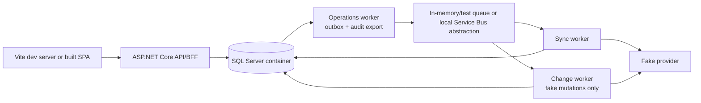

# Local Development Plan

Status: workflow contract; commands become executable when Phase 1 scaffolding
lands

The default local experience uses the fake Azure DevOps provider and requires no
Azure DevOps credentials. Live provider access is an explicit opt-in for a
dedicated sandbox only.

## Prerequisites

Planned toolchain:

- .NET 10 SDK
- current project-pinned Node.js LTS and Corepack
- Docker-compatible container runtime
- SQL Server container (started through development orchestration/Testcontainers)
- optional Azure CLI for short-lived sandbox Entra tokens

The repository will pin:

- .NET SDK feature band in `global.json`
- Node/package manager in `.nvmrc`/`.node-version` and `package.json`
- NuGet/npm dependencies in lockfiles
- development container images by immutable version/digest where practical

## Modes

| Mode | Provider | Database | Writes |
|---|---|---|---|
| Default development | Deterministic fake | Local SQL Server container | Fake state only; app read-only by default |
| UI demo | Fake | SQL Server; optional explicitly limited SQLite profile | Fake state only |
| Automated test | Fake/fixture providers | SQL Server Testcontainers | Isolated deterministic test state |
| Live sandbox probe | Azure DevOps | Local SQL Server | Read-only unless a specific capability test enables a sandbox operation |
| Production | Azure DevOps | Azure SQL | Disabled by default; managed identity and gates only |

Startup must reject:

- fake provider outside Development/Test
- PAT provider outside Development
- live writes without all gates/capability evidence
- missing production `READ_ONLY_MODE`
- SQLite for migration/integration correctness tests

## Planned repository commands

The initial scaffold will expose repository-root commands rather than requiring
developers to remember project paths:

```text
./eng/bootstrap        verify/install restorable development tooling
./eng/dev              run API, web, worker, SQL, and fake provider
./eng/format           format backend/frontend
./eng/lint             static checks
./eng/test             fast local test suite
./eng/test-all         integration + browser suite
./eng/db-update        apply local EF migrations
./eng/seed             reset and seed deterministic Contoso data
```

PowerShell equivalents may be supplied if Windows is an approved development
platform. Until these files exist, this section is a required implementation
contract, not a claim that the commands work.

## Configuration

Checked-in defaults:

```text
ASPNETCORE_ENVIRONMENT=Development
ACCESS_PROVIDER=Fake
READ_ONLY_MODE=true
WRITES_GLOBAL_ENABLED=false
ENTRA_PROVIDER_ENABLED=false
```

Local overrides use .NET user-secrets and ignored environment files only for
nonsecret settings. The application prints safe configuration names/status, not
values.

No repository configuration contains:

- PAT/client secret/certificate private key
- Azure DevOps/Graph access token
- production organization URL or tenant identifiers unless intentionally public
- service endpoint authorization data
- connection strings with credentials

The local SQL login is development-only and is never reused in shared
environments.

## Fake provider

The full UI and application API must be usable without network access to Azure
DevOps.

Seed organization:

```text
Contoso
  Project Alpha
  Project Beta
  Project Gamma

Users
  Evan     evan@example.invalid
  Alice    alice@example.invalid
  Bob      bob@example.invalid
  Charlie  charlie@example.invalid

Groups
  ADO-Alpha-Developers
  ADO-Alpha-Readers
  ADO-Platform-Admins
  ADO-Beta-Developers
```

Scenarios include:

- direct and group Project/repository permissions
- team and nested-group membership
- Entra-backed group representation
- exact and inherited Allow/Deny
- conflicts and Unknown bits/tokens
- candidate group with same, gained, lost, and cohort-expanded access
- unsupported pipeline/environment/resource facts
- empty/single-user/duplicate groups
- unresolved identity

The provider supports deterministic mutable state plus opt-in faults:

```text
page size / continuation
429 and delayed HTTP 200
selected-page failure
eventual consistency delay
timeout before/after mutation commit
concurrent external modification
descriptor remap
namespace drift
worker crash hooks
```

Seed IDs, clock, and ordering are stable. Resetting the seed is destructive only
to local fake state.

## Local architecture



Local orchestration must preserve production boundaries:

- web/API does not resolve `IAccessMutationProvider`
- operations, sync, and change workers are distinct processes/composition roots
- queue messages contain IDs
- SQL and outbox remain authoritative
- fake mutation still requires read-only/approval/audit gates in E2E tests

An in-process shortcut can be offered for rapid component development, but it
cannot be the only tested path.

## Database workflow

- EF migrations are the only schema-change mechanism.
- Local development uses a SQL Server container for production semantics.
- Startup does not automatically apply migrations in shared/production
  environments.
- `db-update` applies reviewed migrations locally.
- Tests create isolated databases/containers and clean them deterministically.
- Seed data is inserted through the same normalized provider/sync path where
  practical, not a second incompatible model.

SQLite may support a read-only disposable demo profile only if it does not alter
the production model. It is not accepted for rowversion, locking, outbox,
generation, migration, or audit tests.

## Authentication locally

Development options:

1. **Default fake user authentication** — deterministic Viewer/Analyst/Approver/
   Access Administrator test identities. Startup rejects it outside Development/
   Test.
2. **Real Entra app sign-in** — for integration testing against a development app
   registration and localhost redirect URI.

Fake authentication must still exercise scoped authorization policies and
requester/approver separation. A “disable auth” switch is not the primary
development path.

## Live sandbox access

Live access is optional and never required for normal UI/domain work.

Requirements:

- dedicated nonproduction Azure DevOps organization
- explicitly registered organization slug
- tenant-approved development app/identity
- read-only by default
- no production user/resource data
- no globally scoped/full-access PAT

Prefer:

- Azure CLI/MSAL short-lived Entra user token for an ad hoc read probe
- certificate/federated service principal for repeatable non-Azure automation

If a PAT is unavoidable, store it in user-secrets/OS credential storage, make it
short-lived/minimally scoped/organization-scoped, and delete it after the probe.
The app logs only credential source/type and expiry status, never the value.

Live mutation contract tests require a separately named sandbox project and
repository, explicit command-line acknowledgement, operation-level enablement,
and operator-verified cleanup. They are not part of `test` or normal app startup.

## Developer data safety

- Never capture a production response as a fixture.
- Sanitized sandbox fixtures use `example.invalid`, synthetic GUIDs,
  organization/resource names, and descriptors.
- Provider request/response body logging is off.
- Local exports are ignored and include a confidentiality warning.
- Reset scripts verify the local/test database and fake organization before
  deletion.
- No command defaults to applying remote changes.

## Debugging and observability

Local OpenTelemetry exports to console or a local collector with redaction.
Useful views:

- request/queue/worker correlation
- sync stage/page/checkpoint
- freshness and capability outcomes
- permission evaluation evidence
- migration operation/verification timeline

Metrics and traces never use email, descriptor, ACL token, or resource name as
metric dimensions. A dedicated safe diagnostic view can show typed IDs to an
authorized developer.

## Initial bootstrap definition of done

- [ ] Fresh clone can verify prerequisites with one documented command.
- [ ] Default startup requires no external credential or Azure subscription.
- [ ] Contoso data reaches the UI through fake provider -> sync -> SQL -> API.
- [ ] Read-only mode is visible and backend enforced.
- [ ] Backend/frontend formatting, build, and fast tests run from repository root.
- [ ] SQL integration and Playwright suites run in isolated environments.
- [ ] Fake auth/provider/PAT startup guards fail outside allowed environments.
- [ ] Live sandbox setup is separate, opt-in, and documented without secrets.
