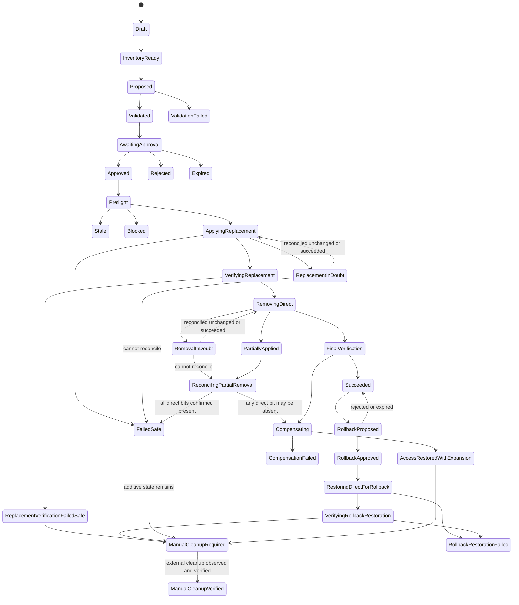

# Migration and Change Engine

Status: proposed  
Default: disabled by `READ_ONLY_MODE=true`

## Safety contract

The change engine exists to replace selected direct user permissions with
group-based access without silently changing effective access.

Non-negotiable invariants:

1. Planning never performs an Azure DevOps mutation.
2. The approved immutable plan is the plan executed.
3. Every remote mutation has a persisted audit-attempt event first.
4. Replacement access is added and verified before direct access is removed.
5. Unknown or inconclusive is a stop, not a success.
6. Only exact approved bits/edges are changed; unrelated state is preserved.
7. A timed-out write is reconciled before retry.
8. Rollback is a separately previewed compensating plan, not a guarantee.
9. Read/write identities and runtimes are separate.
10. All gates fail closed.

## MVP operation boundary

Allowed only after sandbox proof and per-organization enablement:

```text
Forward path:
  AddGroupMembership          user -> existing native Azure DevOps group
  AddPermissionBits           allowlisted Project/Git Allow bits on that group
  ReplacementVerificationBarrier (includes direct-bit-suppressed counterfactual)
  RemovePermissionBits        exact verified redundant user Allow bits
  FinalVerificationBarrier

Automatic compensation primitive:
  AddPermissionBits           restore exact captured user Allow bits

Manual-only additive cleanup candidates:
  RemovePermissionBits        candidate group bits, never auto-executed in MVP
  RemoveGroupMembership       candidate membership, never auto-executed in MVP
```

Initial writable actions are explicitly limited to Project `GENERIC_READ` and
Git `GenericRead`, `GenericContribute`, `CreateBranch`, and `CreateTag` at
project/repository scope, with action name/expected bit/live capability all
matching. A group ACE may be added only to a native, non-team, non-system group
registered as permission-managed. Approval must acknowledge that the group
permission applies to all current and future members. Otherwise, the group must
already supply replacement access and the plan only adds membership.

Excluded:

- Entra membership mutation
- new group creation
- explicit Deny removal or copying Deny to a shared group
- built-in system/admin/protected principals
- branch, Build, Environment, ServiceEndpoint, and Library writes
- whole ACL replacement
- blind whole-ACE removal
- bulk execution
- any unsupported/unknown action or token

## Separation of duties

Application roles are independent:

| Role | Migration capability |
|---|---|
| Viewer | View inventory and limitations |
| Access Analyst | Analyze, recommend, and create draft plans |
| Migration Approver | Approve an immutable plan they did not request |
| Access Administrator | Request execution of an approved plan |
| Application Administrator | Configure orgs/flags/roles; no implicit migration write |

Approval binds:

- plan version and canonical hash
- baseline generation/hash
- selected findings
- exact operations
- all acknowledged target-user gains
- group-cohort blast radius
- expiration

Persist three decisions as human `ApplicationActor` records keyed by Entra
tenant/object ID, never Azure DevOps principals:

- plan-version creator (Access Analyst)
- approver (Migration Approver)
- execution requester (Access Administrator)

The approver must differ from both the plan creator and execution requester. The
creator and execution requester may be the same only if they independently hold
both roles. Plan creation, approval, and execution request each require fresh
BFF-validated Entra app-role evidence (initial proposed maximum age: 15 minutes)
and bind the current organization/project-scoped SQL grant/policy hash. The
worker rechecks expiry and local hashes. Entra revocation inside the bounded
token/evidence window is a documented residual because the worker has no token
introspection endpoint. PIM, MFA, and Conditional Access protect privileged
application groups.

## Write gates

All must be true at both execution request and worker preflight:

```text
deployment permits mutation runtime
AND READ_ONLY_MODE == false
AND global dynamic write flag == enabled
AND organization write flag == enabled
AND operation feature flag == enabled
AND provider capability for exact operation == proven
AND target namespace/resource/action == allowlisted
AND every direct-removal operation has enabled/proven exact restoration
```

Configuration rejects `remove-direct-bit=true` unless
`restore-direct-bit=true` and its provider capability is current. The worker
rechecks this dependency before every removal. If the all-mutation/read-only kill
switch disables restoration after a removal, no blind write is attempted; the
execution becomes `CompensationFailed` and follows the manual incident path.

Failure to read configuration is a deny. The change worker has no public ingress
and receives only a plan/execution ID; it reloads every fact from SQL.

## State machine



State meanings:

- `FailedSafe`: existing direct access was not removed; additive replacement may
  remain.
- `ReplacementVerificationFailedSafe`: replacement verification failed or was
  inconclusive after additions; direct access remains and additive cleanup is a
  separately reviewed manual rollback.
- `PartiallyApplied`: some removals may have occurred; immediate reconciliation
  and compensation are required.
- `ReconcilingPartialRemoval`: live reads determine every selected direct bit's
  actual state after failure/crash; any absent/unknown bit enters restoration.
- `ReplacementInDoubt` / `RemovalInDoubt`: the provider may have applied a
  request whose response was lost; reconciliation resumes the correct phase.
- `AccessRestoredWithExpansion`: captured direct access is restored, but additive
  replacement access intentionally remains until a separate rollback cleanup is
  previewed for manual execution.
- `ManualCleanupRequired`: Azure DevOps cannot prove causal ownership of an
  identical group bit/edge, so the app does not remove additive state
  automatically.
- `RollbackApproved` through `VerifyingRollbackRestoration`: a separately
  approved rollback of a successful migration automatically restores exact
  captured direct bits and verifies them before any manual additive cleanup.
- `Blocked`: policy or verification stopped further destructive work.

Transitions are append-only audit events and use database rowversion plus an
organization execution lease. MVP allows one active execution per organization.

## Plan data

An immutable `MigrationPlanVersion` contains:

```text
createdByActor/evidence, target DirectorySubject/person,
organization-specific principal, and replacement group stable IDs
selected direct finding IDs
source generation set
baseline access snapshot
group current transitive-cohort snapshot/hash and future-member policy
proposed access snapshots
before/after comparisons
known unknowns and limitations
ordered typed operations and dependencies
operation preconditions and captured pre-state
possible inverse operations
evaluator/interpreter/provider capability versions
expiration and canonical plan hash
```

Canonicalization uses a documented deterministic JSON format:

- stable property and collection ordering
- UTC normalized timestamps
- stable IDs, not display names
- no volatile UI fields
- explicit schema/algorithm versions
- cryptographic SHA-256 hash

Editing creates a new version and invalidates prior approval.

## Required algorithms

### AnalyzeUserAccess

```text
AnalyzeUserAccess(personId, actor, freshnessPolicy):
    person = RequireDirectorySubject(kind=User, personId)
    links = LoadCurrentPrincipalDirectoryLinks(person)
    snapshots = []
    coverage = []

    for link in links ordered by organization:
        if not Authorize(actor, Viewer, link.organization/project scope):
            coverage.add(OmittedUnauthorized(link.organizationId))
            continue
        if link.status != Confirmed:
            coverage.add(UnknownIdentityCorrelation(link))
            continue

        snapshots.add(AnalyzeOrganizationPrincipalAccess(
            link.principalId, freshnessPolicy))

    return PersonAccessSnapshot(
        person,
        snapshots,
        omitted/ambiguous coverage,
        aggregate completeness)

AnalyzeOrganizationPrincipalAccess(principalId, freshnessPolicy):
    user = RequireStableActivePrincipal(principalId)
    RejectIfOrganizationDisabled(user.organization)

    sourceCoverage = ResolveRequiredCoverage(
        principals, identifiers, memberships,
        projects, repositories, namespace schemas, Project/Git ACLs)

    if freshnessPolicy requires complete and sourceCoverage is not complete:
        return BlockedAccessSnapshot(sourceCoverage)

    closure = MembershipGraph.ResolveContainers(user)
    resources = ResourceIndex.FindSupportedResourcesAffectedBy(
        user + closure.containers)

    results = []
    for coordinate in resources x supportedActions:
        results.add(PermissionEvaluator.Evaluate(
            user, coordinate.resource, coordinate.action,
            sourceCoverage.generations))

    return AccessSnapshot(
        principal=user,
        results=results,
        accessPaths=bounded explanations,
        constraints=user entitlement/status,
        completeness=aggregate completeness,
        generations=sourceCoverage.generations,
        evaluatorVersion=current version,
        createdAt=Clock.UtcNow)
```

Planning requires complete policy-defined coverage for every selected finding
and replacement coordinate. Interactive views may show partial results as
`Unknown`. A migration plan targets one organization-specific principal and
group; a cross-organization person remediation produces separate plans because
Azure DevOps organizations have independent identities, permissions, approvals,
and failure boundaries.

### RecommendGroups

```text
RecommendGroups(userSnapshot, selectedFindings):
    candidates = GroupRepository.FindEligibleExistingGroups(
        same organization and project scopes)

    remove:
        system/protected/admin groups
        groups with incomplete membership/permission data
        groups whose membership cannot be managed as proposed
        groups that would create a membership cycle

    prefilter using scope and affected-permission fingerprints
    candidates = deterministic top CandidateBudget (default 100)
    recommendations = []

    for group in candidates within time/query/coordinate budgets:
        groupSnapshot = AnalyzeGroupAndCohort(group)
        if groupSnapshot.transitiveMemberCount exceeds CohortBudget:
            recommendations.add(ManualOnly(ImpactBudgetExceeded))
            continue

        proposed = Simulate(
            add user to group,
            optionally add exact missing group Allow bits,
            remove only selected direct user bits)

        userComparison = CompareAccess(userSnapshot, proposed.user)
        cohortImpact = CompareGroupCohortOnlyOnChangedCoordinates(
            groupSnapshot.completeTransitiveMembers, proposed.groupPermissions)

        recommendations.add(
            coverage,
            missing,
            user gains/losses/unknowns,
            cohort gains/losses/unknowns,
            required operations,
            support/approval requirements)

    return incremental/partial results with budget/completeness metadata,
           sorted lexicographically by:
        no loss or unknown
        no group permission modification
        lowest weighted user gain
        lowest cohort blast radius
        highest selected-direct coverage
        fewest operations
```

The engine recommends based on permission simulation, never group name. It runs
as a cancellable background job; exceeding a budget yields partial results and
`ManualOnly`, never an unbounded request or weakened safety.

### CompareAccess

```text
CompareAccess(before, after):
    keys = union(before.coordinates, after.coordinates)
    changes = []

    for key in keys:
        b = before[key] or NotSet
        a = after[key] or NotSet

        if b/outcome authority or a/outcome authority is insufficient:
            class = UNKNOWN
        else if b != Allow and a == Allow:
            class = GAINED
        else if b == Allow and a != Allow:
            class = LOST
        else if b.outcome != a.outcome:
            class = CHANGED
        else if b.paths != a.paths:
            class = CHANGED_SOURCE
        else:
            class = SAME

        changes.add(key, class, before/after, risk, materiality)

    return AccessComparison(changes)
```

No material `LOST` result is eligible for automatic migration. Every gain and
cohort impact requires explicit acknowledgement. `UNKNOWN` is blocking on any
affected coordinate.

### CreateMigrationPlan

```text
CreateMigrationPlan(actor, organizationPrincipalId, groupId, selectedFindingIds):
    Authorize(actor, AccessAnalyst, organization/project scope)
    evidence = RequireFreshAuthorizationEvidence(actor)
    RequireReadOnlyPlanningAllowed()

    baseline = AnalyzeOrganizationPrincipalAccess(
        organizationPrincipalId, REQUIRE_COMPLETE_AND_FRESH)
    groupBaseline = AnalyzeGroupAndCohort(groupId, REQUIRE_COMPLETE_AND_FRESH)
    findings = LoadExactOpenFindings(selectedFindingIds)

    RequireFindingsBelongToUserAndSupportedScope(findings)
    RequireGroupEligible(groupBaseline)

    proposed = SimulateDesiredState(
        baseline, groupBaseline, findings, supported operations)

    userComparison = CompareAccess(baseline, proposed.user)
    cohortComparison = CompareCohort(groupBaseline, proposed.group)

    operations = TopologicalOrder([
        additive membership,
        additive exact group permission bits,
        replacement verification barrier with selected direct bits suppressed,
        exact user permission-bit removals,
        final verification barrier
    ])

    for operation:
        capture exact pre-state, precondition hash,
        desired exact state, support capability,
        dependencies, risk, cohort precondition where relevant,
        and executable inverse or explicit ManualOnly reason

    plan = ImmutablePlanVersion(
        createdByActor=actor, authorizationEvidence=evidence,
        all provider evidence, comparisons, operations,
        expiry, schema/algorithm versions)

    plan.hash = CanonicalHash(plan)
    Audit(PlanCreated, plan.hash, no provider mutation)
    return plan
```

### ValidateMigration

```text
ValidateMigration(plan):
    require plan schema and algorithm versions are supported
    require plan not expired and hash recomputes exactly
    require target organization/resource/principals are active
    require target is not application/system/admin/protected
    require native ADO group and supported membership operation
    require complete/fresh baseline, membership closure, and resource mapping
    require action is exactly Project GENERIC_READ or Git GenericRead,
            GenericContribute, CreateBranch, or CreateTag
    require supported Project/Git namespace/token and live capability
    require no system/reserved/deprecated/unknown bits
    require no direct Deny migration/removal
    require no material loss or blocking Unknown
    require all expansion/cohort impact shown for acknowledgement
    if adding group permission:
        require native non-team non-system permission-managed group
        require complete transitive cohort hash
        require approval of policy for all current and future members
    require operation count and risk within policy
    require supported restoration primitive for every direct-bit removal
    require restoration operation flag/capability is enabled whenever removal is
            enabled
    require executable inverse or explicit ManualOnly reason for each addition
    require additions precede verification and removals
    require final verification after removals

    return Valid or structured blocking reasons
```

Validation is deterministic and can run during plan creation, approval, and
execution preflight. Execution still performs live state checks.

### ExecuteMigration

```text
ExecuteMigration(executionId):
    acquire organization execution lease
    execution = ReloadFromSql(executionId)
    plan = ReloadImmutablePlan(execution.planVersionId)
    approval = ReloadApproval(plan.id)

    RequireAllWriteGates()
    RequireFreshAuthorizationEvidence(execution.requesterEvidence)
    RequireFreshAuthorizationEvidence(approval.approverEvidence)
    RequireCurrentLocalGrantHashesMatchBothEvidenceRecords()
    RequireApproverDiffersFromPlanCreatorAndExecutionRequester()
    RequireApprovalBinds(plan.hash, acknowledgedExpansionHash)
    RequireNotExpired()
    ValidateMigration(plan)

    liveBaseline = LiveReadEveryAffected(
        identities, memberships, ACLs, namespace schema, cohort)

    if CanonicalHash(liveBaseline) != plan.baselinePreconditionHash:
        Transition(Stale)
        Audit(StaleBaseline)
        stop

    recomputed = RecomputeComparison(liveBaseline, plan.operations)
    if recomputed != approved safety envelope:
        Transition(Blocked)
        Audit(PreflightComparisonChanged)
        stop

    for operation in additive dependency order:
        if operation changes group permissions:
            RequireLiveCohortHash(operation.cohortPrecondition)
        result = ExecuteOperationSafely(operation)
        if result Failed or unreconciled InDoubt:
            Transition(FailedSafe)
            stop; never enter direct-removal phase

    Transition(VerifyingReplacement)
    verification = VerifyMigration(plan, ReplacementOnly)
    if verification != Verified:
        Transition(ReplacementVerificationFailedSafe)
        Audit(ReplacementNotVerified)
        GenerateManualAdditiveCleanupPreview()
        stop; leave original direct access intact

    for operation in exact direct-removal order:
        RequireLiveOperationPrecondition(operation)
        result = ExecuteOperationSafely(operation)
        if result Failed or unreconciled InDoubt:
            Transition(PartiallyApplied)
            RecoverPartialRemoval(plan, actual operation journal)
            stop normal execution

    Transition(FinalVerification)
    verification = VerifyMigration(plan, Final)
    if verification == Verified:
        Transition(Succeeded)
        enqueue targeted sync
    else:
        Transition(Compensating)
        ExecuteImmediateSafeRestoration(plan, actual operation results)
        enqueue targeted sync
```

```text
RecoverPartialRemoval(plan, journal):
    Transition(ReconcilingPartialRemoval)
    live = read every selected direct user bit and unrelated masks

    if every selected direct bit is confirmed present and unrelated state matches:
        Transition(FailedSafe)
        offer audited manual additive-cleanup preview
        return

    Transition(Compensating)
    for every selected bit:
        if state is Unknown:
            perform bounded exact live reconciliation reads
            if still Unknown:
                Transition(CompensationFailed)
                alert; do not issue a blind write; require manual incident response
                return
        if state is present:
            continue
        if state is absent:
            restore exact captured supported Allow bit with live precondition
            reconcile ambiguous response before continuing

    verify all selected direct bits are present and unrelated bits unchanged
    if verified:
        Transition(AccessRestoredWithExpansion)
    else:
        Transition(CompensationFailed)
        alert and require manual incident response
```

### ExecuteOperationSafely

```text
ExecuteOperationSafely(operation):
    current = LiveReadExactState(operation.target)

    if current == desired:
        AuditAttempt(operation)
        AuditResult(NO_CHANGE)
        return NoChange

    if Hash(current) != operation.preconditionHash:
        return Failed(ConcurrentChange)

    PersistAuditAttemptBeforeRemoteCall(operation, current, desired)
    if audit persistence fails:
        return Failed(AuditUnavailable)

    try:
        response = Provider.ExecuteOnce(operation)
    catch timeout/connection loss after send:
        MarkAttempt(InDoubt)
        actual = ReconcileLiveState(operation)
        if actual == desired:
            AuditRecovery(SucceededAfterAmbiguousResponse)
            return Succeeded
        if actual == current:
            return RetryableOnlyUnderBoundedPolicy
        return InDoubt

    actual = LiveReadExactState(operation.target)
    if actual != desired or unrelated state changed:
        AuditResult(FailedVerification)
        return Failed

    AuditResult(Succeeded)
    return Succeeded
```

The provider has no blind automatic retry policy for mutations.

### VerifyMigration

```text
VerifyMigration(plan, stage):
    schedule bounded live reads with explicit eventual-consistency delays

    verify:
        exact group membership edge exists
        exact approved group Allow bits exist
        unrelated group/user bits and membership edges are unchanged
        namespace schema/capability is unchanged
        live transitive group cohort and governance policy remain approved

    if stage == ReplacementOnly:
        # Current provider-effective access is insufficient proof because the
        # direct user ACE still exists.
        for each selected direct bit:
            counterfactual = PermissionEvaluator.Evaluate(
                live facts,
                suppress exactly this plan's selected user ACE bits)
            require counterfactual == Allow
            require authority == DerivedSupported
            require a surviving path through the replacement group
            require no surviving path depends on a selected direct user bit

        compare full counterfactual snapshot to baseline
        require no baseline Allow becomes Deny/NotSet/Unknown
        require every gain is in approved expansion set

    if stage == Final:
        recompute every affected coordinate from fresh unsuppressed provider state
        require no baseline Allow became Deny/NotSet/Unknown
        require every gain is in approved expansion set
        require every source change matches the plan

    recompute affected existing-group-member cohort
    require impact stays inside approved cohort comparison

    if stage == Final:
        verify selected exact direct user bits are absent
        verify nonselected direct bits remain

    optionally compare supported Git coordinates with Permissions Report

    return:
        Verified       all required checks authoritative and matched
        Failed         observed mismatch
        Inconclusive   timeout, partial data, unsupported/unknown result
```

`Inconclusive` is a failure for progression. Entra changes might take up to one
hour to appear in Azure DevOps; dynamic-group processing can take more than 24
hours. Neither is an end-to-end SLA. MVP does not change Entra membership and
does not keep an execution lock open indefinitely. If the bounded verification
window expires, original direct access remains and the plan is
blocked/failed-safe.

### GenerateRollback

```text
GenerateRollback(executionId):
    execution = LoadActualOperationResults(executionId)
    current = LiveReadEveryAffectedState()

    automaticOperations = []
    manualCleanupCandidates = []
    for successful operation in reverse dependency order:
        if execution removed pre-existing direct access:
            automaticOperations.add(
                AddPermissionBits(user, exact captured supported Allow bits))
        if execution appears to have added group permission bits:
            cohort = live complete transitive members
            impact = simulate removal for every member on changed coordinates
            manualCleanupCandidates.add(
                RemovePermissionBits preview,
                reason=OwnershipNotProvable,
                current cohort hash and impact/Unknown)
        if execution appears to have added membership:
            manualCleanupCandidates.add(
                RemoveGroupMembership preview,
                reason=OwnershipNotProvable,
                target-user access comparison)
        attach current-state precondition

    order:
        AddPermissionBits to restore direct access
        verify direct access restoration from live provider state
        stop automatic execution
        present manual cleanup candidates and current impact
        after an operator changes Azure DevOps externally, observe and verify
        final state and unrelated-bit/edge preservation

    if an inverse would overwrite external changes,
       remove pre-existing state, restore unknown bits,
       or reconstruct unavailable secrets:
        mark ManualOnly with reason

    proposed = Simulate(current, automaticOperations + manual candidates)
    comparison = CompareAccess(current, proposed)
    return immutable rollback/restoration plan with explicit execution mode
```

```text
ExecuteApprovedRollback(rollbackPlanId):
    reload immutable rollback plan and distinct approval
    require original execution == Succeeded
    require fresh requester/approver authorization evidence and all gates
    live = read exact selected user ACEs, group state, and cohort
    stop if restoration baseline/preconditions differ

    Transition(RestoringDirectForRollback)
    for each captured supported direct user Allow bit:
        add exact bit with audit-before-call and ambiguous-result reconciliation

    Transition(VerifyingRollbackRestoration)
    require every restored bit and baseline user access are live and verified
    if failed or inconclusive:
        Transition(RollbackRestorationFailed)
        stop and alert

    Transition(ManualCleanupRequired)
    present current manual additive-cleanup preview
```

Immediate compensation after a failed final verification executes the supported
`AddPermissionBits` primitive to restore exact captured user Allow bits and then
verifies them. It stops if current-state preconditions do not match. It does not
automatically remove additive replacement access; preserving excess access
temporarily is generally safer than removing the only verified access. The state
is `AccessRestoredWithExpansion`, not `RolledBack`.

Azure DevOps supplies no causal operation ID or conditional write for these
facts. “Pre-state absent and post-state present” does not by itself prove
ownership: an external actor can add the identical edge/bit in the final race
window. Therefore cleanup of existing-group additions is always `ManualOnly` in
the MVP, regardless of an application governance label. The preview still
recomputes the complete current cohort and target-user access so an operator
sees losses/Unknown before acting. Access Manager can observe and verify an
external cleanup, but it does not issue that cleanup mutation.

## Idempotency and replay

- Every app command has an idempotency key scoped to organization/actor.
- Each plan version can have at most one active execution.
- An organization lease serializes MVP executions.
- Membership add returns `NO_CHANGE` if the edge exists.
- Permission add/remove first reconciles exact masks.
- Service Bus duplicate delivery reloads existing execution state.
- Expired/hash-mismatched approval cannot be replayed.
- Operation attempt number and desired-state hash prevent accidental widening.

Azure DevOps does not accept the application's idempotency key. Idempotency is
implemented by read/compare/write/read and durable operation state.

## Concurrency protection

No universal Azure DevOps conditional-write ETag exists for ACL/membership APIs.
Protection is:

1. plan baseline and exact operation preconditions
2. live read of every affected target before execution
3. recomputed comparison against the approved safety envelope
4. transitive cohort hash immediately before/after a replacement-group ACE write
5. a second exact target read immediately before each write
6. exact-bit/edge mutation
7. immediate read-back of changed and unrelated state
8. organization-local execution lease

An external actor can still race in the provider. Approval of a group permission
explicitly establishes policy for all current and future members, covering a
member added in the final uncloseable membership/ACE race window. If that
governance policy is not approved, the application cannot modify the group's
permissions and may only use a group that already supplies replacement access.
Any other detected mismatch stops the workflow and requires a new plan.

## Audit sequence

Required events include:

```text
PlanCreated / PlanValidated / PlanRejected
ApprovalRequested / Approved / Rejected / Expired
ExecutionRequested / PreflightStarted / PreflightBlocked
OperationAttempted (persisted before provider call)
OperationNoChange / Succeeded / Failed / InDoubt / Reconciled
VerificationStarted / Verified / Failed / Inconclusive
CompensationStarted / Succeeded / Failed
ExecutionSucceeded / FailedSafe / PartiallyApplied
AccessRestoredWithExpansion / CompensationFailed
ReplacementVerificationFailedSafe / ManualCleanupRequired / ManualCleanupVerified
RollbackProposed / RollbackApproved / RestoringDirectForRollback
RollbackRestorationVerified / RollbackRestorationFailed
TargetedRefreshRequested
```

Audit includes actor, organization/project/resource/target, prior/requested
safe state, result, API operation, correlation ID, and redacted error. It never
contains access tokens, PATs, secrets, authorization headers, variable values,
or service endpoint credentials.

If an audit attempt cannot be durably stored, no provider call is made. If the
process crashes after the call but before result recording, recovery writes an
`InDoubt` event and reconciles live state.

## Automatic stop conditions

Stop before or during execution on:

- any disabled/missing write gate or capability
- invalid role, scope, separation-of-duties, approval, hash, or expiry
- protected target
- stale/partial source data or live baseline mismatch
- unresolved identity, membership, resource, token, action, or unknown bit
- changed namespace schema/interpreter version
- direct or inherited Deny ambiguity
- any material access loss
- unacknowledged target-user gain or group-cohort impact
- replacement-group cohort hash/policy changed, or current/future-member
  semantics were not explicitly approved
- operation count/risk above policy
- audit persistence/export safety failure
- ambiguous provider response that cannot be reconciled
- failed or inconclusive replacement/final verification
- unrelated provider state changed
- unsafe or incomplete compensation data

## Bulk migration

Bulk **planning** is post-MVP and can combine immutable single-user plans into a
preview that reports adds, removals, membership changes, warnings, failures,
cohort impact, and estimated operations.

Bulk **execution** is a separate later capability. It requires:

- cross-plan dependency/conflict detection
- organization operation budgets
- per-user verification barriers
- removal of individual changes from the batch
- fail-safe continuation policy that never treats one user's success as proof
  for another

It is not implemented by putting a loop around single migration execution.

## Testing

State-machine/property invariants:

- no removal transition is reachable before verified replacement
- no provider call occurs without prior audit attempt
- approved hash always equals executed hash
- Unknown never permits removal
- retries cannot broaden an ACE mask
- unrelated/unknown bits always survive
- protected principals are unreachable mutation targets

Scenario matrix:

- existing access equals proposed access
- proposed group provides less/more access
- target user or group has explicit Deny
- nested native and Entra groups
- group permission change affects existing members
- provider state changes after planning and before each operation
- additive operation already exists
- timeout before send, after send, and after provider commit
- partial API failure and worker crash after every transition
- replacement verification fails/inconclusive
- direct removal partly succeeds
- compensation succeeds/fails/precondition changes
- rollback tries to remove pre-existing replacement state
- audit store and export unavailable

No production write flag can be enabled until the full matrix passes in the fake
provider and a dedicated Azure DevOps sandbox for the exact authentication and
Project/Git operations.
