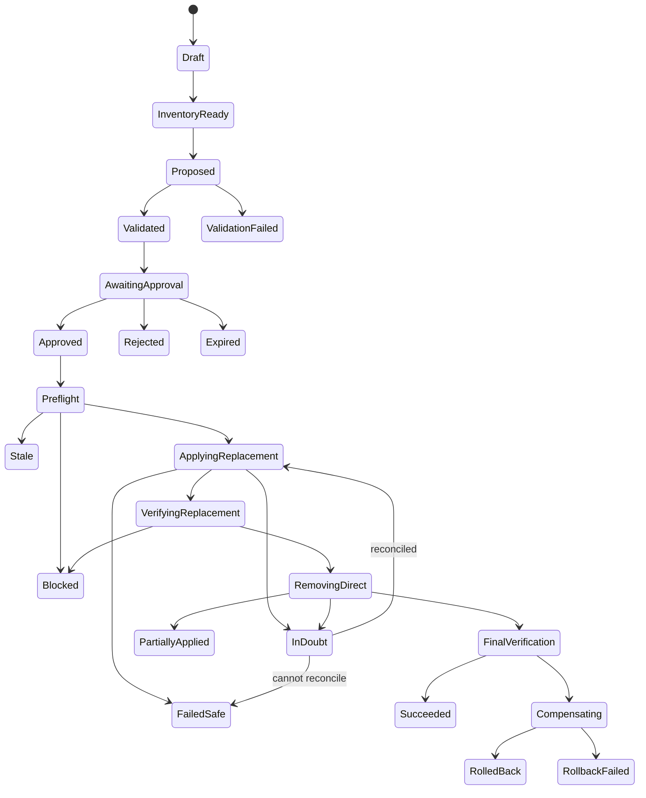

# Migration and Change Engine

Status: proposed  
Default: disabled by `READ_ONLY_MODE=true`

## Safety contract

The change engine exists to replace selected direct user permissions with
group-based access without silently changing effective access.

Non-negotiable invariants:

1. Planning never performs an Azure DevOps mutation.
2. The approved immutable plan is the plan executed.
3. Every remote mutation has a persisted audit-attempt event first.
4. Replacement access is added and verified before direct access is removed.
5. Unknown or inconclusive is a stop, not a success.
6. Only exact approved bits/edges are changed; unrelated state is preserved.
7. A timed-out write is reconciled before retry.
8. Rollback is a separately previewed compensating plan, not a guarantee.
9. Read/write identities and runtimes are separate.
10. All gates fail closed.

## MVP operation boundary

Allowed only after sandbox proof and per-organization enablement:

```text
AddGroupMembership          user -> existing native Azure DevOps group
AddPermissionBits           supported Project/Git Allow bits on that group
VerificationBarrier
RemovePermissionBits        exact verified redundant user bits
FinalVerificationBarrier
```

Excluded:

- Entra membership mutation
- new group creation
- explicit Deny removal or copying Deny to a shared group
- built-in system/admin/protected principals
- branch, Build, Environment, ServiceEndpoint, and Library writes
- whole ACL replacement
- blind whole-ACE removal
- bulk execution
- any unsupported/unknown action or token

## Separation of duties

Application roles are independent:

| Role | Migration capability |
|---|---|
| Viewer | View inventory and limitations |
| Access Analyst | Analyze, recommend, and create draft plans |
| Migration Approver | Approve an immutable plan they did not request |
| Access Administrator | Request execution of an approved plan |
| Application Administrator | Configure orgs/flags/roles; no implicit migration write |

Approval binds:

- plan version and canonical hash
- baseline generation/hash
- selected findings
- exact operations
- all acknowledged target-user gains
- group-cohort blast radius
- expiration

The requester and approver must be different human identities. PIM, MFA, and
Conditional Access are enforced in Entra for privileged application groups.

## Write gates

All must be true at both execution request and worker preflight:

```text
deployment permits mutation runtime
AND READ_ONLY_MODE == false
AND global dynamic write flag == enabled
AND organization write flag == enabled
AND operation feature flag == enabled
AND provider capability for exact operation == proven
AND target namespace/resource/action == allowlisted
```

Failure to read configuration is a deny. The change worker has no public ingress
and receives only a plan/execution ID; it reloads every fact from SQL.

## State machine



State meanings:

- `FailedSafe`: existing direct access was not removed; additive replacement may
  remain.
- `PartiallyApplied`: some removals may have occurred; immediate reconciliation
  and compensation are required.
- `InDoubt`: the provider may have applied a request whose response was lost.
- `Blocked`: policy or verification stopped further destructive work.

Transitions are append-only audit events and use database rowversion plus an
organization execution lease. MVP allows one active execution per organization.

## Plan data

An immutable `MigrationPlanVersion` contains:

```text
target user and replacement group stable IDs
selected direct finding IDs
source generation set
baseline access snapshot
group and existing-member cohort snapshot
proposed access snapshots
before/after comparisons
known unknowns and limitations
ordered typed operations and dependencies
operation preconditions and captured pre-state
possible inverse operations
evaluator/interpreter/provider capability versions
expiration and canonical plan hash
```

Canonicalization uses a documented deterministic JSON format:

- stable property and collection ordering
- UTC normalized timestamps
- stable IDs, not display names
- no volatile UI fields
- explicit schema/algorithm versions
- cryptographic SHA-256 hash

Editing creates a new version and invalidates prior approval.

## Required algorithms

### AnalyzeUserAccess

```text
AnalyzeUserAccess(userId, freshnessPolicy):
    user = RequireStableActivePrincipal(userId)
    RejectIfOrganizationDisabled(user.organization)

    coverage = ResolveRequiredCoverage(
        principals, identifiers, memberships,
        projects, repositories, namespace schemas, Project/Git ACLs)

    if freshnessPolicy requires complete and coverage is not complete:
        return BlockedAccessSnapshot(coverage)

    closure = MembershipGraph.ResolveContainers(user)
    resources = ResourceIndex.FindSupportedResourcesAffectedBy(
        user + closure.containers)

    results = []
    for coordinate in resources x supportedActions:
        results.add(PermissionEvaluator.Evaluate(
            user, coordinate.resource, coordinate.action, coverage.generations))

    return AccessSnapshot(
        principal=user,
        results=results,
        accessPaths=bounded explanations,
        constraints=user entitlement/status,
        completeness=aggregate completeness,
        generations=coverage.generations,
        evaluatorVersion=current version,
        createdAt=Clock.UtcNow)
```

Planning requires complete policy-defined coverage for every selected finding
and replacement coordinate. Interactive views may show partial results as
`Unknown`.

### RecommendGroups

```text
RecommendGroups(userSnapshot, selectedFindings):
    candidates = GroupRepository.FindEligibleExistingGroups(
        same organization and project scopes)

    remove:
        system/protected/admin groups
        groups with incomplete membership/permission data
        groups whose membership cannot be managed as proposed
        groups that would create a membership cycle

    recommendations = []

    for group in candidates:
        groupSnapshot = AnalyzeGroupAndCohort(group)

        proposed = Simulate(
            add user to group,
            optionally add exact missing group Allow bits,
            remove only selected direct user bits)

        userComparison = CompareAccess(userSnapshot, proposed.user)
        cohortImpact = CompareGroupCohort(
            groupSnapshot.members, proposed.groupPermissions)

        recommendations.add(
            coverage,
            missing,
            user gains/losses/unknowns,
            cohort gains/losses/unknowns,
            required operations,
            support/approval requirements)

    return sort lexicographically by:
        no loss or unknown
        no group permission modification
        lowest weighted user gain
        lowest cohort blast radius
        highest selected-direct coverage
        fewest operations
```

The engine recommends based on permission simulation, never group name.

### CompareAccess

```text
CompareAccess(before, after):
    keys = union(before.coordinates, after.coordinates)
    changes = []

    for key in keys:
        b = before[key] or NotSet
        a = after[key] or NotSet

        if b/outcome authority or a/outcome authority is insufficient:
            class = UNKNOWN
        else if b != Allow and a == Allow:
            class = GAINED
        else if b == Allow and a != Allow:
            class = LOST
        else if b.outcome != a.outcome:
            class = CHANGED
        else if b.paths != a.paths:
            class = CHANGED_SOURCE
        else:
            class = SAME

        changes.add(key, class, before/after, risk, materiality)

    return AccessComparison(changes)
```

No material `LOST` result is eligible for automatic migration. Every gain and
cohort impact requires explicit acknowledgement. `UNKNOWN` is blocking on any
affected coordinate.

### CreateMigrationPlan

```text
CreateMigrationPlan(actor, userId, groupId, selectedFindingIds):
    Authorize(actor, AccessAnalyst, organization/project scope)
    RequireReadOnlyPlanningAllowed()

    baseline = AnalyzeUserAccess(userId, REQUIRE_COMPLETE_AND_FRESH)
    groupBaseline = AnalyzeGroupAndCohort(groupId, REQUIRE_COMPLETE_AND_FRESH)
    findings = LoadExactOpenFindings(selectedFindingIds)

    RequireFindingsBelongToUserAndSupportedScope(findings)
    RequireGroupEligible(groupBaseline)

    proposed = SimulateDesiredState(
        baseline, groupBaseline, findings, supported operations)

    userComparison = CompareAccess(baseline, proposed.user)
    cohortComparison = CompareCohort(groupBaseline, proposed.group)

    operations = TopologicalOrder([
        additive membership,
        additive exact group permission bits,
        replacement verification barrier,
        exact user permission-bit removals,
        final verification barrier
    ])

    for operation:
        capture exact pre-state, precondition hash,
        desired exact state, support capability,
        dependencies, risk, and possible inverse

    plan = ImmutablePlanVersion(
        all evidence, comparisons, operations,
        expiry, schema/algorithm versions)

    plan.hash = CanonicalHash(plan)
    Audit(PlanCreated, plan.hash, no provider mutation)
    return plan
```

### ValidateMigration

```text
ValidateMigration(plan):
    require plan schema and algorithm versions are supported
    require plan not expired and hash recomputes exactly
    require target organization/resource/principals are active
    require target is not application/system/admin/protected
    require native ADO group and supported membership operation
    require complete/fresh baseline, membership closure, and resource mapping
    require supported Project/Git namespace, token, action, and capability
    require no system/reserved/deprecated/unknown bits
    require no direct Deny migration/removal
    require no material loss or blocking Unknown
    require all expansion/cohort impact shown for acknowledgement
    require operation count and risk within policy
    require pre-state and safe inverse/manual-only reason for each mutation
    require additions precede verification and removals
    require final verification after removals

    return Valid or structured blocking reasons
```

Validation is deterministic and can run during plan creation, approval, and
execution preflight. Execution still performs live state checks.

### ExecuteMigration

```text
ExecuteMigration(executionId):
    acquire organization execution lease
    execution = ReloadFromSql(executionId)
    plan = ReloadImmutablePlan(execution.planVersionId)
    approval = ReloadApproval(plan.id)

    RequireAllWriteGates()
    RequireActorStillAuthorized()
    RequireDifferentValidApprover()
    RequireApprovalBinds(plan.hash, acknowledgedExpansionHash)
    RequireNotExpired()
    ValidateMigration(plan)

    liveBaseline = LiveReadEveryAffected(
        identities, memberships, ACLs, namespace schema, cohort)

    if CanonicalHash(liveBaseline) != plan.baselinePreconditionHash:
        Transition(Stale)
        Audit(StaleBaseline)
        stop

    recomputed = RecomputeComparison(liveBaseline, plan.operations)
    if recomputed != approved safety envelope:
        Transition(Blocked)
        Audit(PreflightComparisonChanged)
        stop

    for operation in additive dependency order:
        result = ExecuteOperationSafely(operation)
        if result Failed or unreconciled InDoubt:
            Transition(FailedSafe)
            stop; never enter direct-removal phase

    Transition(VerifyingReplacement)
    verification = VerifyMigration(plan, ReplacementOnly)
    if verification != Verified:
        Transition(Blocked)
        Audit(ReplacementNotVerified)
        stop; leave original direct access intact

    for operation in exact direct-removal order:
        RequireLiveOperationPrecondition(operation)
        result = ExecuteOperationSafely(operation)
        if result Failed or unreconciled InDoubt:
            Transition(PartiallyApplied)
            begin reconciliation/compensation
            stop normal execution

    Transition(FinalVerification)
    verification = VerifyMigration(plan, Final)
    if verification == Verified:
        Transition(Succeeded)
        enqueue targeted sync
    else:
        Transition(Compensating)
        ExecuteImmediateSafeRestoration(plan, actual operation results)
        enqueue targeted sync
```

### ExecuteOperationSafely

```text
ExecuteOperationSafely(operation):
    current = LiveReadExactState(operation.target)

    if current == desired:
        AuditAttempt(operation)
        AuditResult(NO_CHANGE)
        return NoChange

    if Hash(current) != operation.preconditionHash:
        return Failed(ConcurrentChange)

    PersistAuditAttemptBeforeRemoteCall(operation, current, desired)
    if audit persistence fails:
        return Failed(AuditUnavailable)

    try:
        response = Provider.ExecuteOnce(operation)
    catch timeout/connection loss after send:
        MarkAttempt(InDoubt)
        actual = ReconcileLiveState(operation)
        if actual == desired:
            AuditRecovery(SucceededAfterAmbiguousResponse)
            return Succeeded
        if actual == current:
            return RetryableOnlyUnderBoundedPolicy
        return InDoubt

    actual = LiveReadExactState(operation.target)
    if actual != desired or unrelated state changed:
        AuditResult(FailedVerification)
        return Failed

    AuditResult(Succeeded)
    return Succeeded
```

The provider has no blind automatic retry policy for mutations.

### VerifyMigration

```text
VerifyMigration(plan, stage):
    schedule bounded live reads with explicit eventual-consistency delays

    verify:
        exact group membership edge exists
        exact approved group Allow bits exist
        unrelated group/user bits and membership edges are unchanged
        namespace schema/capability is unchanged

    recompute every affected target-user coordinate
    require:
        no baseline Allow became Deny/NotSet/Unknown
        every gain is in approved expansion set
        every source change matches the plan

    recompute affected existing-group-member cohort
    require impact stays inside approved cohort comparison

    if stage == Final:
        verify selected exact direct user bits are absent
        verify nonselected direct bits remain

    optionally compare supported Git coordinates with Permissions Report

    return:
        Verified       all required checks authoritative and matched
        Failed         observed mismatch
        Inconclusive   timeout, partial data, unsupported/unknown result
```

`Inconclusive` is a failure for progression. Entra propagation can take up to
roughly an hour; MVP does not keep an execution lock open indefinitely. If the
bounded verification window expires, original direct access remains and the
plan is blocked/failed safe.

### GenerateRollback

```text
GenerateRollback(executionId):
    execution = LoadActualOperationResults(executionId)
    current = LiveReadEveryAffectedState()

    operations = []
    for successful owned operation in reverse dependency order:
        if execution added state that did not pre-exist:
            candidate inverse may remove exactly that owned state
        if execution removed pre-existing direct access:
            candidate inverse restores exact captured bits first
        attach current-state precondition

    order:
        restore access
        verify restoration
        only then clean up replacement state owned by this execution
        final verification

    if an inverse would overwrite external changes,
       remove pre-existing state, restore unknown bits,
       or reconstruct unavailable secrets:
        mark ManualOnly with reason

    proposed = Simulate(current, operations)
    comparison = CompareAccess(current, proposed)
    return new immutable rollback plan requiring preview and approval
```

Immediate compensation after a failed final verification prioritizes restoring
captured direct access and stops if current-state preconditions do not match. It
does not automatically remove additive replacement access; preserving excess
access temporarily is generally safer than removing the only verified access,
and the outcome is clearly audited/escalated.

## Idempotency and replay

- Every app command has an idempotency key scoped to organization/actor.
- Each plan version can have at most one active execution.
- An organization lease serializes MVP executions.
- Membership add returns `NO_CHANGE` if the edge exists.
- Permission add/remove first reconciles exact masks.
- Service Bus duplicate delivery reloads existing execution state.
- Expired/hash-mismatched approval cannot be replayed.
- Operation attempt number and desired-state hash prevent accidental widening.

Azure DevOps does not accept the application's idempotency key. Idempotency is
implemented by read/compare/write/read and durable operation state.

## Concurrency protection

No universal Azure DevOps conditional-write ETag exists for ACL/membership APIs.
Protection is:

1. plan baseline and exact operation preconditions
2. live read of every affected target before execution
3. recomputed comparison against the approved safety envelope
4. a second exact read immediately before each write
5. exact-bit/edge mutation
6. immediate read-back of changed and unrelated state
7. organization-local execution lease

An external actor can still race in the provider. Any detected mismatch stops
the workflow and requires a new plan.

## Audit sequence

Required events include:

```text
PlanCreated / PlanValidated / PlanRejected
ApprovalRequested / Approved / Rejected / Expired
ExecutionRequested / PreflightStarted / PreflightBlocked
OperationAttempted (persisted before provider call)
OperationNoChange / Succeeded / Failed / InDoubt / Reconciled
VerificationStarted / Verified / Failed / Inconclusive
CompensationStarted / Succeeded / Failed
ExecutionSucceeded / FailedSafe / PartiallyApplied / RolledBack
TargetedRefreshRequested
```

Audit includes actor, organization/project/resource/target, prior/requested
safe state, result, API operation, correlation ID, and redacted error. It never
contains access tokens, PATs, secrets, authorization headers, variable values,
or service endpoint credentials.

If an audit attempt cannot be durably stored, no provider call is made. If the
process crashes after the call but before result recording, recovery writes an
`InDoubt` event and reconciles live state.

## Automatic stop conditions

Stop before or during execution on:

- any disabled/missing write gate or capability
- invalid role, scope, separation-of-duties, approval, hash, or expiry
- protected target
- stale/partial source data or live baseline mismatch
- unresolved identity, membership, resource, token, action, or unknown bit
- changed namespace schema/interpreter version
- direct or inherited Deny ambiguity
- any material access loss
- unacknowledged target-user gain or group-cohort impact
- operation count/risk above policy
- audit persistence/export safety failure
- ambiguous provider response that cannot be reconciled
- failed or inconclusive replacement/final verification
- unrelated provider state changed
- unsafe or incomplete compensation data

## Bulk migration

Bulk **planning** is post-MVP and can combine immutable single-user plans into a
preview that reports adds, removals, membership changes, warnings, failures,
cohort impact, and estimated operations.

Bulk **execution** is a separate later capability. It requires:

- cross-plan dependency/conflict detection
- organization operation budgets
- per-user verification barriers
- removal of individual changes from the batch
- fail-safe continuation policy that never treats one user's success as proof
  for another

It is not implemented by putting a loop around single migration execution.

## Testing

State-machine/property invariants:

- no removal transition is reachable before verified replacement
- no provider call occurs without prior audit attempt
- approved hash always equals executed hash
- Unknown never permits removal
- retries cannot broaden an ACE mask
- unrelated/unknown bits always survive
- protected principals are unreachable mutation targets

Scenario matrix:

- existing access equals proposed access
- proposed group provides less/more access
- target user or group has explicit Deny
- nested native and Entra groups
- group permission change affects existing members
- provider state changes after planning and before each operation
- additive operation already exists
- timeout before send, after send, and after provider commit
- partial API failure and worker crash after every transition
- replacement verification fails/inconclusive
- direct removal partly succeeds
- compensation succeeds/fails/precondition changes
- rollback tries to remove pre-existing replacement state
- audit store and export unavailable

No production write flag can be enabled until the full matrix passes in the fake
provider and a dedicated Azure DevOps sandbox for the exact authentication and
Project/Git operations.
