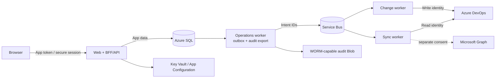

# Security Architecture and Threat Model

Status: proposed  
Security posture: read-only and fail-closed by default

Azure DevOps permission inventory is sensitive security metadata. Mutation
capability is an administrative control plane. The application is designed so a
compromised web tier does not automatically become a compromised Azure DevOps
write identity.

## Trust boundaries



Boundaries:

- Browser to application
- Web/API to SQL intent/outbox (no Service Bus send right)
- Operations worker to queue and immutable audit storage
- Sync runtime/read identity to Azure DevOps
- Change runtime/write identity to Azure DevOps
- Optional Entra provider to Microsoft Graph
- Mutable operational database to separately protected audit export

## Authentication

### Application users

- Single-tenant Microsoft Entra OpenID Connect.
- Authorization-code flow with PKCE, handled by the BFF.
- The browser receives a `Secure`, `HttpOnly`, `SameSite` session cookie, not an
  Azure DevOps or Microsoft Graph token.
- Anti-CSRF token is required for every state-changing cookie-authenticated
  endpoint.
- Enterprise application uses “assignment required.”
- Conditional Access and MFA protect all access; PIM protects privileged role
  groups.
- Tenant, issuer, audience, signature, lifetime, and nonce/state are validated.
- Session lifetime and reauthentication policy are stricter for approval and
  execution.

On-behalf-of access to Azure DevOps is not the default. It may be evaluated only
for a future operation that intentionally needs the signed-in user's delegated
authority. Background sync and deterministic audited changes use workload
identities.

### Azure DevOps workloads

Use separate managed identities:

| Identity | Runtime | Azure DevOps rights |
|---|---|---|
| Web | App Service | None |
| Sync/read | Sync worker | Minimum inventory and ACL visibility |
| Change/write | Change worker | Only allowlisted membership and Project/Git permission operations |

Token scope:

```text
https://app.vssps.visualstudio.com/.default
```

Each workload identity must be explicitly added and licensed in each same-tenant
Azure DevOps organization. Azure DevOps uses its own groups, access levels, and
resource permissions; Entra application permissions do not grant Azure DevOps
access. Use the Enterprise Application service-principal object ID.

The write credential is unavailable to the web and sync runtime. Merely loading
both identities into one process would not provide meaningful isolation.

Outside Azure, use certificate/federated service-principal credentials rather
than a client secret when possible.

### PAT policy

PATs are forbidden in production. A development PAT adapter may exist only when
all conditions hold:

- environment is Development
- fake provider is not sufficient for the explicit test
- token is organization-scoped, minimally scoped, and short-lived
- value comes from user-secrets/credential store, never source/config files
- logging and diagnostics redact it
- startup rejects the adapter outside Development

Prefer a short-lived Entra token for local live probes. Legacy Azure DevOps OAuth
is not implemented because Microsoft deprecated it.

## Application authorization

Roles are independent rather than hierarchical:

| Role | Allowed |
|---|---|
| Viewer | Read permitted organization/project inventory, freshness, and limitations |
| Access Analyst | Reports, effective analysis, recommendations, and draft plans; no approval/write |
| Migration Approver | Approve or reject exact plan hashes; cannot approve own plan |
| Access Administrator | Request execution of a valid approved plan |
| Application Administrator | Configure organizations, mappings, retention, flags, and app role scope; no implicit migration write |

Role assignments can be scoped to organization and optionally project. Every
HTTP endpoint and Application command enforces the scope; UI visibility is not
security.

`ApplicationActor` is keyed by Entra tenant/object ID and remains separate from
organization-scoped Azure DevOps principals. Current Entra app-role/group
membership establishes candidate roles; persisted `ApplicationRoleGrant` rows
constrain organization/project scope and never expand beyond Entra
authorization. Application Administrator changes to app-managed scopes are
audited. Approval/execution revalidates both actors' current role-grant hashes.
Effective authorization is the intersection of the validated Entra app role and
an active local scope grant; absence denies access, and organization-wide scope
must be explicit.
The initial Application Administrator scope is bootstrapped through a reviewed
deployment record, not self-granted through the UI; subsequent changes are
audited and cannot grant a role absent from the actor's Entra `roles` claim.

MVP authorization evidence comes from a freshly validated Entra token/session
at each interactive approval or execution request:

- Entra app roles are assigned to users/groups on the Enterprise Application and
  arrive in the validated `roles` claim; MVP does not query Microsoft Graph to
  calculate them.
- The BFF requires recent reauthentication and persists only an
  `AuthorizationEvidence` hash of actor, app-role set, token issue/auth time,
  local scoped-grant hash, and policy version—never the token.
- Initial proposed evidence lifetime is 15 minutes and cannot exceed token/
  session expiry; Phase 0 policy ratification can shorten it.
- The change worker rechecks evidence expiry and current SQL scoped-grant/policy
  hashes for requester and approver immediately before work.
- Entra app-role revocation cannot be instantaneously introspected by the worker.
  Revocation inside the bounded evidence/token window is a documented residual
  risk. A future live authorization provider would require separate consent and
  an ADR.

Execution requires:

- requester still has Access Administrator scope
- approver still has Migration Approver scope
- approver is distinct from both the plan creator and execution requester;
  creator/requester may match only with both roles
- approval hash/expiry/acknowledgements are valid
- target is not protected

Application identities, built-in system groups, collection/project
administrators, configured break-glass users, and protected organizations or
projects are denylisted from automated migration.

## Read-only and write controls

`READ_ONLY_MODE=true` is the default in all new environments and deployments.

All write gates:

```text
static deployment capability
global READ_ONLY_MODE
dynamic global write kill switch
organization write flag
operation-specific feature flag
provider capability evidence
namespace/resource/action allowlist
```

Every layer checks the relevant gate:

- API rejects execution requests.
- Application command handler refuses outbox creation.
- Change worker refuses preflight.
- Mutation provider refuses unsupported calls.

Failure to retrieve flags/capabilities denies the write. A kill-switch exercise
is part of deployment acceptance.
Direct-removal enablement is invalid unless exact restoration code, feature
flag, provider capability, and audit path are also enabled; the worker rechecks
that invariant before each removal.

Application Administrator can manage app-owned dynamic flags, mappings, policy
values, and protected targets only within static deployment limits. Every change
requires fresh authorization evidence, optimistic concurrency, and audit.
Removing a protected target requires a second distinct Application
Administrator. Secrets, workload identity grants, static `READ_ONLY_MODE`, and
deployment capability remain outside the application.

Dynamic flag/policy requests are durable SQL workflows applied only by the
Operations worker to Azure App Configuration using the expected ETag and
read-back verification. Protected targets and typed mapping overrides are
authoritative SQL aggregates; the API has neither App Configuration write
credentials nor a bypass around their approval/concurrency rules. High-impact
mapping overrides require a second distinct Application Administrator and
invalidate affected read models/plans transactionally.

## Least privilege in Azure DevOps

The read identity needs only tested visibility for registered organizations:

- explicit organization membership and directly assigned appropriate license
- `View instance-level information`
- `View project-level information` in every registered project
- repository `Read` where repository inventory is required
- read the selected identity/project/team/repository APIs
- the minimum ACL visibility that the Phase 0 probe proves

The write identity:

- is not Project Collection Administrator
- is not a member of broad administrator groups
- is granted membership-management and `Manage permissions` only where sandbox
  tests prove the exact MVP operations need it
- is policy-limited to native-group membership plus Project `GENERIC_READ` and
  Git `GenericRead`, `GenericContribute`, `CreateBranch`, and `CreateTag` at
  allowlisted project/repository scopes
- cannot target its own principal, groups, or ACLs
- is separately licensed and monitored

Security read and write APIs advertise the same broad
`vso.security_manage` delegated/PAT scope; Azure DevOps does not document a
read-only security scope. Managed identities request `/.default`, so token scope
does not create read-only isolation. Phase 0 must prove whether the sync identity
can query required ACLs without a resource permission that could also mutate
them. If not, “read identity” means the application/provider exposes no mutation
client and the runtime lacks the change identity, but a compromised identity may
retain residual provider capability. That residual risk must be accepted or the
ACL feature redesigned; it must not be hidden.

Resource lifecycle scopes such as `vso.code_manage`,
`vso.environment_manage`, and `vso.serviceendpoint_manage` are distinct from
`vso.security_manage` used by ACL/role assignment APIs. Resource permissions,
runtime composition, and application allowlists further narrow actual use.

The exact least-privilege grants are an empirical Phase 0 deliverable. If Azure
DevOps cannot express a safe boundary for an operation, that operation is not
automated.

## Secrets and sensitive data

- Managed identity removes application credentials where possible.
- Remaining certificates/secrets live in Key Vault and are accessed through
  managed identity.
- No secrets in repository, build logs, environment files, images, or browser.
- Treat Azure DevOps and Microsoft Graph access tokens received as a client as
  opaque. Validate ID tokens and tokens issued for this application's own API
  through supported middleware; never parse Microsoft API access-token claims.
- Authorization headers, cookies, tokens, PATs, query strings containing
  descriptors/tokens, and request/response bodies are redacted.
- Service endpoint authorization parameters and variable values are dropped at
  provider mapping; secret values are never persisted.
- Queue messages contain database IDs, not provider credentials or full plans.
- Diagnostic downloads require Application Administrator scope, are bounded,
  redacted, audited, and expire.

Secret scanning runs in local hooks where practical and CI. Production
credentials rotate without code changes.

## Data protection

Classification:

- inventory, ACLs, memberships, access paths: Confidential
- migration plans/executions/audit: Confidential / security administrative
- credentials/tokens/service endpoint secrets: Restricted and not persisted

Controls:

- TLS 1.2+ externally and current Azure defaults internally
- encryption at rest through Azure-managed keys initially; customer-managed key
  only if policy requires it
- private endpoints for SQL, Service Bus, Key Vault, App Configuration, and
  audit storage
- organization-scoped authorization and composite database constraints
- minimal database roles per runtime
- row-level security evaluated as defense in depth, not a replacement for app
  authorization
- approved retention/pseudonymization/deletion policy
- backups and exports follow residency and expiry requirements

Search and exports protect against enumeration and exfiltration with page, row,
size, and rate limits. CSV cells beginning with formula control characters are
escaped.

## Network and platform controls

- Front Door Premium/WAF in front of App Service.
- Workers have no public ingress.
- Provider egress permits only documented Azure DevOps, login, and optional
  Microsoft Graph hosts.
- Organization/resource metadata can never select an outbound host (SSRF
  defense).
- Azure resources use private endpoints and private DNS where supported.
- Defender recommendations, container scanning, and Azure Policy are enabled.
- Administrative interfaces are tenant-only and can be network restricted if
  organizational policy requires it.
- Non-production and production subscriptions/resource groups and identities
  are separate.

## Audit integrity

Every attempted remote mutation writes an append-only audit-attempt event before
the provider call. Events include safe prior/requested/observed state, actor,
target, operation, provider correlation ID, and redacted error.

Integrity controls:

- application database role can append, not update/delete audit rows
- per-organization sequence and previous-event hash form a tamper-evident chain
- continuous signed digest/export by the no-Azure-DevOps operations worker to
  separately permissioned WORM-capable Blob storage; Log Analytics is a
  searchable monitoring copy, not the immutable authority
- export watermark and lag alerting; change execution fails closed on export
  failure or lag beyond the ratified threshold (initial proposal: 15 minutes)
- retention/immutability policy protected from application identities
- all audit access and export is audited

Hash chaining does not prevent a subscription/database owner from tampering. A
separate immutable export and operational separation provide the stronger
control.

If audit persistence fails, no provider call occurs. If the process crashes
after a call, recovery records `InDoubt`, reconciles live state, and appends the
result.

## Threat model

| Threat | Primary controls | Residual risk / response |
|---|---|---|
| Compromised administrator | MFA, CA, PIM, scoped independent roles, two-person approval, plan expiry, operation limits | Two colluding privileged users can authorize harm; maintain independent audit and alerts |
| Compromised web/API identity | No Azure DevOps identity or Service Bus send right, least SQL rights, input/authz controls | Can create malicious plan intent/outbox state; operations/change workers reload and independently validate |
| Compromised sync identity | No mutation client/change credential, minimum tested provider rights, explicit residual-capability record | ACL APIs may not offer pure read scope; isolate, monitor, and disable identity on compromise |
| Compromised change identity | No public ingress, narrow resource grants, operation allowlists, protected targets, kill switch | Azure DevOps permission granularity may be broader; sandbox proof and monitoring required |
| Credential leakage | Managed identities, Key Vault, no production PAT, redaction | Runtime memory compromise still possible; isolate runtime and contain network/RBAC |
| Privilege escalation in app | Nonhierarchical scoped roles, deny-by-default policies, authz matrix tests | Misconfiguration remains possible; assignment required, PIM, reviews |
| IDOR/cross-org read | Organization scope in every provider query/FK; tenant-scoped person link; per-linked-org authorization tests | New aggregation endpoints can regress; architecture/API tests required |
| Unexpected access expansion | Before/after, transitive cohort hash, explicit all-current/future-member policy for group changes | External changes can occur later; audit and targeted reconciliation |
| Accidental access removal | Add-first, authoritative verification, exact-bit removal, compensation | Eventual consistency can be inconclusive; stop with original access |
| API replay/duplicate | Immutable hash, expiry, execution uniqueness, idempotency keys, live reconciliation | Provider has no idempotency key; `InDoubt` process required |
| Concurrent external modification | Live baseline/preconditions, organization lease, exact read-back | No universal Azure DevOps conditional write; any mismatch stops |
| Stale cached permissions | Generation/freshness contract and live preflight | No complete ACL change feed; plans expire quickly |
| Audit tampering | Append-only role, hash chain, immutable external export, alerts | Platform owners remain powerful; separate ownership where required |
| SSRF | Fixed provider host construction and egress allowlist | Microsoft host changes require controlled configuration update |
| Secret ingestion | Whitelist DTO mappings, no body logging, omit variable/service endpoint secrets | New provider fields need contract tests before mapping |
| Graph explosion/cycle | Direct-edge traversal limits and cycle detection | Result becomes Unknown; no destructive action |
| Fake provider in production | Startup guard and environment attestation | Deployment mislabeling must fail closed |
| Supply-chain compromise | Lockfiles, dependency review, SAST/SCA, SBOM, signed artifacts/images, OIDC deploy | Dependencies remain trusted code; patch and provenance process |
| CSV/spreadsheet injection | Formula prefix escaping, content type, export warning/limits | External tools can transform data; document safe handling |
| Denial of service/rate exhaustion | WAF/rate limits, bounded queries, queues, adaptive provider concurrency | Azure DevOps tenant throttling can still delay freshness; surface it |
| Sensitive telemetry leakage | Allowlisted structured fields, redaction tests, no PII metric dimensions | Emergency diagnostics require controlled, audited workflow |

## Input and application security

- Validate all IDs as typed internal IDs, then authorize loaded resources.
- Never accept an Azure DevOps URL/token/descriptor from the browser as an
  executable provider target.
- Encode output; React's default escaping remains enabled.
- Use CSP with no unsafe inline script where tooling permits, HSTS, frame
  protection, referrer policy, and restrictive permissions policy.
- Same-origin BFF reduces CORS surface; no wildcard credentialed CORS.
- Parameterized EF queries; no dynamic SQL from filters.
- Upload is not required for MVP. Exports are server-generated.
- Rate-limit search, refresh, plan creation, approval, execution, and diagnostics
  independently.
- Problem details expose safe codes/correlation IDs, not stack traces/provider
  bodies.

## Dependency and delivery security

CI must include:

- pinned lockfiles and repeatable restore
- formatting, build, unit/integration/E2E tests
- secret scanning
- static analysis and dependency/container scanning
- license policy
- generated SBOM
- signed/provenanced application and container artifacts
- IaC lint/security policy
- GitHub Actions OIDC to Azure; no deployment secrets
- protected environment approval for production

Dependabot/Renovate policy and servicing cadence are defined before production.
.NET and Node base images are patched continuously; unsupported runtimes are a
release blocker.

## Security validation gates

Before read-only production:

- [ ] Entra assignment-required, CA/MFA/PIM, session, CSRF, and authorization
      matrix tests pass.
- [ ] Sync runtime is proven unable to invoke mutations; identity-level mutation
      probes fail or any unavoidable residual provider capability is explicitly
      accepted with compensating controls.
- [ ] Web/sync runtime cannot obtain the write identity.
- [ ] Provider DTO and telemetry tests prove no secret-bearing fields are stored
      or logged.
- [ ] Organization isolation and export limits pass penetration testing.
- [ ] Retention, privacy, audit ownership, and incident response are approved.

Before any production writes:

- [ ] Threat model is reviewed against implemented architecture.
- [ ] Write identity has tested least privilege and is not a broad admin.
- [ ] All static/dynamic/org/operation gates and kill switch are exercised.
- [ ] Two-person approval and protected-target policies pass negative tests.
- [ ] Approval/execution require bounded fresh authorization evidence; local
      grant revocation and evidence expiry stop the worker.
- [ ] Every mutation has pre-call audit, `InDoubt`, verification, and
      compensation tests.
- [ ] Sandbox live tests pass for exact Project/Git operations and identity type.
- [ ] Alerts/runbooks exist for suspicious changes, verification failure,
      partial application, audit lag, and write identity use.

## Official authentication references

- [Azure DevOps authentication guidance](https://learn.microsoft.com/en-us/azure/devops/integrate/get-started/authentication/authentication-guidance?view=azure-devops)
- [Service principals and managed identities](https://learn.microsoft.com/en-us/azure/devops/integrate/get-started/authentication/service-principal-managed-identity?view=azure-devops)
- [Microsoft Entra OAuth for Azure DevOps](https://learn.microsoft.com/en-us/azure/devops/integrate/get-started/authentication/entra-oauth?view=azure-devops)
- [Authorization code flow](https://learn.microsoft.com/en-us/entra/identity-platform/v2-oauth2-auth-code-flow)
- [On-behalf-of flow](https://learn.microsoft.com/en-us/entra/identity-platform/v2-oauth2-on-behalf-of-flow)
