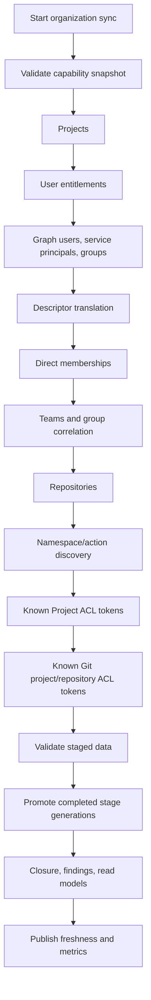

# Synchronization Engine

Status: proposed

## Goal

Build reliable, explainable read models without fanning out to dozens of Azure
DevOps APIs on each page load. Synchronization must make incomplete or
permission-trimmed data visible and must never convert a partial fetch into
authoritative absence.

## Provider boundary

```text
IAccessInventoryProvider
  ProbeCapabilities(organization, identity)
  ListProjects(page)
  ListUserEntitlements(page)
  ListUsers(page)
  ListServicePrincipals(page)
  ListGroups(page)
  ListMemberships(subject, direction, depth=1)
  ListTeams(project, page)
  ListTeamMembers(project, team, page)
  ListRepositories(project)
  ListSecurityNamespaces()
  QueryAcls(namespace, token, descriptors?, extendedInfo?)
```

The Azure DevOps, Entra, and fake providers implement the same normalized page
and error contracts:

```text
ProviderPage<T>
  Items
  ContinuationToken
  IsComplete
  ProviderRequestId
  RateLimitObservation

ProviderError
  Code
  IsTransient
  IsAmbiguous
  RetryAfter
  HttpStatus
  SafeDiagnostic
```

No provider returns raw response DTOs to Application.

## Organization registration

Production organization discovery is explicit:

1. An Application Administrator enters an Azure DevOps organization slug.
2. The API normalizes it to `https://dev.azure.com/{slug}` and rejects all
   non-allowlisted hosts, userinfo, ports, fragments, and path tricks.
3. A read-identity capability probe verifies tenant, membership, access level,
   endpoint versions, and minimum read behavior.
4. The organization is `Active`, `Degraded`, or `Disabled`; it is never silently
   accepted.
5. Write capability is separately probed with the write identity in a sandbox
   resource and remains disabled by default.

The delegated Accounts API can be an onboarding convenience but is not a
production source of truth.

## Full synchronization pipeline



Stages can have dependencies without forcing one giant transaction. Each
authoritative list stage is independently staged and atomically promoted. A
run can therefore finish `Partial` while keeping the last good generation for a
failed stage.

### Stage order and output

| Stage | Input | Output |
|---|---|---|
| Capability | Organization registry | Endpoint/version/read coverage |
| Projects | Organization | Projects |
| Entitlements | Organization | User roster, license, status |
| Principals | Organization | Users, service principals, groups |
| Identifiers | Principals | Graph, storage key, legacy descriptor mappings |
| Memberships | Groups/principals | Direct Azure DevOps edges |
| Teams | Projects | Teams linked to group principals |
| Repositories | Projects | Repository resources |
| Namespace schema | Organization | Namespace/action definitions and schema hash |
| Project ACL | Known projects | Exact Project tokens, ACLs, ACEs |
| Git ACL | Known projects/repos | Exact Git project/repository tokens, ACLs, ACEs |
| Derivations | Promoted generations | Closure, direct findings, summaries |

Do not query every ACL in a namespace. The MVP creates supported tokens from
known projects/repositories and queries those tokens. Raw unsupported ACL tokens
encountered through a targeted diagnostic can be retained, but not interpreted.

## Generation protocol

For each authoritative stage:

```text
BeginStage(run, stage):
    generation = create Staging generation
    fixedQuery = endpoint + version + stable filters/order

For each page:
    fetch with opaque continuation
    validate response and duplicate/page-loop conditions
    normalize into generation-scoped staging rows
    persist page boundary and next token

CompleteStage:
    assert final continuation is absent
    run referential and count sanity checks
    in one SQL transaction:
        mark generation Complete
        switch active generation pointer
        create tombstones for rows absent from this complete authority
        enqueue affected derivations through outbox

FailStage:
    mark generation Failed/Partial
    retain previous active generation
    publish structured issue and freshness degradation
```

A short page is not completion when an endpoint documents a continuation token.
A repeated continuation token, unexpected query-order change, malformed item,
or impossible count fails the stage rather than silently truncating it.

## Membership synchronization

Azure DevOps Graph only supports direct depth. Store direct edges and calculate
transitive closure locally.

Full sync prefers enumerating direct members of every known group
(`direction=down`, `depth=1`) because this establishes the authority boundary for
group contents. Targeted user refresh walks parent groups
(`direction=up`, `depth=1`).

```text
Traverse(subject, direction):
    queue = [subject]
    visited = {}
    edges = {}

    while queue not empty:
        current = dequeue
        if current in visited: continue
        if depth/node/query budget exceeded:
            return Partial(edges, LimitExceeded)

        direct = provider.ListMemberships(current, direction, depth=1)
        if direct failed:
            return Partial(edges, ProviderError)

        add direct edges
        enqueue newly encountered group endpoints

    return Complete(edges)
```

Cycle detection is mandatory even if Azure DevOps normally prevents cycles.
Path, node, edge, and query caps are configurable and included in completeness
metadata.

Azure DevOps does not provide a complete directory-side view of Entra group
membership. Without the optional Entra provider, such paths are marked
unexpanded. With it, Entra direct edges are stored with distinct provenance and
tenant IDs. A Microsoft Graph failure never deletes Azure DevOps membership
facts.

## Descriptor resolution

Resolution is batched and cached by organization:

```text
Graph descriptor -> storage key -> legacy descriptor
Legacy descriptor -> IMS identity -> storage key + Graph descriptor
```

Unresolved descriptors produce `Principal(kind=Unresolved)` plus a `SyncIssue`.
They are not dropped. Identifier remapping creates a new validity interval and
invalidates affected closure/evaluation caches.

## Namespace drift

Every namespace/action response is canonicalized and hashed. On change:

1. Persist the new schema and unknown actions/bits.
2. Mark the organization's namespace capability `Changed`.
3. Re-run decoder contract tests/diagnostics.
4. Invalidate affected derived permission snapshots.
5. Block plan creation/execution for that namespace until an interpreter
   version explicitly accepts the schema.

Unknown bits are preserved in ACE masks. A sync never clears or rewrites
provider state.

## Targeted refresh

Supported targets:

- organization
- project
- user
- group
- resource/ACL token
- plan/execution affected set

A targeted refresh:

- coalesces duplicate pending jobs
- fetches the target plus required dependencies
- updates/tombstones only when the endpoint is authoritative for that exact key
- rebuilds affected membership closure/findings
- reports its own live timestamp and coverage

It cannot infer that other organization objects disappeared.

Writes enqueue a high-priority targeted refresh for every affected principal,
membership edge, group cohort, token, and resource. Migration verification does
its own live reads first; it does not wait for general sync publication.

## Scheduling defaults

Initial values are configuration, not guarantees:

| Stage | Initial interval |
|---|---|
| Projects, entitlements, principals, groups | 4 hours |
| Memberships | 2 hours |
| Teams, repositories, Project/Git ACLs | 6 hours |
| Full reconciliation | 24 hours |
| On-view targeted refresh threshold | 15 minutes |

Apply deterministic per-organization jitter so all tenants do not synchronize
at once. A new run does not overlap the same organization/stage unless the prior
run is declared abandoned through a lease timeout and recovery procedure.

## Concurrency and throttling

Initial maximum read concurrency is four requests per organization and identity,
adapted downward using Azure DevOps rate observations. A global limiter also
protects the shared identity.

Rules:

- Honor `Retry-After` even on HTTP 200 by delaying the next call.
- Honor `X-RateLimit-Delay`, remaining, reset, and cost when present.
- Retry safe reads after 408/429/transient 5xx with server delay and bounded
  decorrelated jitter.
- Do not retry 401/403 as transient; surface capability/authorization failure.
- Retry 404 only where eventual creation visibility is a documented/expected
  part of targeted verification.
- Place hard ceilings on attempts and total stage time.
- Persist page checkpoints only after durable page ingestion.
- If an opaque token expires, restart that stage with its fixed query rather
  than guessing a successor.

Microsoft Graph has a separate limiter and retry budget.

## Freshness and coverage contract

Every read/analysis API returns or links to:

```json
{
  "asOf": "2026-08-26T00:00:00Z",
  "status": "Fresh | Stale | Partial | Unknown",
  "generations": {
    "principals": "...",
    "memberships": "...",
    "gitAcls": "..."
  },
  "coverage": [
    {
      "capability": "GraphMemberships",
      "state": "Complete | Partial | Unsupported | Forbidden",
      "reasonCode": "..."
    }
  ],
  "issues": 0
}
```

`Fresh` requires all data used by that result—not merely the newest stage—to
meet its policy. The UI displays stale/partial badges and reasons. Migration
planning requires complete policy-defined coverage; execution requires live
preflight regardless of badge.

## Partial failure behavior

| Failure | Behavior |
|---|---|
| One page fails | Stage fails/partial; prior active generation stays |
| 403 on an endpoint | Capability becomes Forbidden; no empty replacement |
| Descriptor unresolved | Keep unresolved principal/ACE; affected result Unknown |
| Membership traversal limit | Keep known edges, mark closure Partial |
| Namespace schema changed | Publish facts, block interpretation/write |
| Resource deleted during run | Reconcile on a new complete stage; no ad hoc broad tombstone |
| Worker crash | Lease expires; resume from complete page boundary or restart stage |
| Database unavailable | Stop provider calls, retry job safely; no in-memory-only authority |
| Queue duplicate | Idempotent job key returns existing/coalesced run |

## Security and privacy

- Provider hosts are fixed from the organization registry; resource metadata
  never controls outbound URLs.
- Tokens and authorization headers are redacted before logging/export.
- Query strings containing descriptors or ACL tokens are not logged verbatim.
- Service endpoint authorization fields and variable values are dropped during
  DTO mapping.
- Raw provider bodies are not persisted.
- Sync identity has no provider mutation permission.
- Organization scope is enforced in repository keys and authorization.

## Observability

Metrics:

- stage duration, item/page count, age, and completeness
- provider requests, latency, result class, retry/delay, and TSTU observations
- current/oldest active generation age
- unresolved descriptors/tokens/actions
- closure size, truncation, and cycle count
- checkpoint restarts and continuation loops
- queue age, duplicate coalescing, dead letters

Traces connect API refresh requests, outbox, queue, worker, provider pages, and
generation promotion using correlation IDs. Sensitive/high-cardinality
identifiers are trace attributes only where approved and are never metric
dimensions.

## Testing

- Provider contract fixtures for every paging style and unknown JSON member
- Continuation token encoding, repeated token, short page, and fixed ordering
- 200 plus `Retry-After`, 429, 5xx, timeout, 401/403/404
- Process crash before/after page checkpoint and generation promotion
- Partial stage does not tombstone active rows
- Targeted refresh does not infer global deletion
- Descriptor relink/history and unresolved identity
- Membership DAGs, duplicate paths, cycles, and all budgets
- Namespace/action drift and unknown-bit preservation
- Organization isolation and concurrent stage leases
- Large representative data and SQL query-plan regression

## Definition of done

- [ ] All MVP endpoints use their documented paging contract.
- [ ] A failed or forbidden stage cannot replace a good generation with empty
      data.
- [ ] Freshness and capability coverage are visible in every relevant API/UI.
- [ ] Full Contoso and sandbox runs are repeatable and idempotent.
- [ ] Throttling tests prove delayed HTTP 200 and 429 behavior.
- [ ] A crash at each stage boundary recovers without duplicate/tombstoned data.
- [ ] Sync runtime cannot resolve or invoke the mutation provider.
